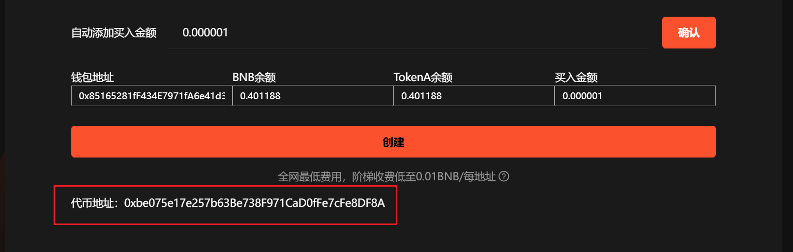

# FOUR创建代币并捆绑买入教程


**Four.Meme创建代币并买入 | 简化交易流程 | 抢得交易先机｜全网最低费用**

币安BSC内盘创建代币的同时进行代币买入操作，有效简化交易流程并加速市场参与，快人一步，抢得先机，从而更早获得潜在的收益。

[立即体验>>>](https://www.gtokentool.com/bundle)


## **Four.Meme是什么**

Four.Meme 是BSC 上首个Meme 代币公平发布平台，旨在为部署者和投资者提供一种无缝且低成本的启动Meme 代币的方式。 其核心功能是帮助用户创建和发行Meme 代币。

## **如何使用FOUR创建并捆绑买入工具**

1. 连接钱包
2. logo 支持的文件类型：JPG、PNG、GIF、SVG、WEBM、WAV、OGG、GLB、GLTF。<mark style="color:orange;">图片最大不能超过1M</mark>
3. 代币名称 必须是英文
4. 代币简称 必须是 英文
5. 描述
6. 选项信息
7. 买入金额

## **准备事项**

1. 一台电脑或者一部手机
2. BSC 钱包（[小狐狸MetaMask钱包安装教程](../supplementary-information/metamask-installation.md)）
3. 钱包最少准备 0.031 BNB
4. 要买入的地址私钥和一些 BNB

## **FOUR.MEME创建并捆绑买入步骤**

### 第1步，连接钱包

进入页面：[https://www.gtokentool.com/bundle](https://www.gtokentool.com/bundle)，点击右上角，连接[小狐狸钱包](../supplementary-information/metamask-installation.md)，并切换到主网。

<figure><figcaption></figcaption></figure>

完成后，会看到 “链名称” 和 您的“钱包地址” ，如下图：

<figure><figcaption></figcaption></figure>

### 第2步，填写信息并上传图片

假设我们创建一个代币名称为GTokenTool的代币，填写信息如下：

logo：图片最大不能超过1M

代币名称：GTokenTool  (<mark style="color:red;">必须英文</mark>)

代币简称：GTT  (<mark style="color:red;">必须英文</mark>)

描述：good job （随便填）

<figure><figcaption></figcaption></figure>

### 第3步，添加选填信息，选择标签

网站：不填

推特：不填

电报：不填

标签：默认

<figure><figcaption></figcaption></figure>

### 第4步，导入小号

手动复制填写，一行一个。


**买入参数设置**

* 导入的钱包请全部使用新地址。
* 所有服务费以及创建代币的费用由导入的钱包第一个钱包进行支付，请保证余额充足。
* 每个钱包预留 0.001 BNB 作为买入 Gas。
* <mark style="color:red;">建议您在使用涉及私钥的功能后，及时更换钱包。</mark>


<figure><figcaption></figcaption></figure>

### 第5步，设置自动添加买入金额，点击“创建”

<figure><figcaption></figcaption></figure>

创建成功后，下方会显示代币地址，可点击代币地址查看代币信息。

<figure><figcaption></figcaption></figure>

<figure><figcaption></figcaption></figure>

这样Four.meme整个流程就结束了，后面大家就可以自行操作啦！

## 常见问题：

### 1.这个功能是怎么收费的？

全网最低费用，阶梯收费低至0.01 BNB/每地址。10个以下地址0.03 BNB/每地址，10个钱包以上仅需0.01 BNB/每地址。

如有不明白或者不清楚的地方，请加入官方电报群：[https://t.me/gtokentool](https://t.me/gtokentool)
