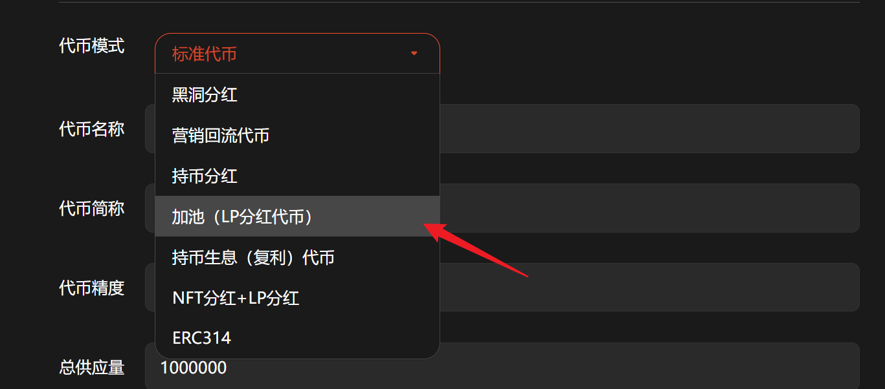
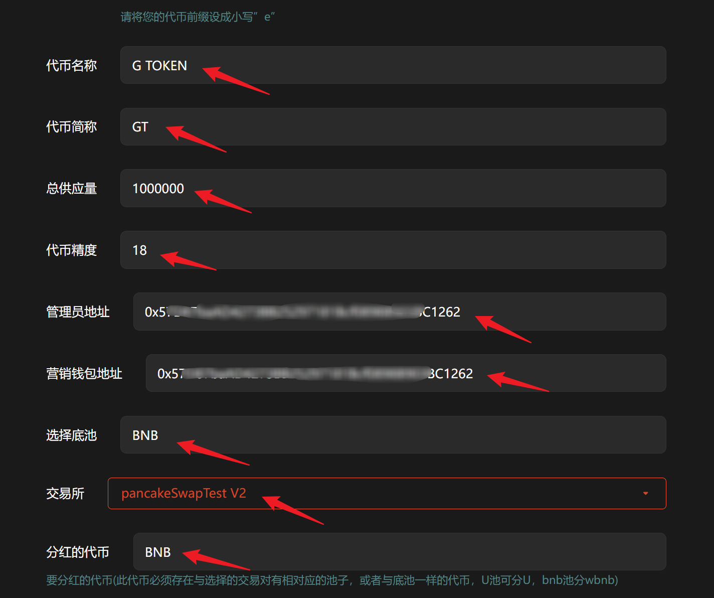
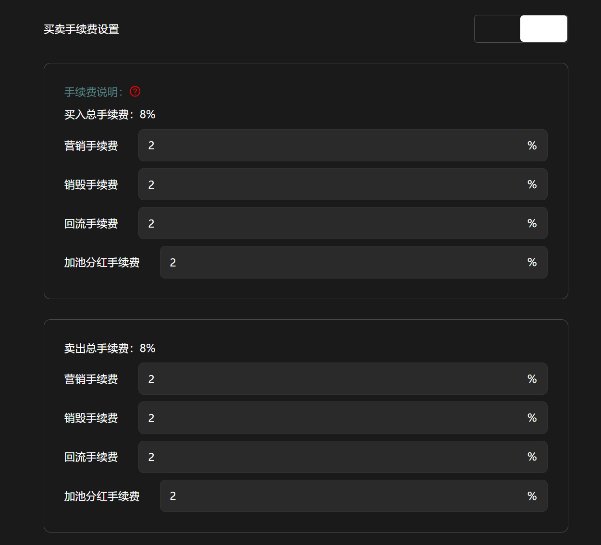

# 加池（LP分红代币）

**GTokenTool** 的 **创建LP分红代币** 工具主要用于发行具备流动性激励机制的资产，通过交易税收奖励流动性提供者（LP）。该工具具备**分红参数可调、自动化链上结算、奖励资产灵活**等特点。其优势在于能自发驱动流动性深度增长，有效降低买卖滑点并稳固币价。它特别适用于需建立深厚资金池、追求极致交易体验的 **Web3 初创团队、资深做市团队及社区模因币运营者**，是构建稳健流动性生态的核心工具。

## 📌 核心摘要

* **功能定位：**&#x4E00;站式流动性内生驱动工具。通过为代币注入“交易即分红”的逻辑，将每一笔交易税收直接转化为对流动性提供者（LP）的持仓奖励。
* **技术特性：**
  * **分红逻辑自定义：**&#x652F;持灵活调整分红参数，用户可自主决定奖励的力度与节奏。
  * **全自动链上派发：**&#x5185;置自动化结算模块，无需手动操作，奖励实时通过链上智能合约精准送达。
  * **多资产兼容奖励：**&#x5206;红币种配置灵活，可根据项目策略选择最符合社区预期的奖励资产。
* **应用价值：**&#x5F7B;底解决项目早期流动性匮乏的痛点。通过利益共享机制自发吸引资金加池，使“池子越换越厚”，在降低交易滑点的同时，为币价构筑坚实的防守底撑。
* **目标受众：**&#x5BFB;求极致交易深度的 Web3 初创项目、需稳固价格基本盘的资深做市团队，以及致力于打造高粘性社区的模因币（Meme）运营者。

## 1、介绍

用户在去中心化交易所（如薄饼swap）添加流动性之后，用户可以获得LP代币，该模式分红可将奖励按比例直接分发到持有LP的地址，鼓励用户多多添加流动性。

## 2、操作步骤

提示：请先安装小狐狸钱包插件，教程：[https://docs.gtokentool.com/fu-zhu-xin-xi/metamask-installation](https://docs.gtokentool.com/fu-zhu-xin-xi/metamask-installation)

### (1) 连接钱包

进入创建页面：[https://www.gtokentool.com/tokenfactory](https://www.gtokentool.com/tokenfactory)，点击右上角，连接小狐狸钱包，并切换到主网（这里以BSC测试网为例)。

完成后，会看到 “链名称” 和 您的“钱包地址” ，如下图：

<figure><figcaption>
连接钱包并选择网络
</figcaption></figure>

### (2) 选择代币模式

点击下拉框，选择 “加池（LP分红代币）”。

<figure><figcaption>
选择LP分红代币
</figcaption></figure>

### (3) 填写您的代币信息

依次填写代币信息，假设我们创建一个代币叫——“G TOKEN”，填写如下：

* **代币全称：**&#x47; TOKEN
* **代币简称：**&#x47;T
* **总供应量：**&#x31;000000（代币数量）
* **代币精度：**&#x31;8（小数点后的位数）
* **管理员地址：**&#x9ED8;认为连接钱包地址
* **营销钱包地址：**&#x8BBE;置营销钱包地址
* **选择池底：**&#x42;NB
* **选择交易所：**&#x70;ancakeSwapTest V2
* **分红的代币：**&#x42;NB

<figure><figcaption>
填写代币信息
</figcaption></figure>

### (4) 杀机器人（可选）

将对开启交易后在n秒内交易的地址全部拉入黑名单, 用于防止机器人抢跑买入，小于30秒。

<figure><figcaption>
设置杀机器人时间
</figcaption></figure>

### (5) 开启限购（可选）

加池子后会立即开启交易，如果关闭交易，最大持有设置为0(限购全部设置成0)。

<figure><figcaption>
开启限购
</figcaption></figure>

### (6) 买卖手续费设置（可选）

根据自己的需求设置买卖手续费。

* 营销手续费：交易中指定额度的代币将会自动转入营销钱包中, 用于项目方做其他营销。
* 销毁手续费：交易中指定额度的代币将会被打入黑洞地址, 变相实现通缩机制。
* 回流手续费：交易中指定额度的代币将会自动添加到流动池内, 保证交易始终存在流动性。
* 加池分红手续费：交易中指定额度的代币, 用来购买分红代币, 并发送给LP持有者。

<mark style="color:violet;">注：最低填写0.01，不能超过两位小数。</mark>

<figure><figcaption>
设置买卖手续费
</figcaption></figure>

### (7) 增加持币地址（可选）

用户交易时, 将会向随机地址空投最小单位代币以增加持币地址，不得超过10个。

<figure><figcaption>
增加持币地址
</figcaption></figure>

### (8) 转账手续费（可选）

<figure><figcaption>
转账手续费设置
</figcaption></figure>

### (9) 推荐返利（可选）

1.用户通过空投可绑定上下级关系，下级交易时，上级可获得推荐费用。
\
2.推荐返利只能新增至3级；推荐返利税单位为 %

<figure><figcaption>
推荐返利设置
</figcaption></figure>

### (10) 完成

点击 “`创建`” ，弹出窗口后可以设置靓号合约。设置完成后，点击”`确认创建`“，在小狐狸钱包支付gas费，就完成了。

<figure><figcaption>
确认创建
</figcaption></figure>

<mark style="background-color:red;">注意：</mark>

1. LP分红代币发成功之后可以在控制台设置加，撤池子手续费（注意：加池子手续费最好跟卖税一样，不然用户可以通过机器人将卖税设置成与加池子手续费一样，比如卖税100，加池子手续费0，用户可以通过机器人将卖税变成0卖出代币）。
2. <mark style="color:purple;">尾号前缀需要设置成e(小写，不要填0X,就写e)。</mark>
3. 撤池子手续费默认进合约地址后按设置的买卖手续费进行分红，有需要设置指定地址的可在控制台中->移除LP接收地址处，输入你想接收的地址，比如填黑洞，那么移除LP的税就会进黑洞地址。
4. 如果需要设置不能设置撤池子，那移除LP的税就需要调整到100以上。
5. 对主币池子无效（比如BNB）。

代币创建完成之后，只能转账，还不能交易。要想使代币可以交易，需要前往PancakeSwap创建一个流动性资金池才可以。教程：[https://docs.gtokentool.com/qu-zhong-xin-hua-jiao-yi/create-liquidity](https://docs.gtokentool.com/qu-zhong-xin-hua-jiao-yi/create-liquidity)

## ❓常见问题 FAQ

### Q: **什么是 LP 分红？**

**A:** 用户在去中心化交易所加池后，除了流动性奖励，还可按比例获得额外代币分红。分红只对自己加池激活的 LP 地址有效。

### Q: 如何获得 LP 分红资格？

**A:** 必须自己加池并产生买卖交易才能激活分红，转账获得的 LP 或仅买入而不卖出都无法获得分红。

### Q: 分红是如何计算的？

**A:** 按照用户**LP 持仓数量占全网总 LP 数量的比例**瓜分奖励池，LP 持有量越多，每期分红收益越高，结算规则链上公开可查。

### Q: **分红币种如何选择？**

**A:** 创建代币时可选择主流币（如 BNB、USDT、USD1、BUSD、U、DOGE、FIST）作为分红币，所选币必须与底池代币有交易对且流动性充足。

### Q: **黑名单和白名单的作用是什么？**

**A: 黑名单**被加入的地址无法卖出或转账，可设置分红黑名单屏蔽分红；**白名单**不受交易暂停、税率限制，开盘前可交易或加池。

### Q: **哪些情况无法分红？**

**A:** 分红代币没有与 BNB 的交易对或池子流动性过小，地址是 MetaMask 智能合约地址，白名单地址（如发币地址、营销钱包地址）交易等这些情况都是不会触发分红的。

### Q: 移除流动性后还能获得分红吗？

**A:** 不能。一旦赎回 LP、移除流动池，LP 凭证会被销毁，立刻失去分红权益，仅重新添加流动性后恢复资格。

### Q: 可以多地址分散持有 LP 叠加分红吗？

**A:** 支持。多个钱包分别持有 LP，会独立计算各自份额，分红独立发放，份额可累加。

### Q: 正常交易代币会影响分红吗？

**A:** 不影响。单纯买卖、转账原生代币不会改变分红资格，**只看 LP 持仓状态**，和代币现货持仓无关。

### 🤝 连接 GTokenTool 

* **💬 Telegram社群**：[点击加入官方群组](https://t.me/gtokentool)
* **🐦 Twitter (X)**：[关注我们获取最新动态](https://x.com/gtokentool)
* **📚 官方文档**：[查看 Gitbook 文档](https://docs.gtokentool.com/)
* **💻 开源代码**：[访问 GitHub 仓库](https://github.com/Gtokentool/docs/blob/master/SUMMARY.md)
* **📺 视频教程**：[订阅 YouTube 频道](https://www.youtube.com/@GTokenTool)

> ⚠️ 风险提示与免责声明
>
> GTokenTool 保留随时全权酌情因任何理由修改、变更或取消此公告的权利，无需事先通知。
>
> 以上信息内容仅供参考，GTokenTool 对本平台上的任何虚拟资产、产品或促销活动不做任何推荐或保证。虚拟资产的价格波动很大，投资交易虚拟资产将面临巨大风险。**请谨慎投资。**
