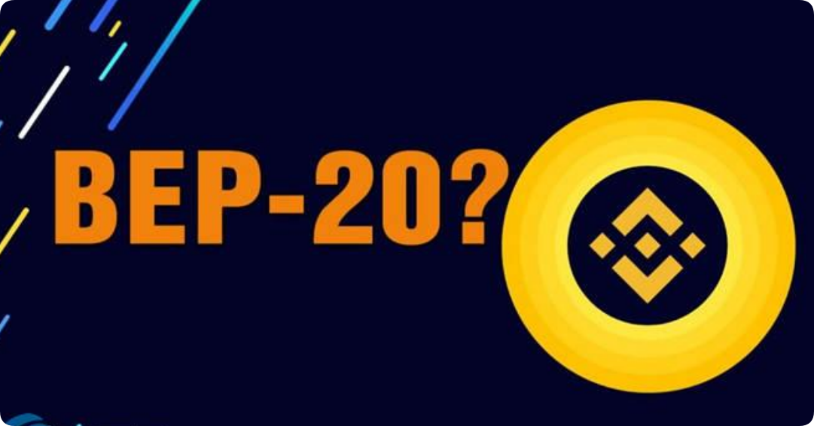

# BEP20一键发币教程

## 什么是BEP20？

BEP20 是 币安智能链（Binance Smart Chain，BSC） 上的一种代币标准，类似于以太坊的 [ERC20](erc20-yi-jian-fa-bi-jiao-cheng.md) 标准。它定义了一套规则，允许开发者在 BSC 上发行和管理代币，确保它们与链上的钱包、交易所和智能合约兼容。

<figure><figcaption></figcaption></figure>

## BEP20是什么链？

BEP20是Binance Smart Chain上的令牌标准，它扩展了最常见的以太坊令牌标准ERC-20。您可以将其视为令牌的蓝图，该令牌定义了令牌的使用方式，谁可以使用令牌以及其他使用规则。由于它与Binance Chain的BEP-2和以太坊的ERC-20相似，因此两者兼容。

BEP20被认为是Binance智能链的技术规范，其目标是为开发人员提供一种灵活的格式以启动一系列不同的令牌。这些可能在业务代表的股份的任何存储在银行的金库(即美元stablecoin)。

当然，人们可以同等地创建本机资产作为BEP20令牌，甚至可以从其他区块链中钉住令牌以使其在BinanceSmart Chain上可用。这是使用“佩吉”硬币完成的，“佩吉”硬币实质上是其他加密资产(例如LINK或XRP)的BEP20版本。

像Binance Chain上的BEP2令牌一样，BNB推动BEP20令牌转移。这为验证者提供了将交易包括在区块链中的动力，因为他们将收取BNB作为其麻烦的费用。

您可能知道Binance Smart Chain被设想为Binance Chain的扩展。凭借双链架构，两条链是互补的–BinanceSmart Chain可满足去中心化应用程序的需求，而不会阻塞原始链，而原始链已针对超快交易进行了优化。

## BEP20一键发币流程

### **(1) 连接钱包**

进入[GTokenTool](https://www.gtokentool.com/)，点击右上角选择，BNB链。

<figure><figcaption></figcaption></figure>

点击连接钱包，选择小狐狸钱包。

<figure><figcaption></figcaption></figure>

<figure><figcaption></figcaption></figure>

连接成功后，就可以看到钱包地址。

<figure><figcaption></figcaption></figure>

### **(2) 填写您的**BEP20**代币信息**

点击下面的链接进入BEP20发币工具界面。

发币工具：[https://www.gtokentool.com/tokenfactory](https://www.gtokentool.com/tokenfactory)

<figure><figcaption></figcaption></figure>

依次填写代币信息，假设我们创建一个代币叫——“GTokenTool”，填写如下：

<figure><figcaption></figcaption></figure>

* 代币全称：GTokenTool
* 代币简称：G T
* 代币精度：18（小数点后的位数）
* 总供应量：1000000（代币数量）

填写选项内容

* 官网
* 电报
* 推特

<figure><figcaption></figcaption></figure>

### **(3) 完成**BEP20**发币流程**

点击 “确认创建” ，在小狐狸钱包支付gas费，就完成了。

（注：因为每个用户网络速度不同，支付gas费用时可能会延迟1、2秒，属正常现象。）

<figure><figcaption></figcaption></figure>

以上就是关于BEP20发币的整个流程。

## 常见问题

### 1. 什么是币安智能链以及什么是 BEP20 代币？

币安智能链 (BSC) 是由加密货币交易所币安开发的区块链平台。它作为以太坊网络的替代方案推出，为构建去中心化应用程序 (DApp) 和发行代币提供高性能和低成本的环境。BEP20 代币是在 BSC 网络上发行和使用的原生代币。BEP20 代币（也称为 BSC 代币）遵循一组特定的标准和接口，这些标准和接口定义了如何在 BNB 链上创建、转移和交互代币。

### 2. 如何使用代币生成器创建 BEP20 代币？

要创建 BEP20 代币，只需连接、配置和创建即可。您无需编写自己的智能合约，只需拥有一个 Web3 钱包（例如Metamask）和足够的资金来支付代币创建费用即可。使用代币生成器简化了生成 BEP20 代币的过程。只需在您的钱包和代币生成器上连接到 BSC 网络，然后开始在该区块链上发行代币。

GTokenTool 是一款代币生成器，只需定义各种参数即可轻松创建代币：名称、符号、总供应量和其他可自定义功能。只需仔细按照说明填写表格，然后单击几下即可创建。然后，代币生成器会为您生成智能合约代码。代币会自动部署到币安智能链上，交易处理完成后，您的数字资产就会成功发行。

### 3. 我可以在没有任何智能合约编码知识的情况下创建 BEP20 代币吗？

是的，你绝对可以！GTokenTool 专为没有任何编码或技术知识的用户设计。使用这样的代币生成器是完美的解决方案，可让您充分利用代币化的强大功能。它提供了高度直观的界面和预构建的模板，可指导您完成代币创建过程。

### 4. 使用 BEP20 代币生成器有哪些好处？

对于希望创建和部署代币而无需编写自己的智能合约的用户来说，使用 BEP20 代币生成器具有多种好处。代币创建和部署过程是自动化的，并且大大简化了。代币生成器还提供可自定义的选项，允许您根据自己的需求和要求定制代币功能。GTokenTool 使您能够轻松、合规且经济高效地利用经过审计的银行级智能合约，并拥有良好的业绩记录。

### 5. 我可以对 BEP20 代币的总供应量设置限制吗？

是的，您可以对 BEP20 代币的总供应量设置限制。在代币创建过程中，您可以指定代币的初始供应量并启用“设置总供应量上限”。这允许您控制流通的代币总量上限，为您的代币经济提供稀缺性和价值。请务必谨慎使用此功能，因为在代币合约部署到网络后无法对其进行修改。

### 6. 创建 BEP20 代币后，可以更改其属性吗？

在创建代币并成功部署到 BNB 网络后，代币名称、符号和小数等某些属性无法修改。根据您在创建时启用的附加功能，创建后可能可以在管理代币功能下进行修改。

例如：如果您在创建代币时启用“可以铸造”，那么一旦您创建了 BEP20 代币并将其部署到网络，您就可以返回“管理代币”页面，并在初始创建后向总供应量添加更多代币。如果启用此功能，也可以在创建代币后更改资产文档条目。

如有不明白或者不清楚的地方，请加入官方电报群：[**https://t.me/gtokentool**](https://t.me/gtokentool)
