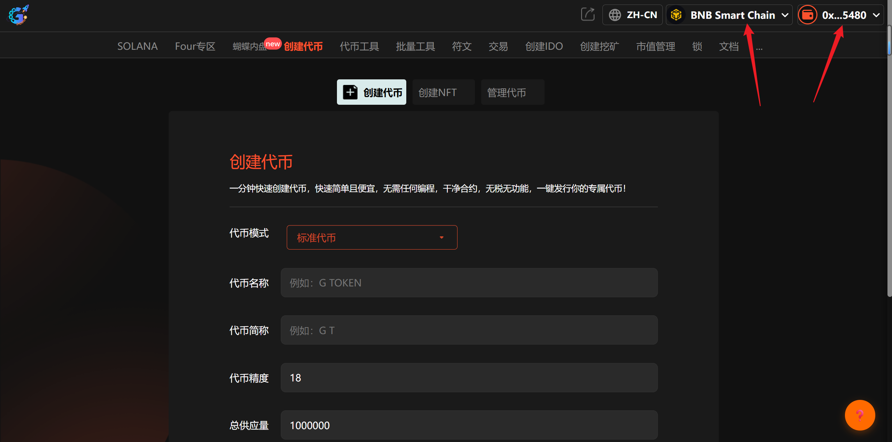
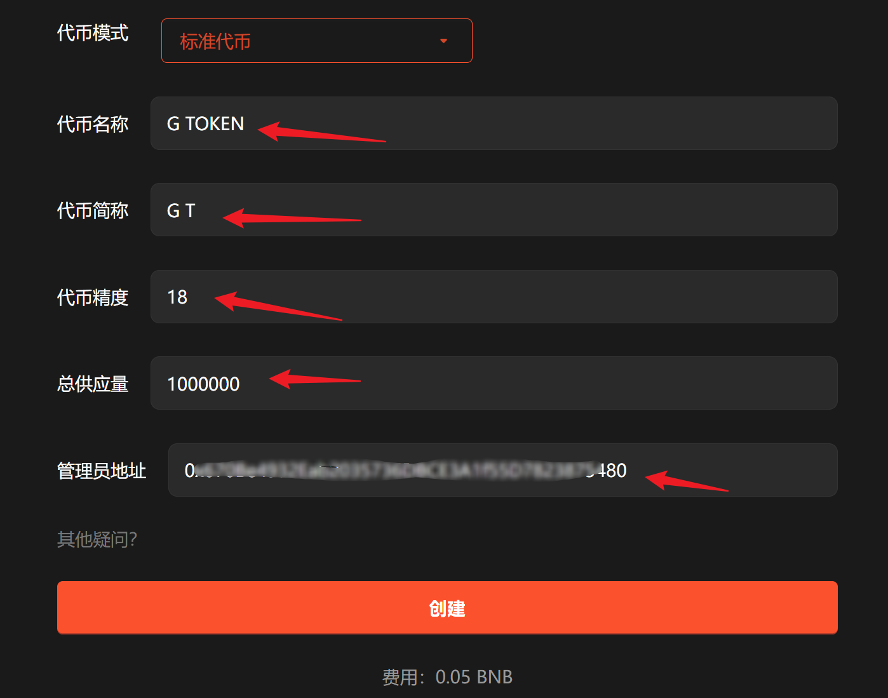
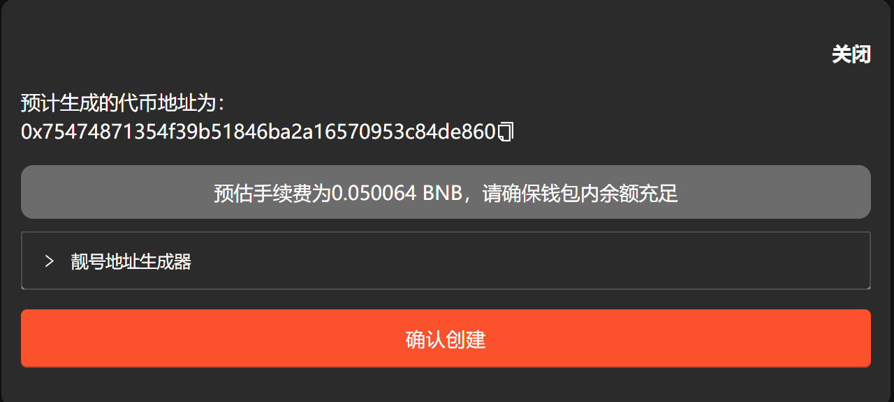

# 标准代币

**GTokenTool** 的 **BSC 创建标准代币** 工具专为 BNB 链设计，用于一分钟内快速发行资产。该工具具备**代码纯净无税、零编程门槛、审计适配性强**等特点。其优势在于部署成本极低且合约逻辑简洁，能有效提升项目透明度。它特别适用于需极速启动项目、进行资产建模或社区实验的 **Web3 初创团队、个人开发者及链上创意人**，是开启 BSC 生态布局的高效起点。

## 📌 核心摘要

* **功能定位：**&#x42;NB Smart Chain (BSC) 生态的极速发币引擎。旨在协助用户在 1 分钟内完成标准化合约部署，实现“零代码”发行资产。
* **技术特性：**
  * **纯净合约规范：**&#x91C7;用标准 Solidity 逻辑，无隐形后门与复杂税率，合约干净透明，天然适配交易所审计。
  * **全图形化交互：**&#x65E0;需任何编程基础，通过表单填写即可完成代币名称、符号及供应量的链上部署。
  * **低成本准入：**&#x6781;简的流程大幅降低了发币的时间成本与 GAS 费用。
* **应用价值：**&#x4E3A; Web3 创意提供即时价值载体。无论是社区实验、应用激励还是资产建模，都能通过该工具实现项目的快速冷启动。
* **目标受众：**&#x521D;创项目方、个人开发者、社区运营者，以及需快速构建链上原型资产的测试团队。

## 📺BSC一键发币工具视频



## 1、介绍

标准代币指的是没有任何功能、机制的代币合约，是一个纯粹的、干净的、标准的合约。这里以BSC为例做介绍。

## 2、操作步骤

提示：请先安装小狐狸钱包插件，教程：[https://docs.gtokentool.com/fu-zhu-xin-xi/metamask-installation](https://docs.gtokentool.com/fu-zhu-xin-xi/metamask-installation)

### (1) 连接钱包

进入创建页面：[https://www.gtokentool.com/tokenfactory](https://www.gtokentool.com/tokenfactory)，点击右上角，连接小狐狸钱包，并切换到主网。完成后，会看到 “链名称” 和 您的“钱包地址” ，如下图：

<figure><figcaption>
连接钱包并选择网络
</figcaption></figure>

### (2) 填写您的代币信息

依次填写代币信息，假设我们创建一个代币叫——“G TOKEN”，填写如下：

* **代币全称：**&#x47; TOKEN
* **代币简称：**&#x47; T
* **代币精度：**&#x31;8（小数点后的位数）
* **总供应量：**&#x31;000000（代币数量）

<figure><figcaption>
填写代币信息
</figcaption></figure>

输入完成后，点击“`创建`”。

### (3) 完成

点击 “`确认创建`” ，在小狐狸钱包支付gas费，就完成了。

（注：因为每个用户网络速度不同，支付gas费用时可能会延迟1、2秒，属正常现象。）

<figure><figcaption>
确认创建弹窗
</figcaption></figure>

<mark style="background-color:red;">注意：</mark>

代币创建完成之后，只能转账，还不能交易。要想使代币可以交易，需要前往 PancakeSwap 创建一个流动性资金池才可以。教程：[https://docs.gtokentool.com/qu-zhong-xin-hua-jiao-yi/create-liquidity](https://docs.gtokentool.com/qu-zhong-xin-hua-jiao-yi/create-liquidity)

## ❓常见问题 FAQ

### Q: 代币小数位填多少合适？

**A:** 通用默认 **18 位**，全网 DEX、钱包、交易所全部兼容；不建议修改为 6/9 位，容易导致交易、添加流动性出错。

### Q: 代币总量怎么设置？

**A:** 无固定限制，常用：1 万亿 / 100 万亿 / 10 亿；总量一旦部署**不可随意修改**，填写前确认好。

### Q: 可以预留团队币、销毁部分初始代币吗？

**A:** 可以。部署后可手动转账销毁、锁定团队份额；也可部署时直接写入销毁地址，减少流通量。

### Q: 创建完代币怎么导入钱包？

**A:** 复制代币合约地址，在 TP、小狐狸、Bitget 钱包内**自定义添加代币**，BSC 网络下粘贴地址即可自动识别余额。

### 🤝 连接 GTokenTool 

* **💬 Telegram社群**：[点击加入官方群组](https://t.me/gtokentool)
* **🐦 Twitter (X)**：[关注我们获取最新动态](https://x.com/gtokentool)
* **📚 官方文档**：[查看 Gitbook 文档](https://docs.gtokentool.com/)
* **💻 开源代码**：[访问 GitHub 仓库](https://github.com/Gtokentool/docs/blob/master/SUMMARY.md)
* **📺 视频教程**：[订阅 YouTube 频道](https://www.youtube.com/@GTokenTool)

> ⚠️ 风险提示与免责声明
>
> GTokenTool 保留随时全权酌情因任何理由修改、变更或取消此公告的权利，无需事先通知。
>
> 以上信息内容仅供参考，GTokenTool 对本平台上的任何虚拟资产、产品或促销活动不做任何推荐或保证。虚拟资产的价格波动很大，投资交易虚拟资产将面临巨大风险。**请谨慎投资。**
