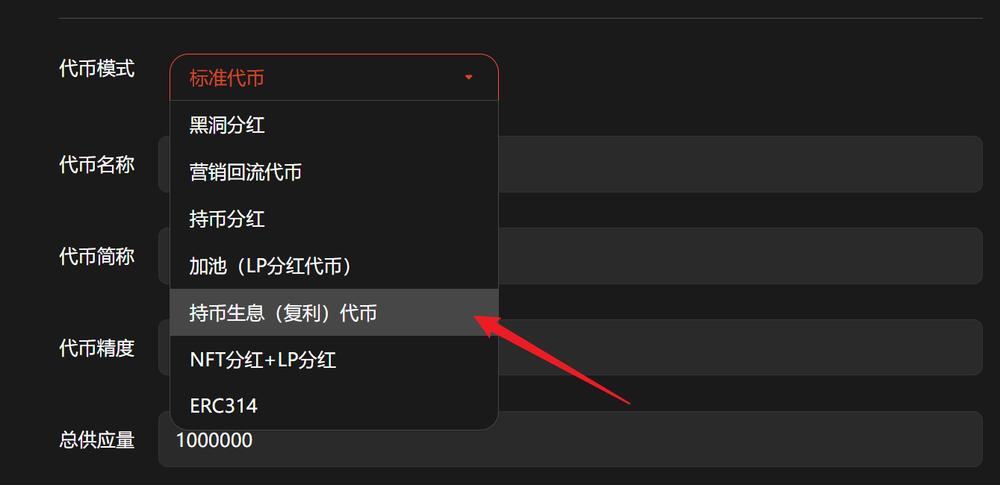
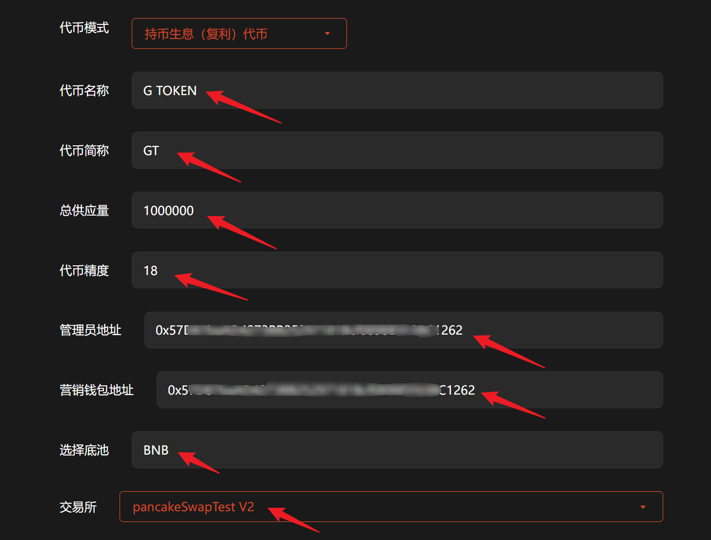
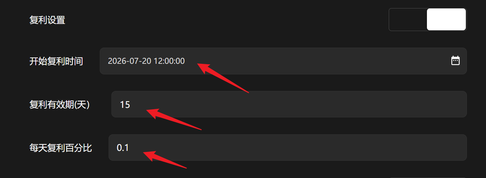

# 持币生息（复利）代币

## 1、介绍

持币复利，钱包内持有代币，即可自动复利生息，代币资产越来越多。

## 2、操作步骤

提示：请先安装小狐狸钱包插件，教程：[https://docs.gtokentool.com/fu-zhu-xin-xi/metamask-installation](https://docs.gtokentool.com/fu-zhu-xin-xi/metamask-installation)

### (1) 连接钱包

进入创建页面：[https://www.gtokentool.com/tokenfactory](https://www.gtokentool.com/tokenfactory)，点击右上角，连接小狐狸钱包，并切换到主网（这里以BSC测试网为例)。

完成后，会看到 “链名称” 和 您的“钱包地址” ，如下图：

<figure><figcaption>
连接钱包并选择网络
</figcaption></figure>

### (2) 选择代币模式

点击下拉框，选择 “持币生息（复利）代币”。

<figure><figcaption>
选择持币生息（复利）代币
</figcaption></figure>

### (3) 填写您的代币信息

依次填写代币信息，假设我们创建一个代币叫——“G TOKEN”，填写如下：

* **代币全称：**&#x47; TOKEN
* **代币简称：**&#x47;T
* **总供应量：**&#x31;000000（代币数量）
* **代币精度：**&#x31;8（小数点后的位数）
* **管理员地址：**&#x9ED8;认为连接钱包地址
* **营销钱包地址：**&#x8BBE;置营销钱包地址
* **选择池底：**&#x42;NB
* **选择交易所：**&#x70;ancakeSwapTest V2

<figure><figcaption>
填写代币信息
</figcaption></figure>

### (4) 复利设置（可选）

根据自己的需求设置复利开始时间、复利有效期以及每天复利百分比。

<figure><figcaption></figcaption></figure>

### (5) 买卖手续费设置（可选）

根据自己的需求设置买卖手续费。

* 营销手续费：交易中指定额度的代币将会自动转入营销钱包中, 用于项目方做其他营销。
* 销毁手续费：交易中指定额度的代币将会被打入黑洞地址, 变相实现通缩机制。
* 回流手续费：交易中指定额度的代币将会自动添加到流动池内, 保证交易始终存在流动性。

<mark style="color:violet;">注：最低填写0.01，不能超过两位小数。</mark>

<figure><figcaption>
设置买卖手续费
</figcaption></figure>

### (6) 杀机器人（可选）

将对开启交易后在n秒内交易的地址全部拉入黑名单, 用于防止机器人抢跑买入，小于30秒。

<figure><figcaption>
设置杀机器人时间
</figcaption></figure>

### (7) 增加持币地址（可选）

用户交易时, 将会向随机地址空投最小单位代币以增加持币地址，不得超过10个。

<figure><figcaption>
增加持币地址
</figcaption></figure>

### (8) 开启限购（可选）

加池子后会立即开启交易，如果关闭交易，最大持有设置为0(限购全部设置成0)。

<figure><figcaption>
开启限购
</figcaption></figure>

### (9) 转账手续费（可选）

<figure><figcaption>
转账手续费设置
</figcaption></figure>

### (10) 推荐返利（可选）

1.用户通过空投可绑定上下级关系，下级交易时，上级可获得推荐费用。
\
2.推荐返利只能新增至3级；推荐返利税单位为 %

<figure><figcaption>
推荐返利设置
</figcaption></figure>

### (11) 完成

点击 “`创建`” ，弹出窗口后可以设置靓号合约。设置完成后，点击”`确认创建`“，在小狐狸钱包支付gas费，就完成了。

<figure><figcaption>
确认创建
</figcaption></figure>

<mark style="background-color:red;">注意：</mark>

* 能转账不能交易
* 代币创建完成之后，只能转账，还不能交易。要想使代币可以交易，需要前往PancakeSwap创建一个流动性资金池才可以。教程：[https://docs.gtokentool.com/qu-zhong-xin-hua-jiao-yi/create-liquidity](https://docs.gtokentool.com/qu-zhong-xin-hua-jiao-yi/create-liquidity)

## ❓常见问题 FAQ

### Q: 持币生息排除地址有哪些？

**A:** 合约权限地址、合约地址、资金池地址均被排除，不会进行持币生息。

### Q: 复利如何实现？复利的代币从哪里来？

**A:** 增发而来，代币复利以增发的形式实现。

### Q: 复利代币和普通分红币有什么区别？

**A:** 普通分红是单次分发奖励；**复利生息会自动利滚利**，产生的收益会持续叠加本金，持仓时间越久，收益增速越快。

### Q: 卖出或转账后还会有利息吗？

**A:** 不会。转出、卖出代币后，持仓余额减少或清空，即刻停止生息；重新持有代币后，自动恢复利息计算。

### Q: 我持有代币，为什么没有看到收益？

**A:** 持仓数量过低，复利收益微小不明显；链上区块结算延迟，刷新钱包或重新添加代币即可；合约收益池未充值，暂无生息奖励来源。

### Q: 频繁交易会影响复利收益吗？

**A:** 会。频繁买卖、转入转出会中断持续持仓周期，破坏复利叠加效果，长期持有收益最大化。

### Q: 可以多钱包分散持仓累计收益吗？

**A:** 支持。多个钱包独立计算生息，各地址复利单独结算，互不影响。

### 🤝 连接 GTokenTool 

* **💬 Telegram社群**：[点击加入官方群组](https://t.me/gtokentool)
* **🐦 Twitter (X)**：[关注我们获取最新动态](https://x.com/gtokentool)
* **📚 官方文档**：[查看 Gitbook 文档](https://docs.gtokentool.com/)
* **💻 开源代码**：[访问 GitHub 仓库](https://github.com/Gtokentool/docs/blob/master/SUMMARY.md)
* **📺 视频教程**：[订阅 YouTube 频道](https://www.youtube.com/@GTokenTool)

> ⚠️ 风险提示与免责声明
>
> GTokenTool 保留随时全权酌情因任何理由修改、变更或取消此公告的权利，无需事先通知。
>
> 以上信息内容仅供参考，GTokenTool 对本平台上的任何虚拟资产、产品或促销活动不做任何推荐或保证。虚拟资产的价格波动很大，投资交易虚拟资产将面临巨大风险。**请谨慎投资。**
