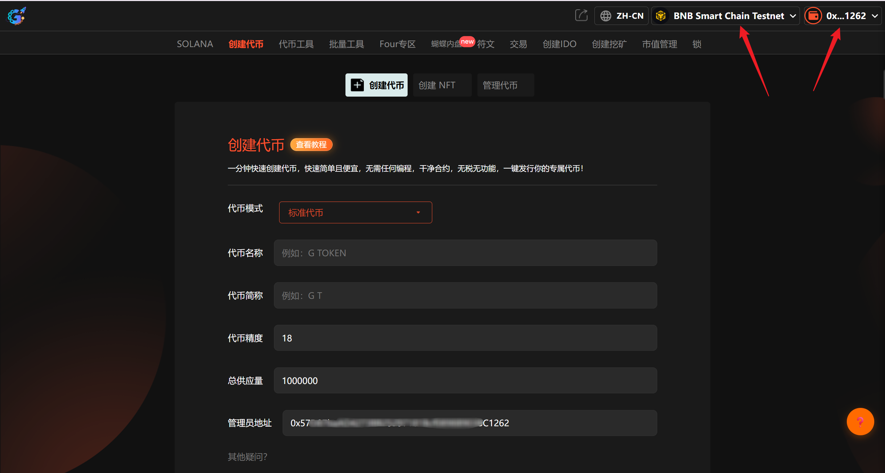
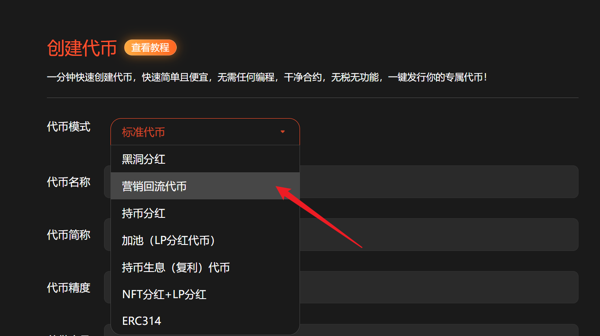
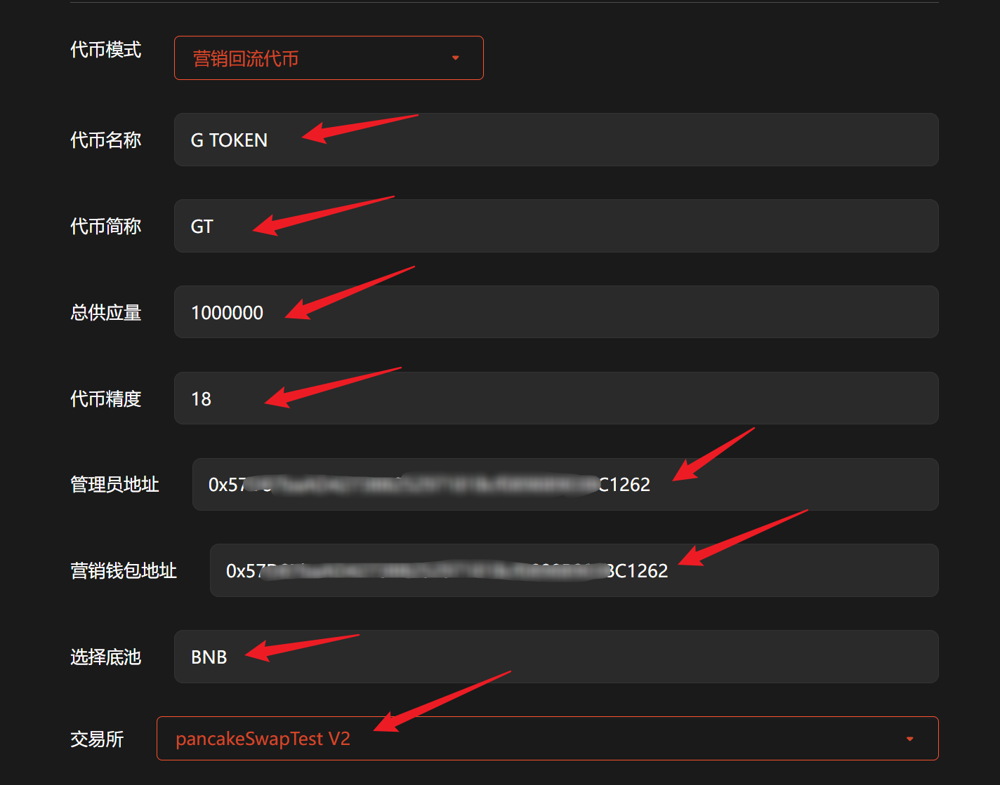

# 营销回流代币

**GTokenTool** 的 **创建营销回流代币** 工具主要用于发行具备自动分红或营销回流机制的资产。该工具具备**交易税率可调、营销钱包自动回流、流动性自动回购**等特点。其优势在于能持续获取运营资金，通过机制创新激励持有并驱动项目扩张。它特别适用于需长期社区激励、高频营销推广的 **Web3 初创团队、社区模因币开发者及流量运营者**，是增强代币经济生命力的核心利器。

## 📌 核心摘要

* **功能定位：**&#x4E00;站式自动化代币经济管理引擎。支持用户发行内置“交易税收”功能的代币，实现资金自动向营销、分红或流动性池回流。
* **技术特性：**
  * **动态税率控制：**&#x652F;持自定义买入/卖出交易税率，灵活调节项目运营资金流。
  * **自动化营销回流：**&#x4EA4;易发生时，指定比例的资金自动划转至营销钱包，确保持续的推广预算。
  * **流动性自动回购：**&#x5185;置回购机制，通过交易税自动补充流动性池，增强资产的价格底撑与稳定性。
* **应用价值：**&#x901A;过内生性的资金循环机制，解决初创项目营销资金匮乏及流动性薄弱的问题，极大延长了代币的生命周期。
* **目标受众：**&#x9700;长期进行社区激励的 Web3 初创团队、追求高频曝光的社区模因币（Meme）开发者，以及资深的链上流量运营者。

## 📺营销回流代币视频教程



## 1、介绍

该模式允许设置税率自动添加流动性, 保证流动池永不枯竭. 还可以设置营销税率为项目方创造额外收益。

## 2、操作步骤

提示：请先安装小狐狸钱包插件，教程：[https://docs.gtokentool.com/fu-zhu-xin-xi/metamask-installation](https://docs.gtokentool.com/fu-zhu-xin-xi/metamask-installation)

### (1) 连接钱包

进入创建页面：[https://www.gtokentool.com/tokenfactory](https://www.gtokentool.com/tokenfactory)，点击右上角，连接小狐狸钱包，并切换到主网（这里以BSC测试网为例)。

完成后，会看到 “链名称” 和 您的“钱包地址” ，如下图：

<figure><figcaption>
连接钱包并选择网络
</figcaption></figure>

### (2) 选择代币模式

点击下拉框，选择 “营销回流代币”。

<figure><figcaption>
选择营销回流代币
</figcaption></figure>

### (3) 填写您的代币信息

依次填写代币信息，假设我们创建一个代币叫——“G TOKEN”，填写如下：

* **代币全称：**&#x47; TOKEN
* **代币简称：**&#x47;T
* **供应总量：**&#x31;000000（代币数量）
* **代币精度：**&#x31;8（小数点后的位数）
* **管理员地址：**&#x9ED8;认为连接钱包地址
* **营销钱包地址：**&#x8BBE;置营销钱包地址
* **选择池底：**&#x42;NB
* **选择交易所：**&#x70;ancakeSwapTest V2

<figure><figcaption>
填写代币信息
</figcaption></figure>

### (4) 买卖手续费设置（可选）

根据自己的需求设置买卖手续费。

* 营销手续费：交易中指定额度的代币将会自动转入营销钱包中, 用于项目方做其他营销。
* 销毁手续费：交易中指定额度的代币将会被打入黑洞地址, 变相实现通缩机制。
* 回流手续费：交易中指定额度的代币将会自动添加到流动池内, 保证交易始终存在流动性。

<mark style="color:violet;">注：最低填写0.01，不能超过两位小数。</mark>

<figure><figcaption>
设置买卖手续费
</figcaption></figure>

### (5) 杀机器人（可选）

将对开启交易后在n秒内交易的地址全部拉入黑名单, 用于防止机器人抢跑买入，小于30秒。

<figure><figcaption>
设置杀机器人时间
</figcaption></figure>

### (6) 增加持币地址（可选）

用户交易时, 将会向随机地址空投最小单位代币以增加持币地址，不得超过10个。

<figure><figcaption>
增加持币地址
</figcaption></figure>

### (7) 开启限购（可选）

加池子后会立即开启交易，如果关闭交易，最大持有设置为0(限购全部设置成0)。

<figure><figcaption>
开启限购
</figcaption></figure>

### (8) 转账手续费（可选）

<figure><figcaption>
转账手续费设置
</figcaption></figure>

### (9) 推荐返利（可选）

1.用户通过空投可绑定上下级关系，下级交易时，上级可获得推荐费用。
\
2.推荐返利只能新增至3级；推荐返利税单位为 %

<figure><figcaption>
推荐返利设置
</figcaption></figure>

### (10) 完成

点击 “`创建`” ，弹出窗口后可以设置靓号合约。设置完成后，点击”`确认创建`“，在小狐狸钱包支付gas费，就完成了。

<figure><figcaption>
确认创建
</figcaption></figure>

<mark style="background-color:red;">注意：</mark>

代币创建完成之后，只能转账，还不能交易。要想使代币可以交易，需要前往PancakeSwap创建一个流动性资金池才可以。教程：[https://docs.gtokentool.com/qu-zhong-xin-hua-jiao-yi/create-liquidity](https://docs.gtokentool.com/qu-zhong-xin-hua-jiao-yi/create-liquidity)

## ❓常见问题 FAQ

### Q: 什么是 BSC 营销回流代币？

**A:** 是带有**交易税负机制**的 BEP20 代币，每一笔买卖自动扣除手续费，按规则拆分：自动回流分红给持币用户；自动销毁代币通缩；营销 / 开发钱包税收（用于运营、推广）。

### Q: 和普通标准版代币有什么区别？

**A:** 普通代币无任何交易税收，转账免费；营销回流代币**每笔买卖扣税**，自带持币分红、自动销毁、营销扣费，适合土狗、MEME、长效运营项目。

### Q: BSC 回流代币安全吗？

**A:** 合约为开源标准模板，本身无漏洞；风险主要来自**管理员权限**，关闭黑名单、销毁权限、移除合约控制权后，就是安全版本。

### Q: 营销代币的税率一般设置多少？

**A:** 行业常规标准：买入税：3%\~8%；卖出税：5%\~12%。拆分自定义：分红、销毁、营销池、开发池可自由分配比例。

### Q: 回流代币能正常添加钱包吗？

**A:** 完全可以，和普通 BEP20 一样，小狐狸、TP、钱包手动添加合约地址即可显示余额与分红。

### Q: 带税代币转账会扣税吗？

**A:** 默认**仅 DEX 买卖扣税**，钱包点对点互转不扣税，不影响正常转账流通。若开启转账手续费，则需要扣税。

### Q: 为什么我卖出到手数量变少了？

**A:** 因为触发**卖出手续费**，扣除回流、销毁、营销税后，才是实际到账数量，属于合约正常机制。

### Q: 带税代币会不会无法交易？

**A:** 税率过高（卖出＞15%）会导致 DEX 路由报错、滑点异常；合理区间内配置税率，完全兼容 PancakeSwap 所有路由。

### Q: 营销代币有黑名单功能吗？

**A:** 模板自带黑名单可选，建议**部署后关闭黑名单权限**，避免限制用户交易、引发跑路质疑。

### 🤝 连接 GTokenTool 

* **💬 Telegram社群**：[点击加入官方群组](https://t.me/gtokentool)
* **🐦 Twitter (X)**：[关注我们获取最新动态](https://x.com/gtokentool)
* **📚 官方文档**：[查看 Gitbook 文档](https://docs.gtokentool.com/)
* **💻 开源代码**：[访问 GitHub 仓库](https://github.com/Gtokentool/docs/blob/master/SUMMARY.md)
* **📺 视频教程**：[订阅 YouTube 频道](https://www.youtube.com/@GTokenTool)

> ⚠️ 风险提示与免责声明
>
> GTokenTool 保留随时全权酌情因任何理由修改、变更或取消此公告的权利，无需事先通知。
>
> 以上信息内容仅供参考，GTokenTool 对本平台上的任何虚拟资产、产品或促销活动不做任何推荐或保证。虚拟资产的价格波动很大，投资交易虚拟资产将面临巨大风险。**请谨慎投资。**
