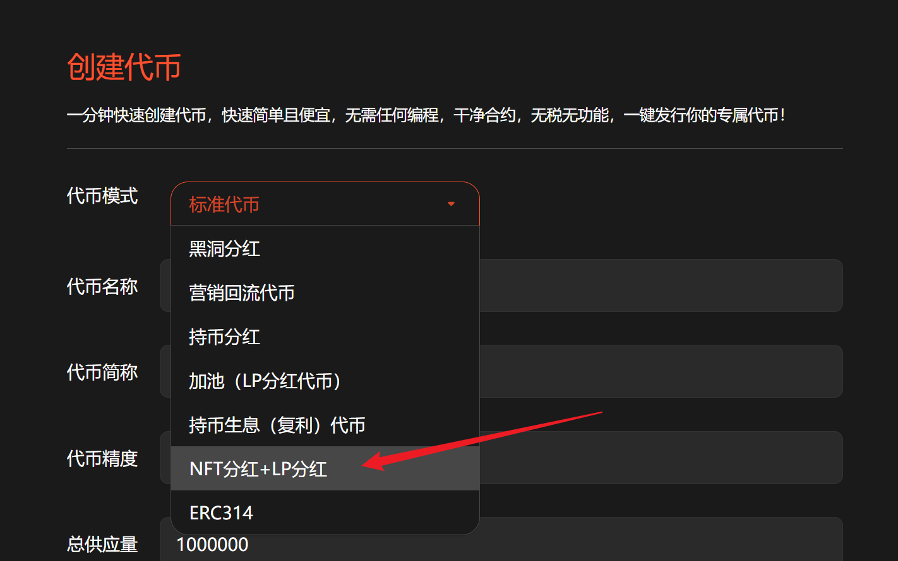
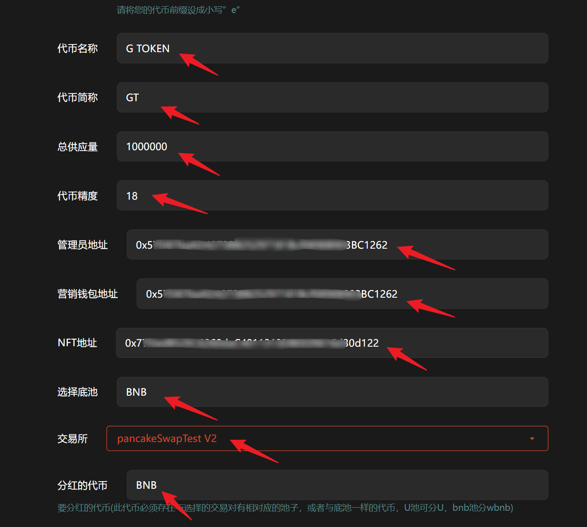
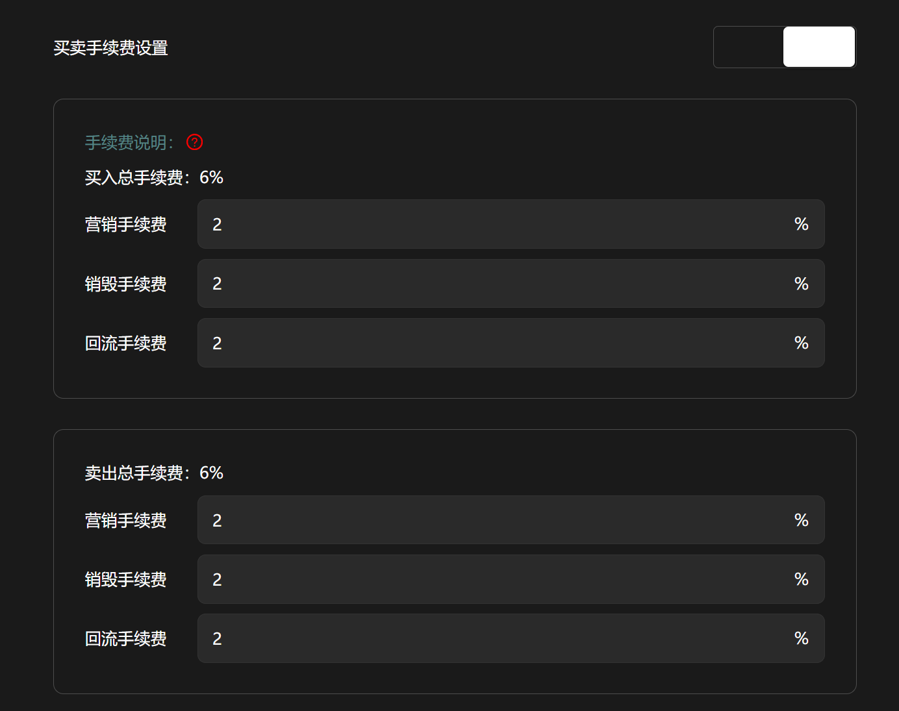
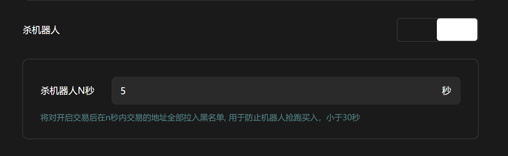
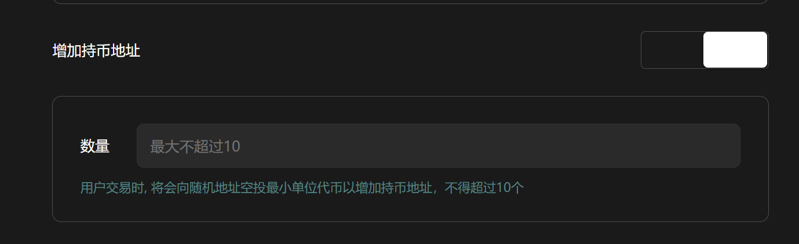
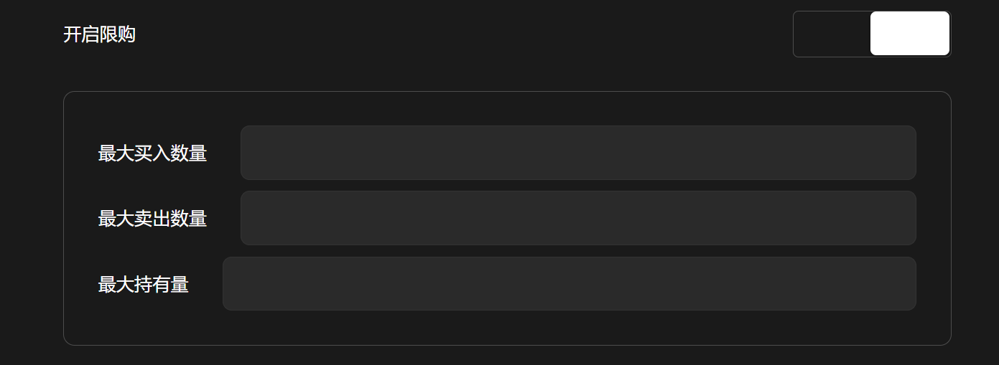
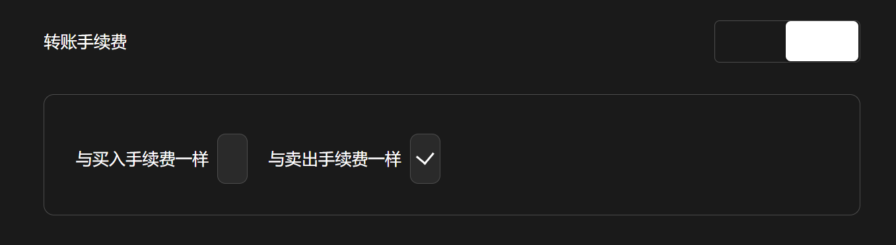
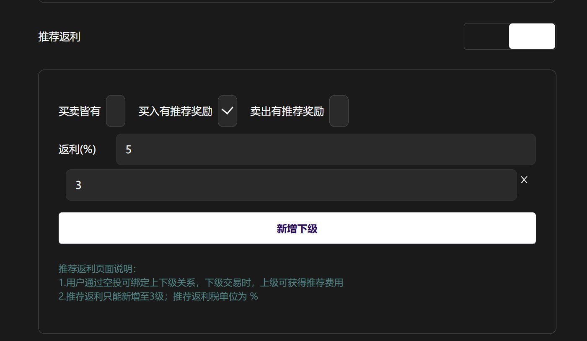

# NFT分红+ LP分红代币

**GTokenTool** 的 **创建NFT分红+ LP分红代币** 工具主要用于发行具备双重激励机制的资产，通过交易税收同时奖励 NFT 持有者与流动性提供者。该工具具备**分红权重可调、自动化双重派发、多维激励配置**等特点。其优势在于能同时锁定流动性并提升 NFT 价值，通过复合收益模型构建极强的社区凝聚力。它特别适用于需深度绑定核心粉丝、追求生态长期稳健发展的 **Web3 初创项目、NFT 艺术团队及高阶模因币运营方**。

## 📌 核心摘要

* **功能定位：**&#x4E00;站式多维复合激励代币发行引擎。通过创新的智能合约逻辑，将交易税收转化为双重奖励流，同步回馈给 NFT 持有者与流动性提供者（LP）。
* **技术特性：**
  * **分红权重自定义：**&#x652F;持灵活调节 NFT 与 LP 之间的收益分配比例，满足项目不同阶段的激励侧重。
  * **自动化双路派发：**&#x5185;置双重自动结算机制，奖励资产无需手动领取，由链上合约精准、高效地分发至合格地址。
  * **多维激励配置：**&#x63D0;供丰富的参数化设置，涵盖分红币种选择、持仓阈值限定等，确保激励精准触达核心用户。
* **应用价值：**&#x901A;过“资产+权益”的双重绑定，在锁定深厚流动性的同时，大幅提升项目关联 NFT 的实用价值与持有意愿。这种复合收益模型能构建极强的社区归属感，有效降低核心资产抛压。
* **目标受众：**&#x9700;深度绑定核心粉丝群体的 Web3 初创项目、寻求资产价值最大化的 NFT 艺术团队，以及追求长效稳健生态布局的高阶模因币（Meme）运营方。

提示：请先安装小狐狸钱包插件，教程：[https://docs.gtokentool.com/fu-zhu-xin-xi/metamask-installation](https://docs.gtokentool.com/fu-zhu-xin-xi/metamask-installation)

## 创建NFT分红代币流程

### (1) 连接钱包

进入创建页面：[https://www.gtokentool.com/tokenfactory](https://www.gtokentool.com/tokenfactory)，点击右上角，连接小狐狸钱包，并切换到主网（这里以BSC测试网为例)。

完成后，会看到 “链名称” 和 您的“钱包地址” ，如下图：

<figure><figcaption>
连接钱包并选择网络
</figcaption></figure>

### (2) 选择代币模式

点击下拉框，选择 “NFT分红+LP分红代币”。

<figure><figcaption>
选择NFT分红+LP分红
</figcaption></figure>

### (3) 填写您的代币信息

依次填写代币信息，假设我们创建一个代币叫——“G TOKEN”，填写如下：

* **代币全称：**&#x47; TOKEN
* **代币简称：**&#x47;T
* **总供应量：**&#x31;000000（代币数量）
* **代币精度：**&#x31;8（小数点后的位数）
* **管理员地址：**&#x9ED8;认为连接钱包地址
* **营销钱包地址：**&#x8BBE;置营销钱包地址
* **NFT地址：**&#x8BBE;置NFT地址
* **选择池底：**&#x42;NB
* **选择交易所：**&#x70;ancakeSwapTest V2
* **分红的代币：**&#x42;NB

<figure><figcaption>
填写代币信息
</figcaption></figure>

### (4) 买卖手续费设置（可选）

根据自己的需求设置买卖手续费。

* 营销手续费：交易中指定额度的代币将会自动转入营销钱包中, 用于项目方做其他营销。
* 销毁手续费：交易中指定额度的代币将会被打入黑洞地址, 变相实现通缩机制。
* 回流手续费：交易中指定额度的代币将会自动添加到流动池内, 保证交易始终存在流动性。

<mark style="color:violet;">注：最低填写0.01，不能超过两位小数。</mark>

<figure><figcaption>
设置买卖手续费
</figcaption></figure>

### (5) 杀机器人（可选）

将对开启交易后在n秒内交易的地址全部拉入黑名单, 用于防止机器人抢跑买入，小于30秒。

<figure><figcaption>
设置杀机器人时间
</figcaption></figure>

### (6) 增加持币地址（可选）

用户交易时, 将会向随机地址空投最小单位代币以增加持币地址，不得超过10个。

<figure><figcaption>
增加持币地址
</figcaption></figure>

### (7) 开启限购（可选）

加池子后会立即开启交易，如果关闭交易，最大持有设置为0(限购全部设置成0)。

<figure><figcaption>
开启限购
</figcaption></figure>

### (8) 转账手续费（可选）

<figure><figcaption>
转账手续费设置
</figcaption></figure>

### (9) 推荐返利（可选）

1.用户通过空投可绑定上下级关系，下级交易时，上级可获得推荐费用。
\
2.推荐返利只能新增至3级；推荐返利税单位为 %

<figure><figcaption>
推荐返利设置
</figcaption></figure>

### (10) 完成

点击 “`创建`” ，弹出窗口后可以设置靓号合约。设置完成后，点击”`确认创建`“，在小狐狸钱包支付gas费，就完成了。

<figure><figcaption>
确认创建
</figcaption></figure>

<mark style="background-color:red;">注意：</mark>

* 代币创建完成之后，只能转账，还不能交易。要想使代币可以交易，需要前往PancakeSwap创建一个流动性资金池才可以。教程：[https://docs.gtokentool.com/qu-zhong-xin-hua-jiao-yi/create-liquidity](https://docs.gtokentool.com/qu-zhong-xin-hua-jiao-yi/create-liquidity)
* 暂不支持其他平台创建的NFT

## ❓常见问题 FAQ

### Q: 什么是 NFT 分红+ LP 分红？

**A:** 同时满足两个条件就能拿双重分红：持有指定 NFT + 为池子提供流动性（持有 LP），缺一个就少一份收益。LP 占比分基础收益，NFT 给收益加成，两个乘起来就是你到手的分红。总分红 = LP 分红 + NFT 分红（含加成）

### Q: 转出或卖掉 NFT 后，还能享受分红吗？

**A:** 不能。一旦 NFT 转出、出售、转移至其他钱包，立即失去分红资格，重新购入持有后自动恢复权益。

### Q: 我有代币也有 NFT，为什么没有分红？

**A:** NFT 合约未绑定白名单、不属于指定合集；NFT 暂时托管 / 质押在第三方平台，不在本地钱包；分红资金池暂无充值资产，无收益可分发；钱包缓存延迟，重新连接钱包刷新即可。

### Q: 代币持仓数量会影响分红高低吗？

**A:** 核心权重以**NFT 为主**，代币仅作为生态通行证；不会因为代币持仓少，就限制 NFT 对应的基础分红权益。

### 🤝 连接 GTokenTool 

* **💬 Telegram社群**：[点击加入官方群组](https://t.me/gtokentool)
* **🐦 Twitter (X)**：[关注我们获取最新动态](https://x.com/gtokentool)
* **📚 官方文档**：[查看 Gitbook 文档](https://docs.gtokentool.com/)
* **💻 开源代码**：[访问 GitHub 仓库](https://github.com/Gtokentool/docs/blob/master/SUMMARY.md)
* **📺 视频教程**：[订阅 YouTube 频道](https://www.youtube.com/@GTokenTool)

> ⚠️ 风险提示与免责声明
>
> GTokenTool 保留随时全权酌情因任何理由修改、变更或取消此公告的权利，无需事先通知。
>
> 以上信息内容仅供参考，GTokenTool 对本平台上的任何虚拟资产、产品或促销活动不做任何推荐或保证。虚拟资产的价格波动很大，投资交易虚拟资产将面临巨大风险。**请谨慎投资。**
