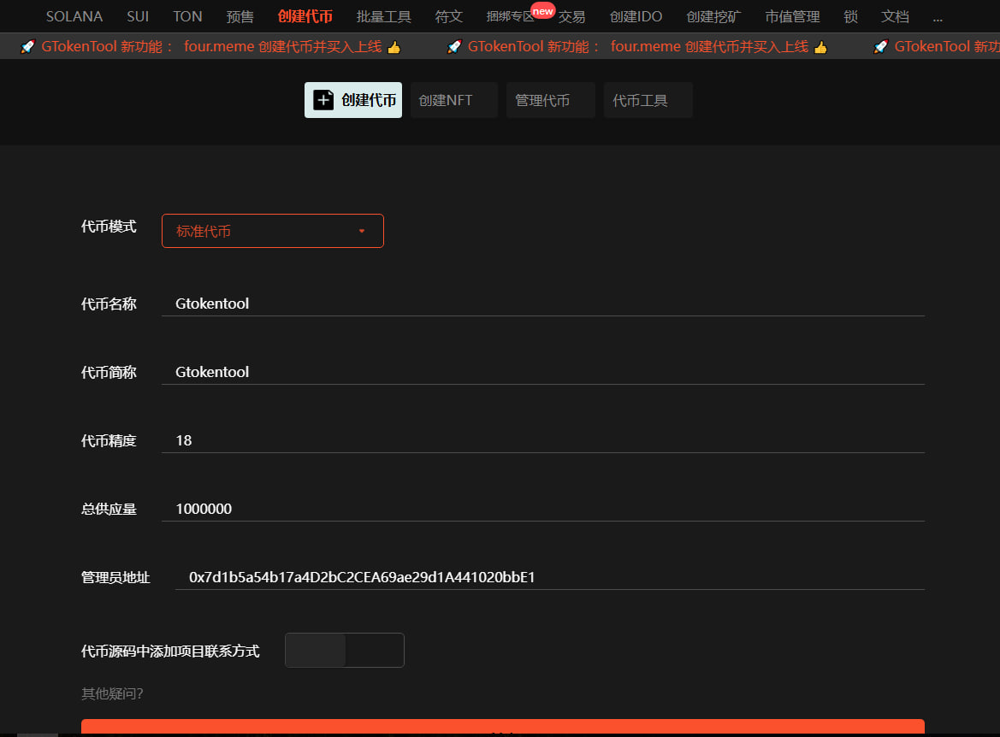
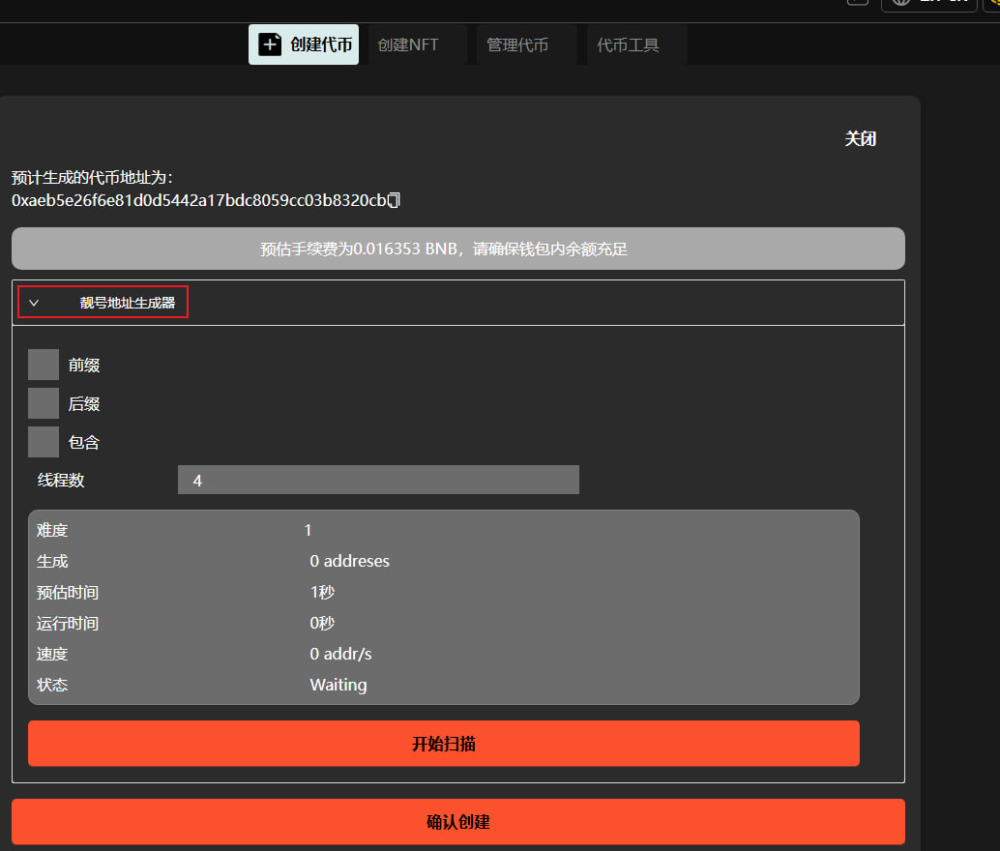
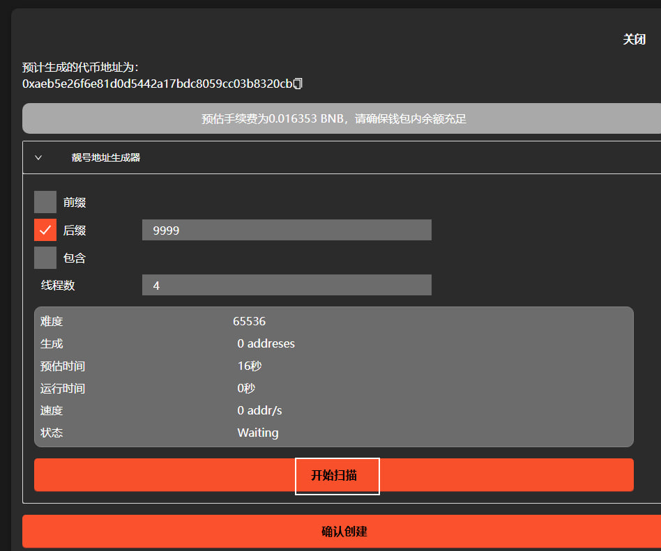
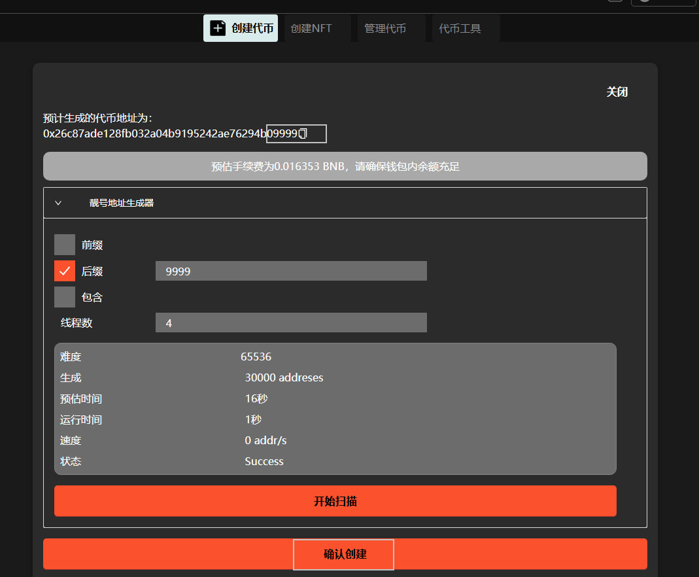

# 合约靓号创建教程

## 合约靓号创建流程

### 1. 进入创建代币页面

我这里选择标准代币，填好代币名称等。

<figure><figcaption></figcaption></figure>

### 2. 点击创建，打开靓号地址生成器

<figure><figcaption></figcaption></figure>

### 3. 填入你需要的靓号

可以选择前缀或者后缀，我这里选择后缀9999，点击扫描。

<figure><figcaption></figcaption></figure>

### 4. 检查合约地址，点击确认创建

扫描完成，上方预计地址后缀出现需要的9999，就成功了，点击确认创建，你的合约后缀就是9999了。

<figure><figcaption></figcaption></figure>

如有不明白或者不清楚的地方，请加入官方电报群：[https://t.me/gtokentool](https://t.me/gtokentool)
