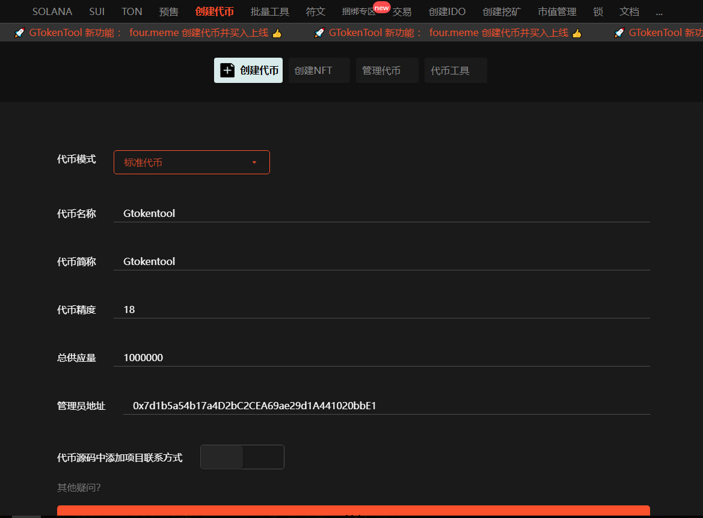
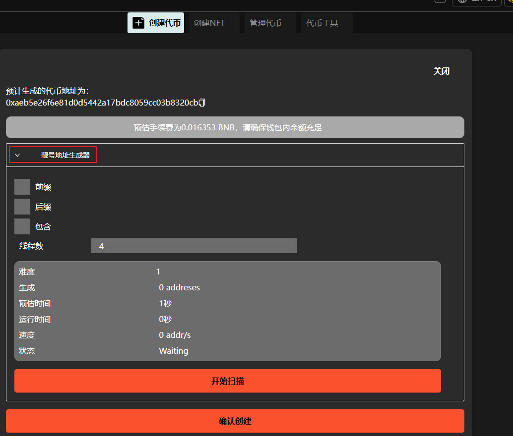
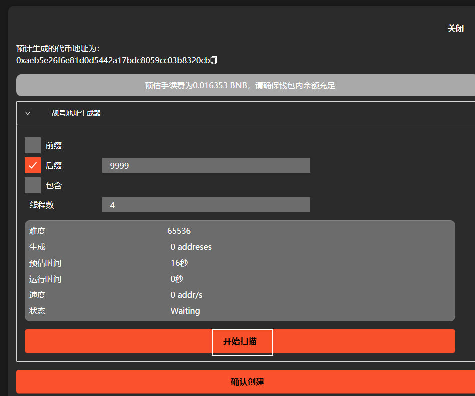
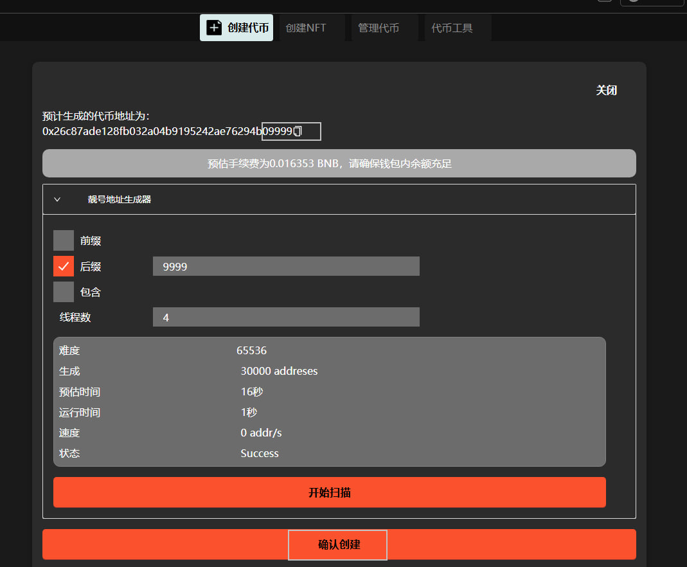

# 合约靓号创建教程

## 合约靓号创建流程

### 1. 进入创建代币页面

我这里选择标准代币，填好代币名称等。

<figure><figcaption>
创建代币
</figcaption></figure>

### 2. 点击创建，打开靓号地址生成器

<figure><figcaption>
打开靓号地址生成器
</figcaption></figure>

### 3. 填入你需要的靓号

可以选择前缀或者后缀，我这里选择后缀9999，点击扫描。

<figure><figcaption>
填入你需要的靓号
</figcaption></figure>

### 4. 检查合约地址，点击确认创建

扫描完成，上方预计地址后缀出现需要的9999，就成功了，点击确认创建，你的合约后缀就是9999了。

<figure><figcaption>
确认创建
</figcaption></figure>

### 🤝 连接 GTokenTool 

* **💬 Telegram社群**：[点击加入官方群组](https://t.me/gtokentool)
* **🐦 Twitter (X)**：[关注我们获取最新动态](https://x.com/gtokentool)
* **📚 官方文档**：[查看 Gitbook 文档](https://docs.gtokentool.com/)
* **💻 开源代码**：[访问 GitHub 仓库](https://github.com/Gtokentool/docs/blob/master/SUMMARY.md)
* **📺 视频教程**：[订阅 YouTube 频道](https://www.youtube.com/@GTokenTool)

> ⚠️ 风险提示与免责声明
>
> GTokenTool 保留随时全权酌情因任何理由修改、变更或取消此公告的权利，无需事先通知。
>
> 以上信息内容仅供参考，GTokenTool 对本平台上的任何虚拟资产、产品或促销活动不做任何推荐或保证。虚拟资产的价格波动很大，投资交易虚拟资产将面临巨大风险。**请谨慎投资。**
