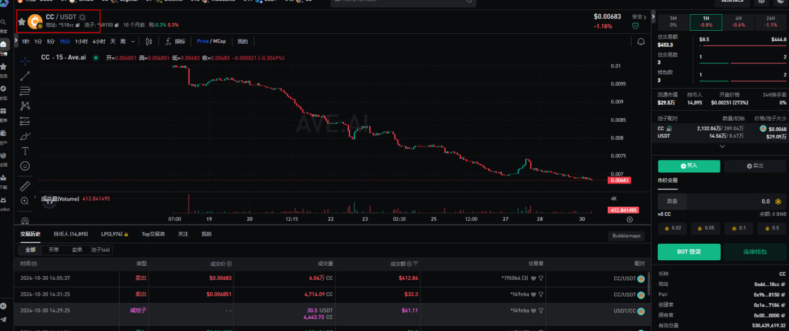
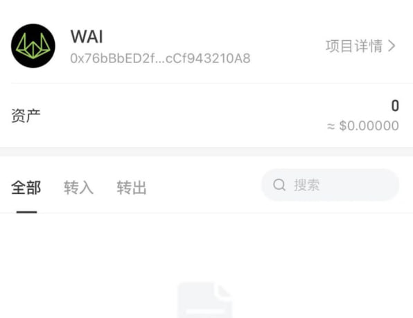
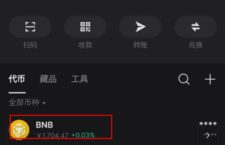
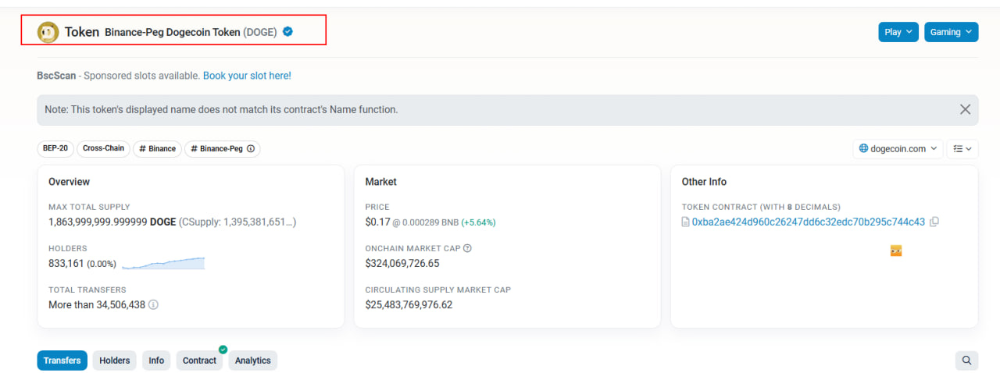
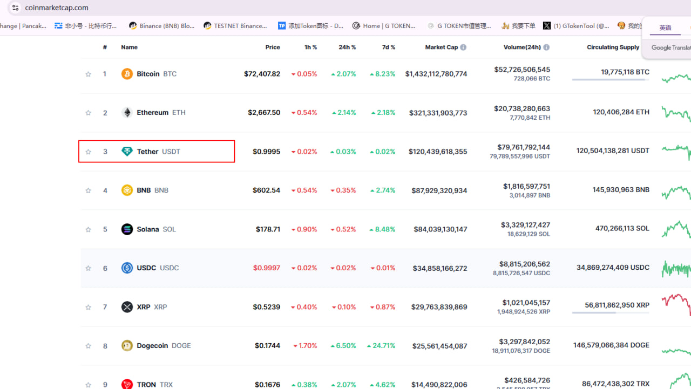

# 代币怎么上头像logo？

## 解决代币没有logo的问题

代币的本质是一个合约，不存在logo。目前我们看到的所有的代币logo，都是由各个平台自己加上去的，其目的是为了方便展示、提高代币的可信度等等。

因此，要想使你的代币有logo头像显示，必须去各个平台申请才行。以下是一些申请渠道和方法：

## 1、Ave.ai的代币头像申请方法 

Ave的代币logo和币种信息、社交媒体链接是一起申请的，目前来说花钱就能搞。

<figure><figcaption></figcaption></figure>

<mark style="background-color:blue;">Ave图标显示</mark>

* **费用：**&#x33;00U\~350U（包含简介、社群等）
* **审计：**&#x33;00U\~350U
* **难度：**&#x975E;常低
* **要求：**&#x57FA;本没要求
* **时间：**&#x5F53;天搞定
* **联系：**&#x53EF;以自己联系Ave客服，或者找[https://t.me/xuxugege](https://t.me/xuxugege)
* **成功率：**&#x31;00%

## 2、TP钱包的代币头像申请方法 

TP钱包的代币logo，需要通过他们官方的Github页面，按照他们的操作流程申请，并不是花钱就能搞定的。具体申请方法，可参照这篇文档：[https://help.tokenpocket.pro/cn/developer/submit-logo](https://help.tokenpocket.pro/cn/developer/submit-logo)

<figure><figcaption></figcaption></figure>

<mark style="background-color:blue;">TP钱包logo</mark>

* **费用：10**w个TPT
* **难度：**&#x8F83;高
* **要求：**&#x6B63;规的官网、代币信息，合约没有黑名单/暂停交易等功能
* **时间：**&#x33;\~5个工作日
* **联系：**&#x53EF;以自己去Github提交，或者联系[https://t.me/xuxugege](https://t.me/xuxugege)
* **成功率：**&#x39;9%
* **GitHub提交：**[https://github.com/TP-Lab/tokens](https://github.com/TP-Lab/tokens)

## 3、Bitget钱包的代币头像申请方法 

Bitget钱包（原名：BK钱包）的代币头像，一般来说是通过他们的电脑端官网进行申请的，填写号相关信息，等着审核就行了。有时候会审核不通过，但一般来说都能成功。申请链接：[https://business.bitkeep.com/](https://business.bitkeep.com/)

<figure><figcaption></figcaption></figure>

<mark style="background-color:blue;">BK头像</mark>

* **费用：**&#x32;00U\~300U
* **难度：**&#x8F83;低
* **要求：**&#x6B63;规的官网、代币信息，合约没有黑名单/暂停交易等功能
* **时间：**&#x34;个工作日
* **联系：**&#x53EF;以自己去Bitget提交，或者联系[https://t.me/xuxugege](https://t.me/xuxugege)
* **成功率：**&#x39;9%

## 4、欧易Web3钱包代币头像申请方法 

欧易Web3钱包的代币头像，主要是通过他们的OKLink浏览器申请的。在浏览器申请到头像之后，Web3钱包就会显示。

* **费用：**&#x34;00U
* **难度：**&#x96BE;
* **要求：**&#x6B63;规的官网、代币信息，合约没有黑名单/暂停交易等功能
* **时间：**&#x31;\~2周
* **联系：**&#x53EF;以自己去欧易提交，或者联系[https://t.me/xuxugege](https://t.me/xuxugege)
* **成功率：**&#x34;0%
* **欧易提交：**[https://docs.google.com/forms/d/e/1FAIpQLSclmaci1m0y6JB5A-o7xu4akvhXNlzgyBqP5\_9fpf\_6TTNSMQ/viewform](https://docs.google.com/forms/d/e/1FAIpQLSclmaci1m0y6JB5A-o7xu4akvhXNlzgyBqP5_9fpf_6TTNSMQ/viewform)

## 5、浏览器申请代币头像 

浏览器的图标，指的是各代币在所属链的浏览器里申请图标。例如你已经在币安链上发行了代币，那么就可以在币安链上申请图标、官网等资料。

<figure><figcaption></figcaption></figure>

<mark style="background-color:blue;">浏览器代币主页</mark>

* **费用：**&#x6570;百U
* **难度：**&#x5F88;高
* **要求：**&#x6B63;规的官网、代币信息，社交媒体链接、官网邮箱、创建者钱包
* **时间：**&#x37;个工作日
* **联系：**&#x53EF;以自己去浏览器提交资料，或者联系[https://t.me/xuxugege](https://t.me/xuxugege)
* **成功率：**&#x33;0%

## 6、CoinMarketCap/CoinGecko申请收录 

CoinMarketCap（简称：CMC）和CoinGecko（简称：CG）是全球加密圈最知名的数据聚合平台，一般来说，如果您的代币可以被这CMC和CG收录，则表明该项目具有巨大的认可度，相当于有背书、有国际机构认可，对于项目的营销宣传将起到巨大的作用。

<figure><figcaption></figcaption></figure>

<mark style="background-color:blue;">CoinMarketCap代币页面</mark>

* **费用：**&#x6570;千U
* **难度：**&#x6781;高
* **要求：**&#x6B63;规的官网、代币信息，社交媒体链接、官网邮箱、预售信息
* **时间：**&#x37;个工作日
* **联系：**&#x53EF;以自己去官网提交资料，或者联系[https://t.me/xuxugege](https://t.me/xuxugege)
* **成功率：**&#x33;0%

## 7、PancakeSwap/Uniswap代币图标申请 

当我们在PancakeSwap或者Unsiwap搜索代币合约进行交易时，有些知名代币会有logo，如USDT、USDC等，大部分则没有logo。这个图标，是没有官方申请渠道的。通常来说，如果您的代币logo在CMC/CG/浏览器已经被收录，那么PancakeSwap等去中心化交易所就有可能会抓取你的logo。

如有不明白或者不清楚的地方，请加入官方电报群：[https://t.me/gtokentool](https://t.me/gtokentool)
