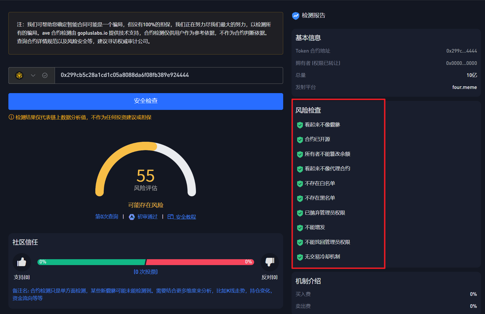

# Ave检测怎么才能全绿?

Ave检测全绿，指的是在Ave安全检测页面，没有任何风险，所有提示都被标注为绿色，如下图：

<figure><figcaption>
Ave全绿效果展示
</figcaption></figure>

## 如何达到Ave检测全绿的效果？

### 1、标准合约自动全绿 

通过GTokenTool创建标准合约，可以实现Ave检测自动全绿，创建地址：[https://www.gtokentool.com/tokenfactory?chainId=56](https://www.gtokentool.com/tokenfactory?chainId=56)

### 2、分红合约如何全绿？ 

分红合约进行Ave检测时，可能会有白名单、黑名单等相关提示，无须担心。首先在确定合约税率无需修改之后，将**合约权限丢弃**，然后进入Ave电报群找到志愿者客服进行复查，即可实现全绿。

* Ave电报群：[https://t.me/ave\_community\_zh](https://t.me/ave_community_zh)
* 相关话术：亲爱的管理,你好, 这是合约地址 (你的合约) 已弃权 麻烦复查下 谢谢

如果管理员不搭理你，就意味着需要花钱上审计了。Ave在检测结果里，会给代币加一个“完成审计”的标志，默认加了审计的都会全绿。就是需要付费，价格100U左右。

<figure><figcaption></figcaption></figure>

### 3、买入税率显示100%怎么解决？

如果你在创建合约的时候，开启了“手动开盘”的功能，那么在你开盘之前，买入税率就是100%，因为其他人无法买入。手动开盘之后，使用非白名单地&#x5740;**（非权限地址和非营销地址）**&#x4E70;入几笔，证明任何人都可以买入。那么Ave在检测到这些交易后，会自动下调买入税率。

### 4、卖出税率为什么不准确？ 

在一些分红合约里，Ave显示的卖出税率会高出实际设置的税率。导致出现该问题的原因在于，用户在卖出时会进行分红，从而将税率拉高，Ave基于实际卖出的情况，显示的税率就会波动起来，经常变化。解决这个问题有两个办法：

1、用非白名单地址多卖几笔，Ave会自动下调卖出税率。

2、进入Ave电报群找客服志愿者申诉，他们在复查后会显示固定税率，不会再波动。

3、找Ave上头像的时候也可以填写税率，这个填完之后就是固定的了。

### 🤝 连接 GTokenTool 

* **💬 Telegram社群**：[点击加入官方群组](https://t.me/gtokentool)
* **🐦 Twitter (X)**：[关注我们获取最新动态](https://x.com/gtokentool)
* **📚 官方文档**：[查看 Gitbook 文档](https://docs.gtokentool.com/)
* **💻 开源代码**：[访问 GitHub 仓库](https://github.com/Gtokentool/docs/blob/master/SUMMARY.md)
* **📺 视频教程**：[订阅 YouTube 频道](https://www.youtube.com/@GTokenTool)

> ⚠️ 风险提示与免责声明
>
> GTokenTool 保留随时全权酌情因任何理由修改、变更或取消此公告的权利，无需事先通知。
>
> 以上信息内容仅供参考，GTokenTool 对本平台上的任何虚拟资产、产品或促销活动不做任何推荐或保证。虚拟资产的价格波动很大，投资交易虚拟资产将面临巨大风险。**请谨慎投资。**
