# X Layer代币开源验证教程

很多人在GTokenTool创建了代币后不知道怎么开源，今天这个教程，就是教大家为X Layer（OK链）代币进行开源验证。

## **什么是开源？** 

所谓开源，就是将代币合约代码完完整整的展示出来，让任何人都可以通过区块链浏览器看到你的代币代码，这样代码里有没有后门就一目了然了，开源的目的也是为了让用户放心。

## **X Layer 代币开源步骤** 

### **1、进入管理代币页面**

首先，我们需要先进入管理代币页面：[https://www.gtokentool.com/managetokens?chainId=196](https://www.gtokentool.com/managetokens?chainId=196)

进入页面后，选择X Layer链并连接钱包。

<figure>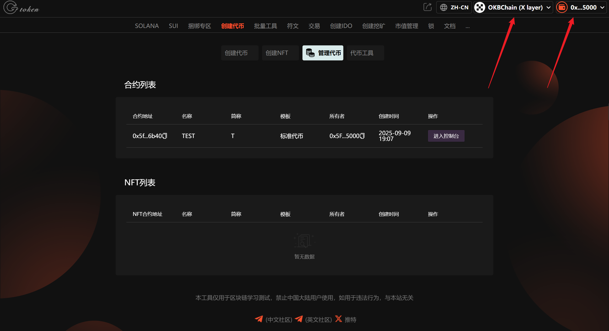<figcaption>
连接钱包并选择X Layer链
</figcaption></figure>

### **2、选择代币进入控制台**

<figure>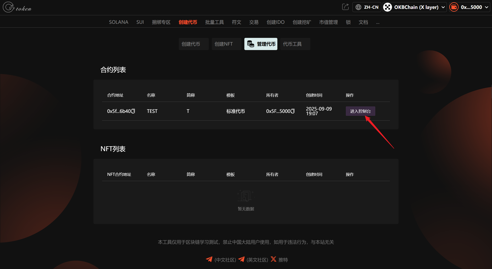<figcaption>
选择代币进入控制台
</figcaption></figure>

### **3、点击“进入区块浏览器”**

<figure>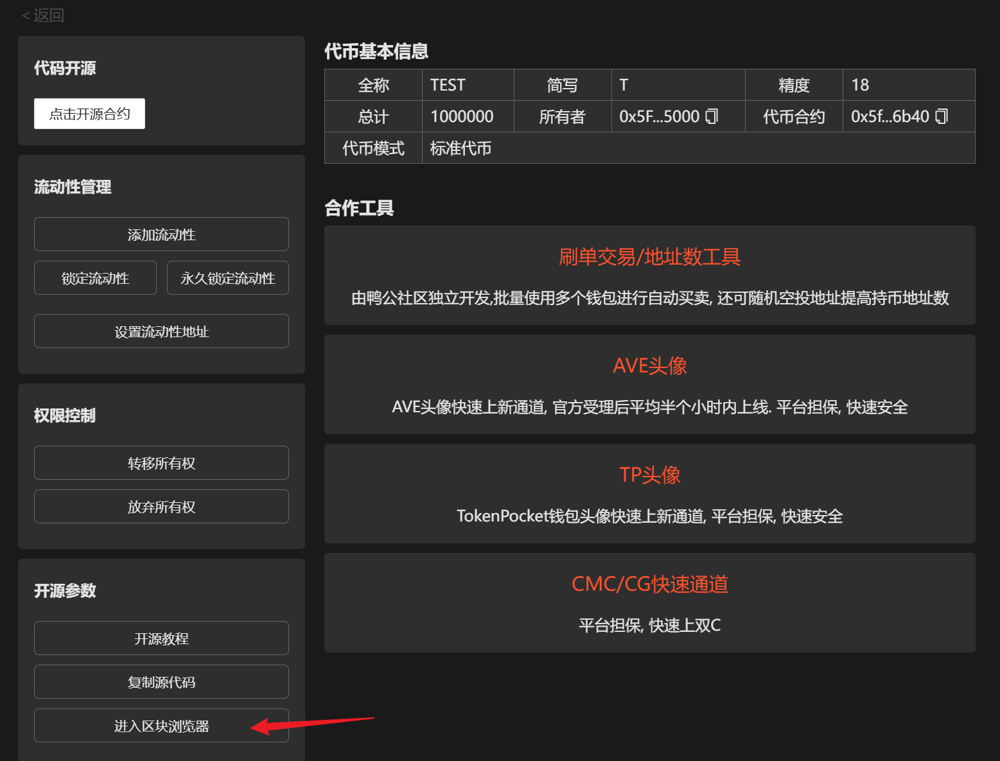<figcaption>
进入区块链浏览器
</figcaption></figure>

### **4、点击“合约”**

<figure>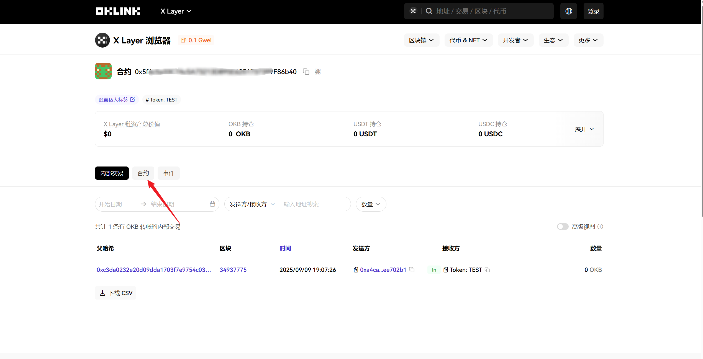<figcaption>
点击“合约”
</figcaption></figure>

### **5、点击“去验证合约”**

<figure>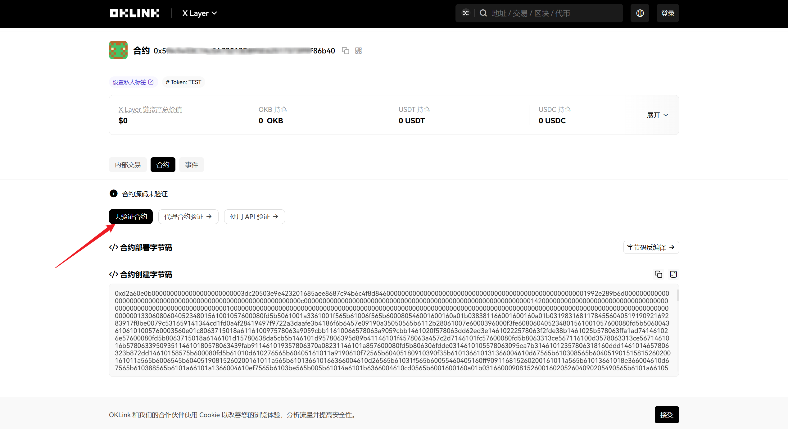<figcaption>
点击“去验证合约”
</figcaption></figure>

### 6. 填写对应参数

**合约地址：**&#x8F93;入代币合约地址。

**编译器类型：**&#x53;olidity(SingleFile)

**编译器版本：**&#x76;0.8.6+commit.11564f7e

填写好后，点击“`下一步`”。

<figure>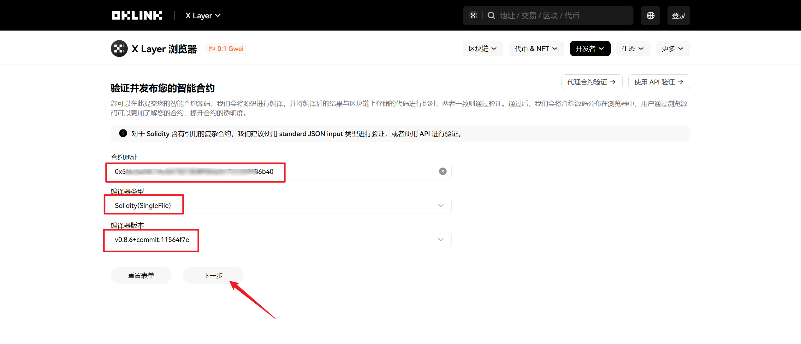<figcaption>
填写对应参数
</figcaption></figure>

### 7. 选择对应参数

**是否优化：**&#x662F;

**优化：**&#x32;00

**是否基于IR：**&#x5426;

**开源许可类型：**&#x4D;IT License (MIT)

**虚拟机版本：**&#x64;efault

<figure>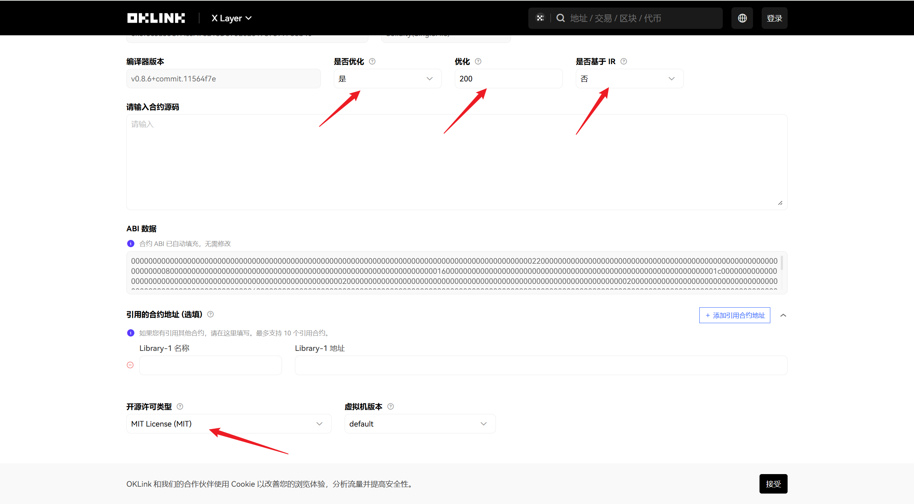<figcaption>
选择对应参数
</figcaption></figure>

### 8. 复制源码

回到控制台页面，点击“`复制源代码`”。

<figure>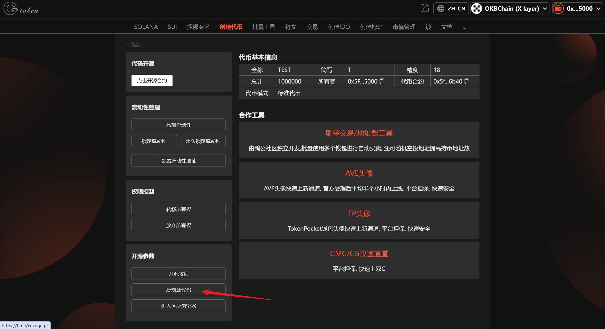<figcaption>
复制源代码
</figcaption></figure>

复制好后，粘贴到开源页面。

<figure>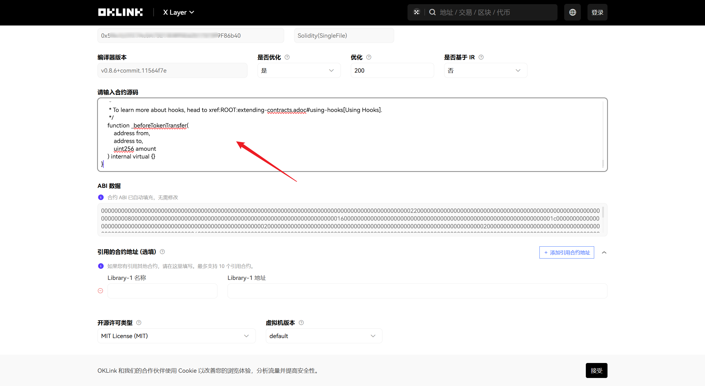<figcaption>
粘贴合约源码
</figcaption></figure>

### 9. 点击“提交”

<figure>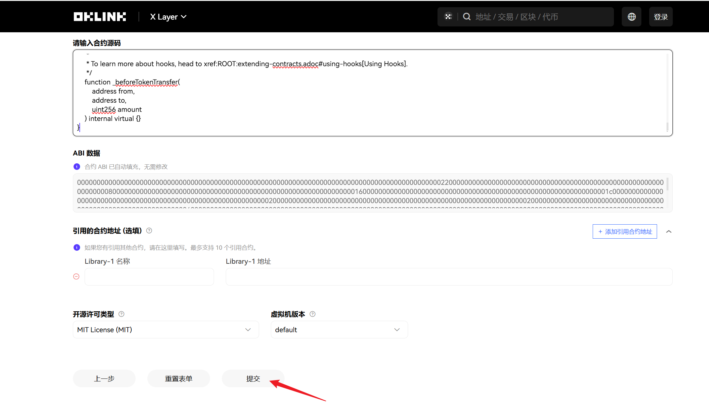<figcaption>
点击“提交”
</figcaption></figure>

等待一会就开源成功了。

<figure>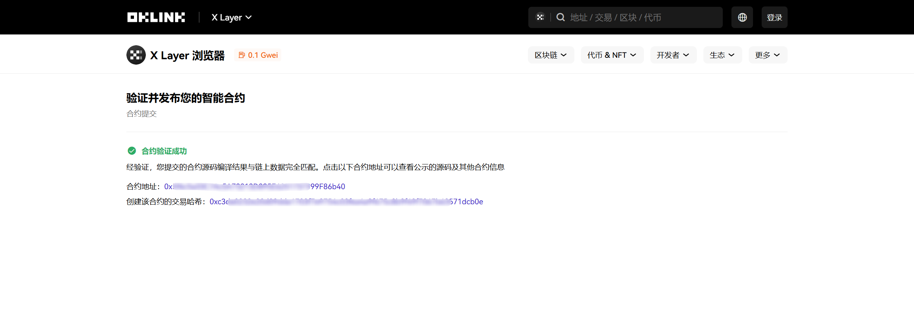<figcaption>
开源成功
</figcaption></figure>

点击合约地址，然后点击“`合约`”，可以看到合约已开源。

<figure>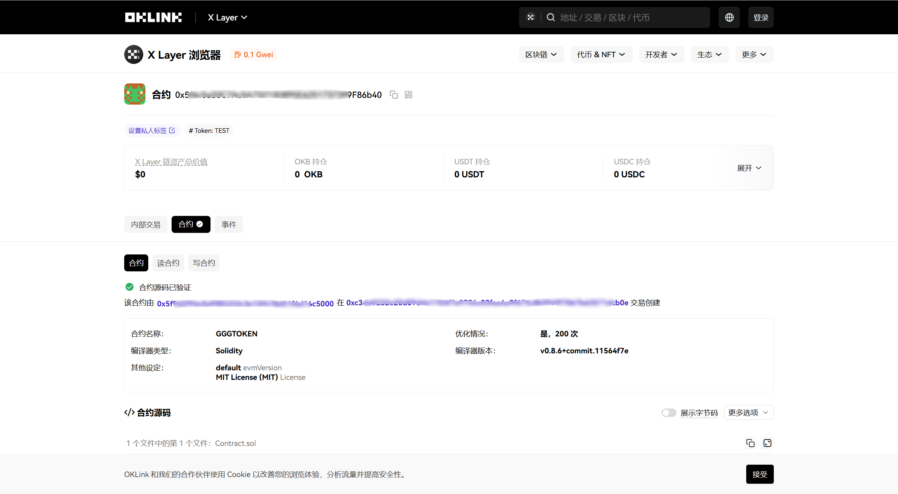<figcaption>
合约源码已验证
</figcaption></figure>

### 🤝 连接 GTokenTool 

* **💬 Telegram社群**：[点击加入官方群组](https://t.me/gtokentool)
* **🐦 Twitter (X)**：[关注我们获取最新动态](https://x.com/gtokentool)
* **📚 官方文档**：[查看 Gitbook 文档](https://docs.gtokentool.com/)
* **💻 开源代码**：[访问 GitHub 仓库](https://github.com/Gtokentool/docs/blob/master/SUMMARY.md)
* **📺 视频教程**：[订阅 YouTube 频道](https://www.youtube.com/@GTokenTool)

> ⚠️ 风险提示与免责声明
>
> GTokenTool 保留随时全权酌情因任何理由修改、变更或取消此公告的权利，无需事先通知。
>
> 以上信息内容仅供参考，GTokenTool 对本平台上的任何虚拟资产、产品或促销活动不做任何推荐或保证。虚拟资产的价格波动很大，投资交易虚拟资产将面临巨大风险。**请谨慎投资。**
