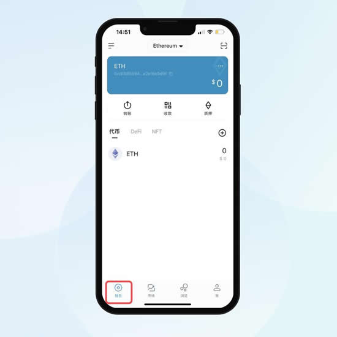

# 币圈的钱包怎么玩? 币圈imtoken钱包安装和使用教程

币圈的钱包是一种允许大家转移和存储加密货币的设备或程序，并且现在市面上有不同类型的加密钱包，例如纸钱包、硬件钱包和软件钱包，而加密钱包的安全性取决于私钥的存储方式，这也是币圈的钱包的重要部分。私钥就像保险箱的钥匙，任何有权访问钱包私钥的人都可以控制那里的余额。虽然加密货币本身的想法对许多人来说仍然是新的，但加密钱包本身的设计是为了方便用户使用。很多投资者都想要知道这个币圈的钱包怎么玩？下面就让[**GTokenTool**](https://www.gtokentool.com)为大家带来币圈钱包使用教程。

## 币圈的钱包怎么玩？

今天GTokenTool就以imToken钱包为例，简单介绍一下币圈的钱包怎么玩？

imToken有四个主要功能页：钱包、市场、浏览和我。对于首次使用imToken的新用户，了解这些功能页能帮助你快速入门imToken。

### 钱包-管理你的多链资产

imToken支持Ethereum、Bitcoin和TRON等12条主流公链，你可以点击「钱包」页面左上角的菜单栏，切换至不同公链钱包进行资产管理。

同时imToken还支持Arbitrum、Optimism等Layer2网络的钱包以及BSC、Avalanche、Polygon等主流EVM兼容链的钱包，通过「自定义节点」功能即可切换至不同网络/链上的钱包并体验其丰富的生态DApp。

<figure><figcaption></figcaption></figure>

### 市场-安全便捷的币币兑换

在「市场」页面，你不仅可以查看最新行情，还可以使用imToken深度集成的去中心化交易所Tokenlon实现安全便捷的币币兑换。

<figure><figcaption></figcaption></figure>

### 浏览-开放的DApp

imToken内置了开放的DApp浏览器功能，你可以在「浏览」页面输入任意DApp网址，即可访问和使用DApp。或搜索关键词，如「Uniswap」，即可发现对应的主流DApp。

<figure><figcaption></figcaption></figure>

### 我-管理你的imToken

在「我」页面，你可以通过「管理钱包」和「使用设置」等功能管理你的imToken，进行助记词备份，指纹/面容ID登陆，语言切换等操作。如果你想学习imToken的基础操作和安全知识，可点击「钱包指南」查看。

<figure><figcaption></figcaption></figure>

## 币圈的钱包类型汇总

加密钱包的范围从简单易用的应用程序到更复杂的安全解决方案。您可以选择的主要钱包类型包括：

**纸钱包：**&#x94A5;匙写在纸等物理介质上，并存放在安全的地方。这当然会使您的加密货币更难使用，因为作为数字货币，它只能在互联网上使用。

**硬件钱包：**&#x5BC6;钥存储在拇指驱动设备中，该设备保存在安全的地方，只有在您想使用加密货币时才连接到计算机。这个想法是试图平衡安全性和便利性。

**在线钱包：**&#x5BC6;钥存储在应用程序或其他软件中——寻找受两步加密保护的。这使得发送、接收和使用您的加密货币就像使用任何在线银行账户、支付系统或经纪一样容易。

每种类型都有其权衡。纸质钱包和硬件钱包因为离线存储而更难被恶意用户访问，但它们的功能有限，并且存在丢失或破坏的风险。由Coinbase等主要交易所提供的在线钱包是开始使用加密货币并提供安全性和易于访问的平衡的最简单方法。(因为您的私人信息是在线的，所以您对黑客的保护与您的钱包提供商的安全性一样好-因此请确保您寻找两因素验证等功能。)

大家在选择适合自己的钱包时，需要注意冷钱包天生就比热钱包更安全，因为它没有连接到互联网。大多数加密货币攻击都发生在黑客攻击在线钱包服务并将密钥转移到他们自己的钱包时，本质上也是转移相关资金。钱包最难的部分是它们负责安全存储小型、高度敏感的数据，用于从区块链加密货币账户窃取资金的最常见攻击媒介之一是接管客户账户，所以建议大家不要将任何加密货币余额存储在在线钱包中。

以上就是币圈的钱包怎么玩? 币圈imtoken钱包安装和使用教程的详细内容，如有不明白或者不清楚的地方，请加入官方电报群：[https://t.me/gtokentool](https://t.me/gtokentool)
