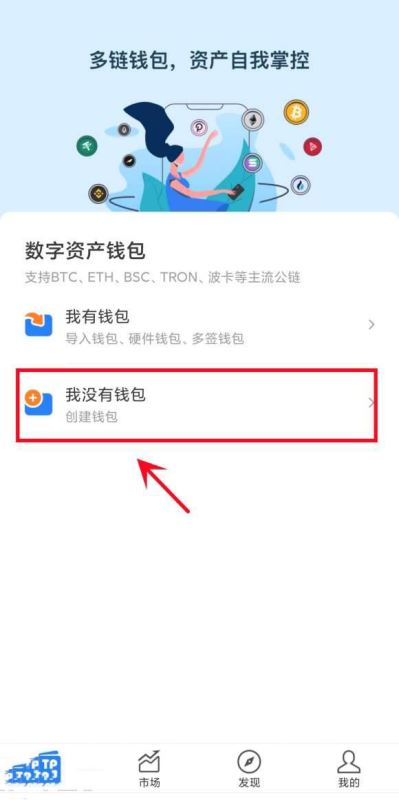

# 比特币个人钱包怎么创建账号？比特币个人钱包创建账号教程

大多数投资者为了保障自己比特币资产的安全，通常会将比特币存储到比特币钱包当中，随着区块链技术的发展，比特币钱包允许用户管理他们的比特币资产，并与其他用户进行交易。而存储到比特币钱包的第一步就是申请比特币钱包账号，但对于很多新手来说还不知道比特币个人钱包怎么创建账号？其实创建账号还是很简单的，主要就是先选择一个钱包后进行登录注册就行。下面[**GTokenTool**](https://www.gtokentool.com)为大家详细说说创建账号的教程：

<figure><figcaption></figcaption></figure>

## 比特币个人钱包怎么创建账号？

比特币个人钱包创建账号还是很简单的，主要就是选择一个钱包登录注册，下文以TP钱包为例创建账号的教程：

1、打开TokenPocket钱包后，点击【我没有钱包】

<figure><figcaption></figcaption></figure>

2、选择想要创建的底层钱包；(此处以比特币钱包为例)

<figure><figcaption></figcaption></figure>

3、点击【创建钱包】；

<figure><figcaption></figcaption></figure>

4、依次设置【钱包名】和【密码】，然后勾选【服务及隐私条款】，点击【创建钱包】；

<figure><figcaption></figcaption></figure>

5、进入备份助记词页面后，请勿截图助记词，备份后点击【备份完成，进行验证】；

<figure><figcaption></figcaption></figure>

## 比特币个人钱包创建账号失败怎么回事？

比特币个人钱包创建账号失败可能是因为网络问题、钱包问题、设备兼容性问题等等，下文是失败的原因以及原因和解决方法：

1. **网络问题：**&#x5982;果您在创建账号时遇到网络问题，例如连接超时或网络不稳定，可能会导致创建失败。请确保您的网络连接稳定，并尝试重新创建账号。
2. **钱包服务问题：**&#x6709;时候钱包服务可能会遇到问题，例如服务器故障或维护。在这种情况下，您可以尝试等待一段时间，并在稍后再次尝试创建账号。
3. **钱包软件版本问题：**&#x5982;果您使用的是钱包应用程序，可能会存在软件版本问题。尝试更新您的钱包应用程序到最新版本，然后再次尝试创建账号。
4. **设备兼容性问题：** 某些钱包应用程序可能不兼容特定的设备或操作系统。确保您使用的设备和操作系统符合钱包的要求，并查看钱包提供商是否有针对您的设备的兼容性建议。
5. **服务器负载问题：**&#x5982;果钱包服务的服务器负载过高，可能会导致创建账号失败。在这种情况下，您可以尝试在非高峰时段再次尝试创建账号。

以上全部内容就是对比特币个人钱包怎么创建账号这一问题的解答，创建比特币钱包是为了提供安全、自主、便捷的比特币管理和交易体验。通过拥有自己的比特币钱包，用户可以更好地控制和管理他们的比特币资产，同时享受更高的隐私保护和交易自由度。需要注意的是，钱包的创建过程可能会因钱包类型和提供的服务而有所不同，但通常都是类似的。在创建钱包时，请务必遵循安全的最佳实践，保护好自己的私钥和种子短语，以确保自己的资产安全。

如有不明白或者不清楚的地方，请加入官方电报群：[https://t.me/gtokentool](https://t.me/gtokentool)
