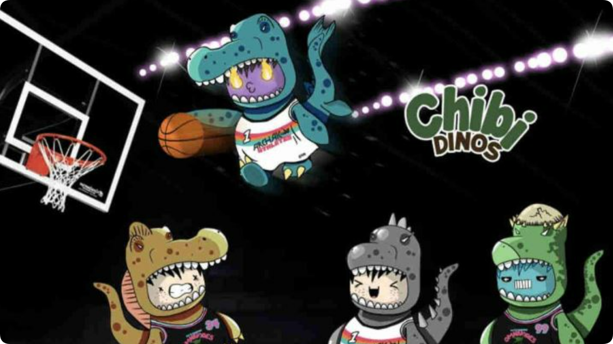

# HOOP是什么币种？HOOP币怎么样？

HOOP币的英文全称是Chibi Dinos，其实这个Chibi Dinos是一个不断扩展的生态系统，跨越Metaverse和Play to EarnGaming，允许玩家互动、预测、竞争和收集。玩家以社区为中心和驱动，故事和游戏玩法将受到用户的影响和指导。Chibi Dinos Universe的旗舰游戏是Primal Hoop，这是一款竞技玩家控制的街机风格篮球游戏，具有单人和多人游戏模式以及冒险角色扮演游戏。那么究竟这个HOOP是什么币种？大家想要知道这个HOOP币怎么样？下面[GTokenTool](https://www.gtokentool.com)为大家介绍一下。

<figure><figcaption></figcaption></figure>

## HOOP是什么币种？

Chibi Dinos LLC是一个NFT和娱乐生态系统，它创造无限的实用性和游戏机会，以赢得竞争、社区参与和整体乐趣和兴奋。Chibi Dinos是您穿越元宇宙与现实世界之间桥梁的向导，为您提供无数的体验，让您在双方发现。

DreamView是一家全球可扩展的技术公司，为世界各地的小型企业提供创意战略和内容解决方案。通过创建动态的、身临其境的、常青的和无限可重复使用的数字内容和体验，DreamView继续彻底改变围绕客户产品的创建、管理、分发、许可和货币化，颠覆数字内容的基本结构和未来。

DreamView团队由开创CGI、视觉效果和3D技术的同一批梦想家创立，这些技术已在许多最大的大片、AAA游戏和主要品牌活动中得到利用，DreamView团队拥有数十年的经验，重新构想如何以视觉和虚拟方式呈现现实(及超越)。该团队以快速、经济高效地制作超现实、为委托他们捕捉、提升和发展其产品/客户体验的国际品牌领导者提供优质且可扩展的体验内容。

DreamView专有的、基于云的ImageEngine Technology™、可扩展的制作解决方案和弹性的内容交付基础设施已大大降低了客户的成本和上市速度。凭借以品牌为中心的方法和强大的创新能力，DreamView弥合了虚拟商品在现实世界、数字空间以及介于两者之间的展示方式和位置的差距。

## HOOP币怎么样？

HOOP币目前价格很低，该项目仅上架了一家交易所，其存在流动性不足的风险，新手投资者还需注意其中风险。

DreamView首席执行官纳撒尼尔·亨特(Nathaniel Hunter)说：“我们很高兴有这个机会来创造赤壁恐龙游戏世界。“我们相信这个项目。数字和现实世界社区创始人Sean Kelly和Chibi Dinos团队已经建立的东西非常了不起。这是一个很棒的概念，我们很高兴能帮助Chibi Dinos进入他们的第一次元宇宙体验。”

赤壁恐龙是10,000个独特生成的风格化2D角色中的一个，由薄荷的随机组合特征组成，3D渲染角色将在6-8周内发布。没有两个恐龙是一样的。在Primal Hoop中，Chibis都参加了由现实世界职业NBA/WNBA球员担任队长的十支不同的恐龙主题篮球队之一。

“在考虑开发Primal Hoop游戏时，我们经历了一个全面的RFP流程，在审查了数十个提案后，我们有信心选择DreamView作为我们的首席开发人员，”Chibi Dinos的创始人Sean Kelly说。“不仅是他们在NFT领域内外创造创新手机游戏的记录，而且吸引我们的是公司的领导层。在NFT领域，很少有人直接与CEO合作开展像我们这样处于早期阶段的项目。”

对于HOOP是什么币种以及HOOP币怎么样这两个问题的具体阐述。凭借以品牌为中心的方法和强大的创新能力，DreamView弥合了虚拟商品在现实世界、数字空间以及介于两者之间的展示方式和位置的差距。要了解更多信息，请访问可扩展的生产解决方案和弹性的内容交付基础设施大大降低了客户的成本和上市速度。凭借以品牌为中心的方法和强大的创新能力，DreamView弥合了虚拟商品在现实世界、数字空间以及介于两者之间的展示方式和位置的差距。

如有不明白或者不清楚的地方，请加入官方电报群：[https://t.me/gtokentool](https://t.me/gtokentool)
