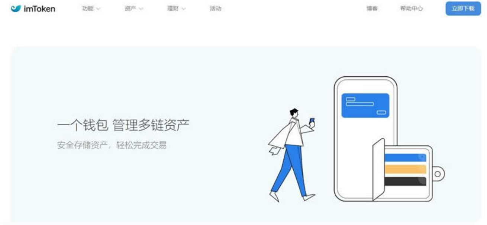

# imToken钱包被盗可以追回吗？imToken钱包被盗怎么防范？

imToken钱包是一款去中心化钱包，也是区块链中数字资产的管理工具，旨在为投资者提供安全、可信赖的数字资产管理服务，虽然它只是一个小型的数字钱包，但是它却可以轻松管理多链资产，此外，imToken钱包还配备了imKeyPro硬件钱包，离线签名的冷钱包可以更好的保障资产的安全性，而用户在使用数字货币钱包时，最关心的问题也是它的安全性，因此不少投资者想知道imToken钱包被盗可以追回吗？下面[**GTokenTool**](https://www.gtokentool.com)将带大家一文彻底弄清。

<figure><figcaption></figcaption></figure>

## imToken钱包被盗可以追回吗？

imToken钱包被盗后是不可以追回的，由于区块链的去中心化的性质，一旦交易确认且转移完成，资产就无法被撤销或追回，因此，如果您的资产被盗并且已经被转移，那么很遗憾，它们是无法被追回的。但不少用户在发现资产被盗后，立马选择报警，如果警察可以及时抓住罪犯，并且资产还未被转移，这种情况下也是有可能追回的。

用户也可以第一时间通过与imToken的支持团队联系，向他们报告此事，并希望他们能够提供帮助，但是，您需要注意的是，这并不保证他们能够追回您的资产，因此，保护自己的资产安全仍然是您最重要的责任，为了防止资产被盗的情况出现，建议用户在安全的环境下使用imToken钱包，不要在人多的地方或网络不安全的地方操作，防止不法分子观察或窃取。

## imToken钱包被盗怎么防范？

在用户日常使用imToken钱包的过程中，可能会遇到黑客攻击、恶意软件下载等情况，因此钱包防盗也同样十分重要下面是GTokenTool整理的imToken钱包防盗的防范措施：

1. **防盗保护措施**

防止不法分子通过各类黑客手段获得私钥信息，建议开启通过imToken钱包内置的钱包防盗保护措施，包括指纹登录、Apple FaceID、PIN码等多重保护方式，让钱包私钥处于最高的安全防护状态。

2. **下载应用时从正规渠道下载**

不要轻信各种下载链接，通过imToken官网或是应用商店等正规渠道进行下载，不要轻易相信来历不明的信息，避免因下载恶意软件而导致信息泄露和资产损失。

3. **网络安全意识和防范意识**

保持对网络安全的高度警惕并学会掌握钱包使用方法，不随意点击链接或下载来路不明的软件，养成良好的IT安全习惯，随时关注imToken钱包软件的维护更新，降低因软件存在漏洞而引起的损失。

以上内容就是**GTokenTool**对于imToken钱包被盗可以追回吗这一问题的详细解答。为了更好的保护imToken钱包信息的安全，用户需要采取多重保护措施，例如开启二次验证账号，设置手机验证、邮箱验证双重身份验证，保障个人信息不会轻易被盗取，同时为钱包信息加密，使用安全防护软件保证自身信息的安全，设置密码保护，确保信息不会被第三方获得，并且定期对imToken钱包软件升级，确保自身的资产安全不会轻易受到不法分子的攻击。

如有不明白或者不清楚的地方，请加入官方电报群：[https://t.me/gtokentool](https://t.me/gtokentool)
