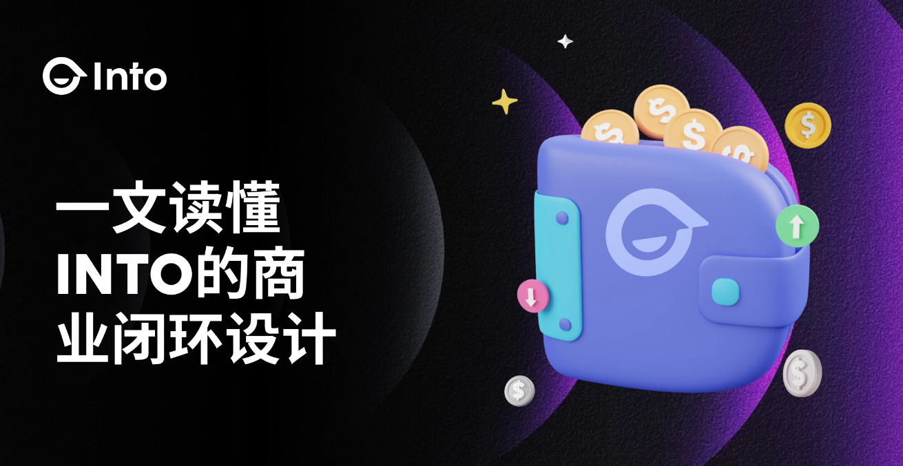

# INTO是什么？Web3社交的商业闭环革命

## 一、数据反抗：Web3社交崛起的必然性

数据主 权的觉醒标志着一个新时代的到来。在Web2时代，用户的个人信息成为科技巨头的摇钱树，而真正的创造者却无法从中获益。这种失衡激发了人们对数据主 权的强烈渴望，Web3的出现正是对这种呼声的回应。它承诺将数据的控制权交还给用户，重塑数字世界的权力结构。

与此同时，传统注意力经济模式也走到了尽头。社交平台过度依赖广告收入，导致用户体验不断劣化，内容质量每况愈下。Web3社交开辟了一条新路，它将用户的参与直接转化为可量化的价值，颠覆了传统的利益分配模式。

<figure><figcaption></figcaption></figure>

去中心化浪潮的兴起更是为Web3社交提供了肥沃的土壤。中心化平台的弊端日益显现，从隐私泄露到言论审查，用户对自由、透明的社交环境的渴望与日俱增。区块链技术的成熟为这一诉求提供了技术支撑，使得真正去中心化的社交平台成为可能。

金融创新的浪潮也在推动Web3社交的发展。传统金融体系的局限性催生了 DeFi 的繁荣，而 SocialFi 则是这一创新浪潮在社交领域的延伸。它不仅创造了全新的商业模式，还大大降低了普通用户参与金融活动的门槛，开启了一个更加包容、普惠的金融新时代。

技术融合更是为Web3社交的崛起提供了坚实基础。区块链、人工智能和大数据分析能力的飞速发展，为创新型社交平台提供了前所未有的可能性。这三大技术的协同效应，正在重塑我们与数字世界互动的方式，开创一个更智能、更安全、更高效的社交新纪元。

## 二、解密 INTO：一个自我进化的数字生态系统

INTO 的核心魅力在于其独特的 SocialFi 模式。在这个创新的生态系统中，用户的每一次社交互动都被精确量化为可兑换的通证，直接将注意力和参与度转化为实际的经济价值。这不仅大大提升了用户的参与积极性，还创造了一个自给自足、良性循环的经济生态。用户不再是平台的产品，而是生态系统的核心驱动力，他们的每一个行为都在为整个生态创造价值，同时也从中受益。

<figure><figcaption></figcaption></figure>

INTO 的内置智能钱包则是连接社交行为和金融活动的关键纽带。这不仅仅是一个简单的资产管理工具，更是一个融合了多链操作、跨链交易的复杂金融系统。用户可以轻松地将社交互动所得的收益转化为其他数字资产，或参与更广泛的 DeFi 活动。这种无缝衔接不仅提升了用户体验，还大大增加了平台的经济活力，形成了一个自我强化的价值循环。

SoulBound Token (SBT) 系统的引入，更是为 INTO 的生态系统增添了革命性的维度。这种不可转让的数字身份凭证，为用户在Web3世界中构建了一个可信的声誉体系。它不仅增强了平台的信任机制，还为未来更复杂的经济活动和社会互动奠定了基础。通过 SBT，用户的社交历史、贡献度、专业技能等都能被公正地记录和认可，为去中心化的信用体系提供了可能性。

此外，INTO 集成的 AI 驱动工具则将平台推向了真正的 DAO。这些工具不仅提升了用户体验，更是为实现高效、公平的社区治理铺平了道路。通过智能化的决策支持系统和自动化的执行机制，INTO 正在探索一种前所未有的社区管理模式，让每个用户都能真正参与到平台的治理中来。

最后，INTO 的全球化战略体现了其宏大的愿景。这不仅仅是简单的多国布局，而是在构建一个跨越文化和地域的全球价值网络。在这个网络中，来自不同背景的用户可以自由地交流、协作，创造出超越地域限制的价值。这种设计不仅拓展了平台的市场，更是在打造一个真正全球化的Web3社交生态。

INTO 的新社交机制堪称一场范式革命。平台设计了一套复杂而精密的算法，能够根据用户行为的质量和影响力动态调整激励。这不仅提高了参与的门槛，也确保了价值分配的公平性。高质量的内容创作、有深度的讨论、有价值的互动都会获得更高的回报，有效抑制了低质量内容和“水军”行为。这种机制不仅激励了用户创造优质内容，还培养了一个高度活跃、充满创造力的社区氛围。

另外，INTO 的用户画像系统是一个技术与人性的完美结合。通过先进的 AI 技术，平台构建了一个多维度、动态更新的用户画像系统。这个系统不仅用于内容推荐，还被用来匹配潜在的社交和商业伙伴。它能深入分析用户的兴趣、行为模式和社交网络，从而提供高度个性化的体验。这不仅大大提升了用户的平台体验，还极大地增强了用户的价值创造能力，形成了一个良性循环。

为了进一步优化产品体验，在技术层面，INTO 的跨链互操作性设计展现了其前瞻性视野。平台支持多链操作，用户可以轻松地在不同区块链网络间转移资产和数据。这种设计不仅增加了用户的选择权，还为 INTO 接入更广泛的Web3生态系统提供了可能。它像一座桥梁，连接了不同的区块链孤岛，为用户打造了一个无缝衔接的Web3体验。

而且，平台还采用了先进的隐私计算技术，如零知识证明和安全多方计算。这些技术使得平台能够在充分保护用户隐私的同时，仍然可以利用数据进行有价值的分析和应用。用户不再需要在隐私和便利之间做出痛苦的选择，INTO 为他们提供了两全其美的解决方案。

综合来看，INTO 的模式很可能对整个互联网生态产生深远的影响。它不仅可能成为连接Web2和Web3的关键桥梁，还可能引领我们进入一个更加开放、公平和充满机遇的数字新时代。对于普通用户来说，这意味着更多的控制权、更公平的回报和更丰富的数字生活 体验。对于创业者和投资者来说，这代表了一个充满无限可能的新蓝海。

如有不明白或者不清楚的地方，请加入官方电报群：[https://t.me/gtokentool](https://t.me/gtokentool)
