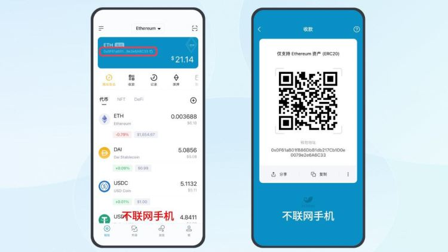

# 冷钱包没有网络可以转账吗？冷钱包转账教程

冷钱包作为一种离线存储加密货币的方式，旨在通过隔绝网络环境来降低数字资产被黑客攻击或丢失的风险。因此从原理上来说，冷钱包在进行转币操作时理论上是不需要直接连接互联网的，但很多投资者对该操作不理解，并且质疑冷钱包没有网络可以转账吗？的可行性。就资料分析来看，冷钱包没有网络不能直接进行转账，但可以借助观察钱包去完成。接下来[**GTokenTool**](https://www.gtokentool.com)为大家详细说说，并介绍一下相关的转账步骤。

## 冷钱包没有网络可以转账吗？

冷钱包没有网络不能直接转账，但可以通过观察钱包进行转账。冷钱包是隔绝网络环境下创建的离线钱包。而观察钱包则主要用于查看冷钱包内的资产情况，协助冷钱包完成转账操作。下文是冷钱包转账教程：

1、创建冷钱包

<figure><figcaption></figcaption></figure>

2、设置观察钱包

<figure><figcaption></figcaption></figure>

3、冷钱包生成授权签名二维码

<figure><figcaption></figcaption></figure>

4、扫描授权签名二维码

<figure><figcaption></figcaption></figure>

5、用观察钱包发起转账，点击需进行转账的代币图标，确认信息后点击「下一步」，生成离线签名二维码。

<figure><figcaption></figcaption></figure>

6、点击 ETH 钱包的扫描按钮，扫描离线签名二维码。确认信息无误后，点击「下一步」，输入密码，点击「授权签名」，生成授权签名二维码。

<figure><figcaption></figcaption></figure>

7、点击「下一步」，点击屏幕中间的「扫码」，扫描不联网手机的授权签名二维码。点击「发送交易」，这样一笔转账交易就被广播出去了。转账成功后，你可通过观察钱包看到冷钱包的余额变化。

<figure><figcaption></figcaption></figure>

## 冷钱包不联网怎么加载数据？

冷钱包不联网加载数据的方法主要涉及到使用离线手机进行操作，通过冷钱包和观察钱包的配合使用，所有常规钱包下的操作都能实现。具体来说除了下载/更新钱包应用时需要联网外，装载冷钱包的手机应始终保持离线状态。这样，即使冷钱包不直接连接到互联网，也能安全地进行交易和其他操作。

例如使用imToken钱包时，可以通过左右滑动资产项来快速操作收款与转账。在收款页面，可以直接复制钱包地址字符串或者二维码给转账方，这个地址字符串与二维码与私钥或者助记词不同，可以放心发送给别人，不用担心安全问题。

如果遇到需要指定金额的收款时，可以点击“指定金额”键，在弹出的金额框中输入金额数量，点击确定即可完成操作。此外对于不同类型的冷钱包，如TP离线冷钱包，其操作流程也是类似的。通过冷钱包和观察钱包的配合，可以实现所有常规的钱包操作。

以上全部内容就是对冷钱包没有网络可以转账吗这一问题的解答，冷钱包通常是指一种离线存储数字货币的钱包，与互联网断开连接，由于它不与互联网连接，因此在一般情况下，冷钱包是无法直接进行数字货币的转账或交易的。当将资产从热钱包或交易所转移到冷钱包时，确保传输通道的安全，以防止信息截获或篡改。用户需要定期备份冷钱包的私钥或种子短语，并将备份存储在安全的地方，以防止设备故障或丢失时能够恢复资产。

如有不明白或者不清楚的地方，请加入官方电报群：[https://t.me/gtokentool](https://t.me/gtokentool)
