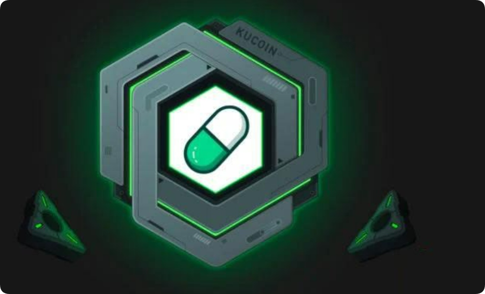

# meme币为何如此火爆？meme币的起源与崛起?

meme币的概念最早可以追溯到2013年，当时一款基于网络流行文化的加密货币——狗狗币（Dogecoin）正式上线。起初，狗狗币只是为了讽刺比特币热潮而开发的一个玩笑性质的项目，但它却在加密货币市场中获得了出人意料的成功。尤其是当狗狗币得到了互联网社区的大力支持后，其市值曾在2021年达到近900亿美元的巅峰，成为了全球前十大加密货币之一。

<figure><figcaption></figcaption></figure>

狗狗币的成功引发了大量模仿者的出现，其他基于网络文化和流行元素的meme币也开始如雨后春笋般涌现。其中最具代表性的要数柴犬币（ShibaInuCoin）。柴犬币以其激进的社区推动力和较低的价格吸引了大量的投资者，成为了继狗狗币之后最具人气的meme币之一。

## meme币最新动态和价格信息

截至2024年11月26日，MEME币的全球市值排名第202位，当前价格为0.11元人民币，24小时成交额为21.17亿元人民币。MEME币的24小时换手率为62.03%，最大发行量为6900亿枚，当前发行量为6900亿枚。

### meme币为何如此火爆？

meme币的火爆有几个关键因素：

社交媒体的推动：meme币的传播依赖于社交媒体，尤其是Twitter、Reddit等平台上的讨论和话题带动。例如，狗狗币的暴涨就与特斯拉创始人埃隆·马斯克频繁在社交媒体上“喊单”有关。社交平台上的集体狂热，进一步推高了市场对meme币的关注度和炒作热情。

低门槛的投资体验：与比特币、以太坊等老牌加密货币动辄数万美金的价格不同，meme币的价格通常较低，这使得普通投资者即使投入少量资金，也能买到数百万甚至数十亿个币。这种高数量的持有感，给了投资者一种低投入高回报的幻想。

短期暴利的诱惑：meme币的价格波动性极大，常常在短时间内经历大起大落。对于那些勇敢参与短期交易的人来说，meme币市场似乎是一个实现“一夜暴富”梦想的绝佳场所。

## meme币的种类都有哪些?

### 1.狗狗币(DOGE)

<figure><figcaption></figcaption></figure>

狗狗币(DOGE)是一种基于区块链技术的开源加密货币，由Billy Markus和Jackson Palmer两位开发者在2013年12月推出。它起初被视作一种山寨币，以柴犬为标志。狗狗币基于Scrypt算法，是莱特币(LTC)的一个分支，易于挖掘，具有交易速度快的优势。与比特币2100万的固定供应量不同，狗狗币拥有无限的供应量。2021年，狗狗币市值一度超过800亿美元，成为市场上的热门货币。

### 2.柴犬币(SHIB)

<figure><figcaption></figcaption></figure>

柴犬币(SHIB)，由匿名人士Ryoshi在2020年创建，灵感来源于狗狗币，采用日本柴犬作为标志。作为基于以太坊的ERC20代币，SHIB的发行量高达1000万亿枚。项目方将初始供应量的一半锁定在Uniswap提供流动性，并将私钥销毁，另一半发送给了Vitalik Buterin。SHIB在ShibaSwap去中心化交易所交易，团队还发布了LEASH和BONE代币。

### 3.宝贝狗狗币(BABYDOGE)

<figure><figcaption></figcaption></figure>

宝贝狗狗币(BabyDoge)于2021年6月1日在币安智能链(BSC)上发行，具有通货紧缩和销毁机制，与流浪狗慈善机构Pawswith Cause合作，旨在帮助狗狗找到家园。BabyDoge自称是“狗狗币的孩子”，对每笔交易收取10%的费用，其中5%自动分配给所有持有者。

### 4.佩佩币(PEPE)

<figure><figcaption></figcaption></figure>

佩佩币(PEPE)是基于以太坊的通货紧缩迷因币，灵感来自Pepe the Frog 网络迷因。PEPE币没有预售、高额交易税，官方销毁了LP代币并放弃了合约权限，避免了Rugpull风险。PEPE币在发行后三天内涨幅超过22,000%。

### 5.狗帽币(WIF)

<figure><figcaption></figcaption></figure>

狗帽币(WIF)是一种在[Solana](https://sol.gtokentool.com)区块链上发行的有趣迷因币，以戴帽子的柴犬为特色，灵感来自商标狗迷因。WIF币以其简单有趣的主题，在加密货币社区中引起了广泛关注。

### 6.Bonk(BONK)

<figure><figcaption></figcaption></figure>

Bonk(BONK)是基于Solana的狗狗主题迷因币，于2022年12月推出，旨在支持Solana社区。BONK通过社区参与和一系列功能整合，如NFT交易平台、机枪池等，推动了币价的大幅上涨。

### 7.Floki Inu (FLOKI)

<figure><figcaption></figcaption></figure>

Floki Inu (FLOKI)是受埃隆·马斯克启发的狗迷因加密货币之一，于2021年夏天首次上市。尽管创建者匿名，但FLOKI吸引了许多支持者，并在2023年随着加密货币市场复苏而开始上涨。

### 8.Dogelon Mars (ELON)

<figure><figcaption></figcaption></figure>

Dogelon Mars (ELON)是2021年推出的以Doge为主题的加密货币之一，团队将其描述为一种公平的通用虚拟货币，并将其吹捧为太空殖民者使用的星际货币。

### 9.Tamadoge(TAMA)

<figure><figcaption></figcaption></figure>

Tamadoge(TAMA)是近期备受期待的加密项目之一，于7月22日推出预售版测试，吸引了大量用户参与。Tamadoge设有专门的NFT商店，围绕边玩边赚的模式，让活跃玩家赢得额外的TAMA代币作为奖励。

### 10.Big Eyes(BIG)

<figure><figcaption></figcaption></figure>

Big Eyes (BIG)是一种新的迷因币，旨在将财富从垄断行业转移到去中心化金融(DeFi)生态系统中。BIG币将结合炒作和社区力量，增加其代币的价值，并致力于海洋保护，将部分收入捐献给慈善事业。

## meme币的风险与未来展望

尽管meme币以其娱乐性和低门槛吸引了大量投资者，但它也存在着巨大的风险。meme币的价格波动性极大，市场情绪往往会在短期内发生剧烈变化。由于大部分meme币缺乏实际的技术支持和应用场景，其价格很大程度上依赖于投资者的炒作情绪和市场趋势。一旦市场情绪转冷，meme币的价格可能会迅速下跌，造成投资者的重大损失。

meme币的项目团队和开发者往往较为匿名，项目透明度不高。这也给了恶意开发者操纵市场或直接“跑路”的机会。在meme币市场中，曾有不少项目因团队卷款潜逃而导致投资者血本无归的案例发生。因此，投资者在选择meme币时，应当格外谨慎，避免盲目跟风投资。

## meme币适合长期投资吗？

对于大多数投资者来说，meme币并不适合作为长期投资的主要资产配置。与比特币、以太坊等主流加密货币不同，meme币的价值并不源于技术创新或商业应用，而是依赖于市场情绪和社交媒体的炒作。因此，meme币的长期前景并不明朗，投资者应当根据自己的风险承受能力合理分配资产。

这并不意味着meme币没有投资机会。对于那些具备较高风险承受能力的投资者来说，meme币市场或许仍然提供了短期获利的机会。通过深入研究和对市场趋势的把握，部分投资者在meme币的波动中确实获得了可观的回报。尤其是在市场情绪高涨的时期，meme币的价格上涨速度可能远超其他类型的资产。

meme币是一种高风险高回报的投资选择。它依托于网络文化和社交媒体的推动，迅速崛起并成为了加密货币市场中备受瞩目的明星。但它的价格波动剧烈，风险极高，投资者必须时刻警惕市场变化，避免因盲目跟风而蒙受损失。对于普通投资者来说，meme币或许更适合作为加密货币投资组合中的一小部分，而不是主要的投资工具。通过理性分析和适度参与，meme币仍然有可能为投资者带来意想不到的收益。

如有不明白或者不清楚的地方，请加入官方电报群：[https://t.me/gtokentool](https://t.me/gtokentool)
