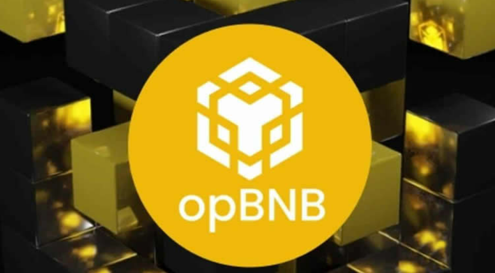
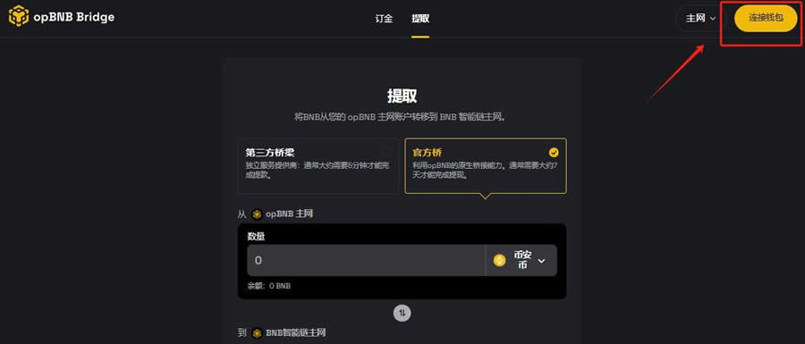

# opBNB链能给BNB链转吗？opBNB链转到BNB链步骤教程

opBNB链是基于币安生态系统开发的一个区块链网络，其核心技术采用了Optimistic Rollup扩展方案，旨在提供高效、低成本的区块链服务，解决解决币安智能链(BSC)在高流量场景下可能遇到的扩展性问题。那也有人会好奇，既然是基于币安生态系统的，那么opBNB链能给BNB链转吗？根据资料显示，opBNB链能给BNB链转，并且具体步骤也比较简单。下面[GTokenTool](https://www.gtokentool.com)详细说说具体流程，帮助大家更好的使用opBNB链。

<figure><figcaption></figcaption></figure>

## opBNB链能给BNB链转吗？

opBNB链能给BNB链转，并且转出步骤也比较简单的，下文是具体教程讲解：

### 1、打开opBNB链，点击连接钱包

<figure><figcaption></figcaption></figure>

### 2、选择合适的钱包连接

<figure><figcaption></figcaption></figure>

### 3、选择“提取”，选择“官方桥”

<figure><figcaption></figcaption></figure>

### 4、然后输入要转如数量就可

<figure><figcaption></figcaption></figure>

## opBNB链和BNB链代币互通吗？

opBNB链和BNB链代币是互通的，用户可以将BSC(币安智能链)中的资金存入opBNB网络，然后在opBNB网络上使用各种应用程序和智能合约，享受高吞吐量和低费用，opBNB网络上的交易数据最终会提交到BSC主网上，实现了代币的互通。

opBNB链和BNB链代币互通的主要原因在于opBNB的设计。opBNB是一个第二层解决方案，旨在通过链下执行交易来减少主网的负担，提高交易速度和降低交易费用。opBNB使用排序器、证明者和验证者来确保状态转换的安全性，并通过桥接技术实现了与BNB链的代币互通。

opBNB链和BNB链的互通性还体现在生态系统的集成上。opBNB不仅是独立的第二层解决方案，还是BSC生态系统的一部分，支持与各种其他项目和代币交互，包括BNB、USDT等。这种集成性为开发者和项目提供了更多的交互机会，促进了应用程序的快速增长。

以上全部内容就是对opBNB链能给BNB链转吗这一问题的解答，opBNB是币安生态中一个重要的二层扩展网络，基于Optimistic Rollup技术，为用户提供更低的费用和更高的效率，同时与币安智能链保持兼容性。它特别适合高频交易的场景，如DeFi、GameFi和NFT领域。如果是开发者或用户，关注opBNB可以帮助其更好地利用币安生态的优势，享受低成本和高效率的区块链服务。但在使用时也要注意安全风险，避免使用公共网络。

如有不明白或者不清楚的地方，请加入官方电报群：[https://t.me/gtokentool](https://t.me/gtokentool)
