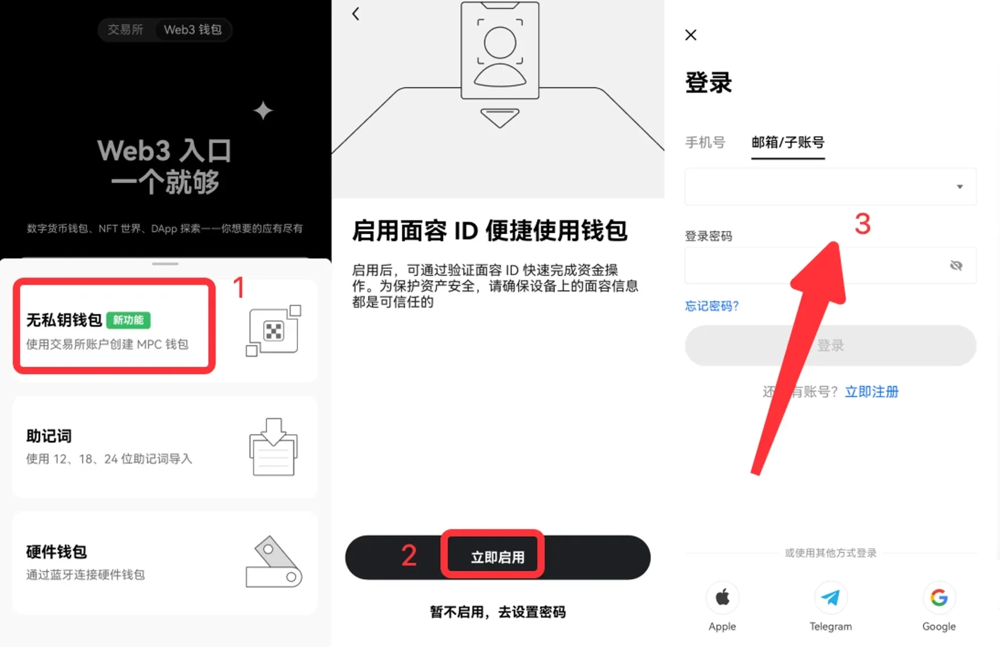

# 欧意OKX Web3 钱包上线 MPC 无私钥钱包使用方法

钱包是区块链的基础设施，承载着用户的资产，也是进入 Web3 的关键入口，但行业发展至今，我们仍在小心地保管着一长串私钥和助记词，一旦弄丢私钥或助记词，也就意味着资产的永久丢失，而这也是 Web3 仍未能大规模应用的原因之一。

另一方面，随着链上生态的发展和链上交互的激增，私钥或者助记词泄漏而导致上亿美金的加密资产被盗，安全、妥善、合理地使用钱包也变得颇具挑战。

基于此，得益于 MPC（Multi-party computation，多方安全计算）技术和区块链签名结合，一种无需私钥和助记词的无私钥钱包成为 Web3 入口的破局者。

## 什么是无私钥钱包？

多方计算是一种重要的密码安全措施，它使多个参与者能够在不泄漏任何一方持有的私人信息或秘密数据的情况下联合计算。通过分布式密钥生成技术（Distributed Key Generation）各自生成私钥碎片，任一方或机器都无法控制完整私钥。

对交易进行签名时，需要多方共同参与计算，从而形成一个完整的签名。

OKX 无私钥钱包就是基于 MPC 技术，将原本的 1 个完整私钥，变成 3 个各自生成的私钥碎片，分开存储，签名时使用其中 2 份私钥碎片即可完成签名，过程中不会产生完整的私钥。

创建无私钥钱包时，OKX 服务器生成一份私钥碎片 1，用户设备生成私钥碎片 2 和私钥碎片 3，其中私钥碎片 2 加密保存在用户设备上，私钥碎片 3 加密备份到 iCloud 或 Google Drive。交易签名时使用私钥碎片 1 + 私钥碎片 2，私钥碎片 3 用作备份。

无私钥钱包同样需要用户对资产进行备份，但不是备份助记词或私钥，而是通过登录第三方云服务，把第三份私钥碎片加密备份到云端，以便能在任何时间、任何地点方便、安全地使用或恢复钱包，避免因设备丢失或者助记词私钥导致资产丢失。从钱包点击创建到生成，整个过程不过几秒，真正实现了无私钥和无助记词的丝滑体验。

## 使用无私钥钱包有什么优势？无需保管私钥，消除单点故障

OKX 的无私钥钱包由于是多方共同创建，故不会出现一个完整的私钥在一台设备上，而是三方各自拿到一份私钥碎片，任何 1 个碎片都不具备单独掌握钱包地址中资产的能力，即使你手上的私钥碎片被盗取，他人也无法通过单个碎片来控制钱包内的资产。

## 丝滑的用户体验，低门槛进入 Web3 世界

助记词或私钥让用户进入 Web3 的门槛变高，无私钥钱包一方面能坚持 Web3 的原则，即让用户自己保管个人资产，另一方面又能将 Web2 的良好体验——无需保管助记词或私钥带给用户。

## 更低的私钥恢复成本

如果私钥碎片丢失或被盗，无私钥钱包可以执行私钥碎片的刷新功能，用新的私钥碎片，替换掉每一方原有的私钥碎片，此时丢失或被盗的碎片约等于被“挂失”。

OKX 无私钥钱包使用教程如何使用 OKX 无私钥钱包？下载 OKX App

打开 OKX 官网，下载 OKX 客户端

### 第一次使用 OKX Web3 钱包

\[1] 打开 OKX App，切换至 Web3 钱包，选择我没有钱包 > 无私钥钱包；

\[2] 点击立即启用；

&#x20;\[3] 输入 OKX 交易所的账号和密码，若已经登录则无需此步骤，再点击创建；

&#x20;\[4] 点击备份钱包 > 输入密码完成备份

<figure><figcaption></figcaption></figure>

<figure><figcaption></figcaption></figure>

已有助记词或私钥钱包，想创建无私钥钱包

\[1] 打开 OKX Web3 钱包，点击 ▼ > 钱包管理 > 添加钱包；&#x20;

\[2] 选择创建钱包 > 无私钥钱包&#x20;

\[3] 输入 OKX 交易所的账号和密码，若已经登录则无需此步骤，再点击创建；

\[4] 点击备份钱包 > 输入密码完成备份

<figure><figcaption></figcaption></figure>

<figure><figcaption></figcaption></figure>

## 如何恢复无私钥钱包？

如果钱包重置、删除钱包、重装 App 或是更换设备，我们可以通过扫码恢复钱包。

\[1] 打开 OKX App，切换至 Web3 钱包，选择我已有钱包 > 恢复无私钥钱包；

\[2] 点击立即启用；

\[3] 输入 OKX 交易所的账号和密码，若已经登录则无需此步骤；

\[4] 点击扫码恢复，使用老设备扫描二维码，同步完成后钱包恢复成功。

<figure><figcaption></figcaption></figure>

<figure><figcaption></figcaption></figure>

如果老设备不可用，或是设备私钥碎片被泄露，则需要通过云端恢复，即登录 iCloud 或 Google Drive 把私钥碎片 3 下载下来，恢复无私钥钱包，此时 3 份私钥碎片会全部刷新成新的私钥碎片。

\[1] 打开 OKX App，切换至 Web3 钱包，选择我已有钱包 > 恢复无私钥钱包；

\[2] 点击立即启用；

\[3] 输入 OKX 交易所的账号和密码，若已经登录则无需此步骤；

\[4] 点击云端恢复，选择从 iCloud 或 Google Drive 恢复，并输入当初云备份时的密码；

<figure><figcaption></figcaption></figure>

<figure><figcaption></figcaption></figure>

注意，如果选择云端恢复，由于私钥碎片全部重置，故老设备的钱包自动失效，需要重新恢复钱包方可继续使用。

## 常见问题我习惯了使用私钥，没有私钥还安全吗？

确实去掉私钥听起来似乎有些离经叛道，但无私钥钱包由于私钥不会完整地存储在单个设备上，这反而使它能够解决目前大多数钱包因私钥带来的风险。

能不能将 OKX 的无私钥钱包导入到另一个同样支持 MPC 的钱包 App 上？

不能。因为 MPC 算法尚未出现一个业界的统一标准，也没有得到机构级安全设备的原生支持，多数为定制产品，故 OKX 的无私钥钱包无法迁移到另一钱包 App上。

但由于用户存有 2 份私钥碎片，故可通过私钥碎片 2 和私钥碎片 3 恢复完整私钥，此过程不需要 OKX 参与，此时无私钥钱包将转为传统私钥控制的钱包，可以导入到其他钱包 App 中使用，为避免责任纠纷，OKX 的无私钥钱包也不再有效。

## 如果 OKX 不可用或者平台跑路了，我的无私钥钱包内的资产安全吗？

由于无私钥钱包创建时私钥碎片被分成了 3 片，分别存储在 OKX 服务器，用户设备和 iCloud 或 Google Drive。交易签名时使用其中 2 份私钥碎片，即可计算出完整签名并使用钱包。

如果 OKX 平台不可用或者跑路，你可通过私钥碎片 2 和私钥碎片 3 恢复出完整私钥即可自行恢复钱包并转出资产。此时无私钥钱包将转变成为由私钥控制的钱包，无私钥钱包也不再有效。

## 如果存在我设备上的私钥碎片泄漏了，我该怎么办？

如果存在你设备上的私钥碎片泄漏了，可以使用云恢复，连接上 iCloud 或 Google Drive 获取私钥碎片 3 到本地，恢复钱包。钱包成功恢复后，3 片私钥碎片会全部重置。此重置过程不会改变用户的钱包地址，资产也不会受到影响。

## 使用无私钥钱包是中心化的行为吗？

对于 Web3 的原住民而言，使用服务器、邮箱等行为看起来似乎非常的不 Web3、中心化，甚至担心自己的隐私被泄漏，但事实并非如此。

首先，OKX 的无私钥钱包是一款完全去中心化、非托管的多链钱包。OKX 只是作为服务方存在，不会也无法接触用户资产。即使被认为是中心化的化身，平台本身也是可替换的。如果平台作恶或是被黑，你可以轻松通过另外 2 份私钥碎片恢复钱包并提取资产，不会对你的资产安全造成威胁。

其次，无私钥钱包更加安全。你将无需保护私钥，也就避免了私钥泄露的可能。即使不甚遗漏了在设备上的私钥碎片，也能通过 OKX 服务器和 iCloud/Google Drive 的私钥碎片重新恢复钱包。

如有不明白或者不清楚的地方，请加入官方电报群：[https://t.me/gtokentool](https://t.me/gtokentool)
