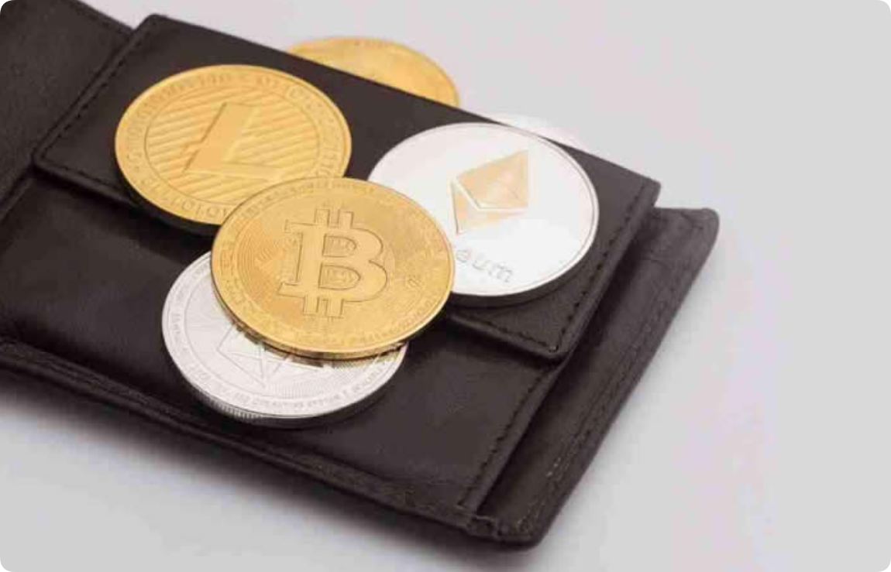

# 钱包签名会被盗吗?钱包签名授权安全吗?

对于数字货币市场中的一部分投资者来说，将数字货币资产存入钱包中是为了进一步获得相应的安全保障，但在投资者进行钱包注册以及使用时，可能会经常看到钱包签名一词，其实钱包签名也是管控数字货币钱包中资产的一种方式，并且签名也是不可以乱钱的，签名就意味着投资者同意对签署内容的认可，如果一旦签名被别人掌握，那么投资者的数字货币资产也就不安全了，但不少投资者并不知道钱包签名会被盗吗？下面就由[**GTokenTool**](https://www.gtokentool.com)为大家详细介绍钱包签名授权安全吗。

<figure><figcaption></figcaption></figure>

## 钱包签名会被盗吗？

钱包签名是会被盗的，黑客可以使用私钥对交易进行签名，并将加密货币等资产转移到他们的钱包中，钱包签名是一种安全机制，用于验证交易的合法性和真实性，在交易过程中，发送方需要使用私钥对交易进行签名，接收方则使用公钥验证交易的真实性，只有持有正确的私钥，才能对交易进行签名，因此钱包签名的安全性取决于私钥的安全性。

通过钱包签名就是利用私钥来签名明文字符，这样输出签名后的字符，这样别人拿到签名之后的字符通过数学校验就可以得知签名的钱包是否为你声称的钱包，通过这种方式来证明自己是钱包的所有者，钱包软件主要功能就是构造交易签名，然后将交易签名上传到节点进行确认，交易签名可以离线进行，但是签名后信息需要传到区块链上才能被确认。

## 钱包签名授权安全吗？

钱包签名授权是安全的，钱包签名授权是指在进行交易时,用户需要通过钱包对交易进行数字签名的过程，在这个过程中，用户需要输入自己的交易密码或使用生物识别技术进行身份验证，以确认这笔交易是由自己发起并且是合法有效的。

在进行数字货币交易时，每个交易都需要一个数字签名才能被认为是有效的。而数字签名本质上就是一种数学算法，在这个算法中使用了公钥和私钥两个密钥。公钥可以公开展示给其他人，而私钥则只有拥有者自己知道。

在进行数字签名时，用户需要使用私钥对交易信息进行加密，然后将加密后的信息和公钥一起发送给网络节点。网络节点会使用公钥对交易信息进行解密，并且验证该交易是否合法。如果验证通过，则该笔交易就被认为是有效的。

对于投资者来说，在使用钱包签名授权前，投资者需要确保交易信息的真实性和合法性，此外用户需要认真检查交易信息和交易对手的身份，避免因为欺诈等原因而签署授权。钱包签名授权在正确使用和管理的情况下，可以增强交易的安全性和可信度。用户需要采取措施保护签名授权的安全，避免损失和丢失数字货币资产的风险。

以上就是钱包签名会被盗吗?钱包签名授权安全吗?的详细内容，如有不明白或者不清楚的地方，请加入官方电报群：[https://t.me/gtokentool](https://t.me/gtokentool)
