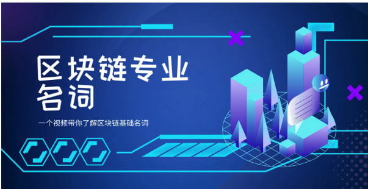
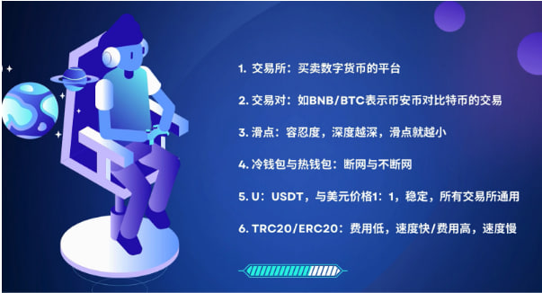
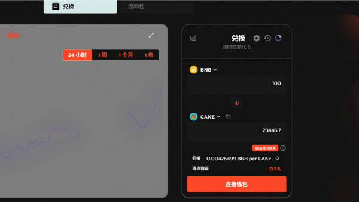
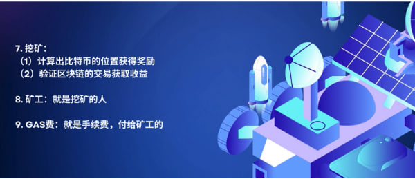
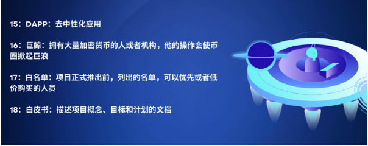

# 区块链专业名词

<figure><figcaption></figcaption></figure>

哈喽 大家好，欢迎来到GTokenTool的教程。

今天来给大家讲一下区块链专业名词，因为很多新人小白进入到这个圈子之后，就会发现很多专业术语会不太明白或者了解，所以我们做了这个视频，来帮助大家，更快速的去了解区块链的基础名词。

\

<figure><figcaption></figcaption></figure>

第一个是交易所，它是买币或者是卖币的一个平台，可以在这上面进行交易或者是兑换。

第二个是交易对，它是由两个币组成的，中间一个斜杠。像这里的话它是BNB/BTC，它表示的是BNB对BTC的交易，表示一个BNB等于多少BTC。如果反过来是BTC/BNB的话，那就表示一个BTC等于多少BNB。

第三个是滑点，滑点的话大家可能接触的比较少，有点陌生，它其实是在我们去做交易的时候会有的一个设置，我们来看图会比较明白一点，像这里的话，意思是用100个BNB去兑换这个CAKE，因为如果是小的交易所的话，交易量会非常少，你突然去买比较多的这个币，可能会导致这个币的价格，突然拉高。也就是说你花100BNB，到时候你你买到的可能并没有这么多，这里是一个预计的数量，所以需要设置一个滑点，也可以叫做容忍度，这里设置是0.5%，也就是说，你花100BNB买到的，比预计的数量少0.5%，你是可以容忍的，那么你点击去提交，它就会去计算，如果在这个范围之内，返回这个CAKE给你，如果在这个范围之外，会返回一个失败的提示，并且将这个BNB转回到你的账户。但是如果是大交易所，交易量会非常大，对价格的影响非常小，也就是说深度越深 滑点就越小了。

<figure><figcaption></figcaption></figure>

\
第四个是冷钱包与热钱包，它是一个断网或者是不断网的区别，冷钱包是不会接触网络的，所以会非常的安全，不会黑客盗取。热钱包，一般我们是用来转账或者是交易的，所以是会联网，但是也会有一点不太安全。所以，不建议把所有的资产，放在这个钱包上面。

第五个是U，平时我们会说到的转U，U就是USDT，它是与美元价格1:1挂钩的，所以它价格是非常稳定的。而且还有个特点，就是所有的交易所都通用。

\

<figure><figcaption></figcaption></figure>

第六个是TRC20和ERC20，这个就是我们去做交易的时候的一个通道，TRC20就是费用很低，然后速度又快。ERC20，费用高但是速度又慢。可能有人就会说，那如果是这样的话，我就只要用TRC20了。但是，不是每一种币，它都能用所有的通道的。但USDT，它是所有的通道都可以用的。

第七个是挖矿，挖矿它有两种，第一种是计算出比特币的位置，获得奖励。第二种是验证区块链的交易获取收益。

第八矿工，就是挖矿的人。

第九gas费，就是手续费，付给这些矿工的。我们去做交易的时候，需要付一个gas费，这个gas费，其实是去付给矿工。他帮我们去验证和计算这个交易，然后收获我们这个手续费。

\

<figure><figcaption></figcaption></figure>

第十 DIFI，它就是基于区块链的金融体系，包括服务和工具范畴。

第十一质押，就相当于将钱借给银行，获得利息。

第十二做多或是做空，做多，就是你看这个币感觉它要上涨的趋势，就去买进。做空，是你感觉这个币它要下跌了，然后去将它抛售。

第十三诱多、诱空，诱多就是做出一种，好像这个币要上涨的假象，引诱这些投资者去买进，但是你刚买进的话，它可能就下跌了。诱空就是相反的，去做出一种这个币它要下跌的假象，然后让这个投资者去抛售，你刚抛售完，它可能就上涨了。

第十四空投，空投是一个非常流行的营销方式，就是免费给你发代币，给那些潜在的用户，或者对这些代币感兴趣的，最终的目的是，让更多的人去使用这个代币，去投入更多的资金。

\

<figure><figcaption></figcaption></figure>

第十五 Dapp，是去中心化应用，像一些软件、网站啊，就是基于区块链上面的应用。

第十六巨鲸，拥有非常大量的加密货币的人或者是机构，他的操作会使这个币圈掀起巨浪，就是说他的一举一动都会影响这个币圈。

\
第十七白名单，项目正式推出前，会列出一个名单，名单上面的人，是可以优先或者说比较低的价格去购买这个币。

第十八白皮书，项目方创建了项目之后，会写一个说明书，里面会写这个项目的概念、目标还有他的计划

以上就是这期内容，谢谢观看，下期再见。

\
