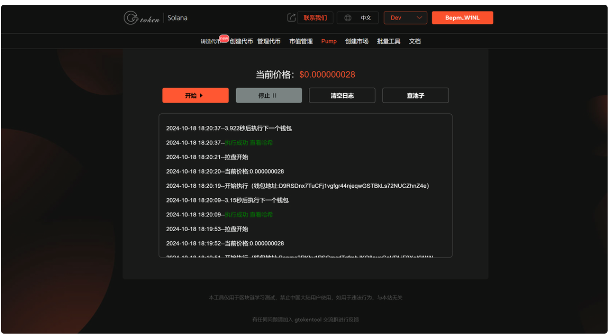

# 如何成为Pump Fun 中的山丘之王：快速实用指南

对于许多代币创建者来说，在 Pump Fun 中获得“山丘之王”地位 不仅仅是一个头衔，更是一个梦想。

这个令人垂涎的位置将您的代币显示在平台顶部显眼的地方，立即吸引交易者和投资者的注意力。

<figure><figcaption></figcaption></figure>

但它是如何实现的呢？ Pump Fun 在授予这一享有盛誉的位置时优先考虑哪些因素？最重要的是：如何定位您的代币以获得成功？。

## Pump Fun如何成为山丘之王

Pump Fun 根据三个关键指标

1. 近期发布

您的代币必须是新推出的，最好不超过 一个小时。新的代币具有优先权，因为它们会在平台上产生炒作和流量。

2. 市值超过 35,000 美元

正如大家所看到的，市值超过35,000 美元的代币表现出强烈的走在网络顶端的趋势。从这个值来看，信心似乎开始在投资者之间传递。

3. 社区参与：超过20条回复

具有至少 20 条回复的代币 表明大量竞价出现在顶部。这种程度的互动会产生炒作、动力和知名度。

## 联合曲线成为山中之王的重要性

Pump Fun 的核心在于其 阶跃函数联合曲线，这是一个根据供需确定代币价格的。

与价格具有投机性的传统市场不同，Pump Fun 的联合曲线保证了 价格的稳定性和可预测性，使创作者更容易吸引早期投资者。

## 结合曲线如何运作

随着代币的铸造和交易，它们的价格会按照预定义的步骤逐步上涨，从而为参与者提供透明度。

早期投资者受益最大，因为他们在联合曲线前进之前以较低的价格购买代币。

例如，在 Pump Fun 结构中：

代币在特定市值阈值（例如 Solana 上的 69,000 美元）达到“King of the Hill”状态 。

在这些水平上，流动性被注入去中心化交易所（例如 Raydium），进一步稳定代币并吸引更多买家。

## 如何一步步成为山丘之王

自然地增加交易量与评论的策略是使用做市值机器人。

使用GTokenTool pump市值机器人工具时 ，设置是一个简单的过程，无需编程知识。

pump fun市值机器人使用教程之前就写好了，这里就不过多的介绍了，大家通过下面的链接查看。

教程地址：[https://docs.gtokentool.com/solana/pump-shi-zhi-guan-li-jiao-cheng](https://docs.gtokentool.com/solana/pump-shi-zhi-guan-li-jiao-cheng)

<figure><figcaption></figcaption></figure>

## 为什么成为山丘之王很重要

成为 Pump Fun 中的王者不仅可以为您带来知名度，还可以为您带来可信度、动力以及吸引高交易量的机会。通过将您的策略​​与 Pump Fun 的关键指标结合起来并利用其联合曲线等工具，您将离成功更近一步。

如有不明白或者不清楚的地方，请加入官方电报群：[https://t.me/gtokentool](https://t.me/gtokentool)
