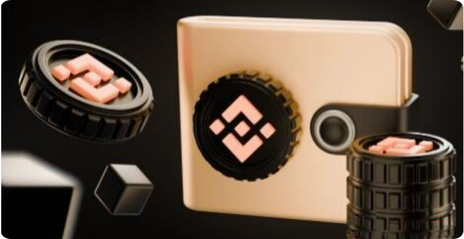

# 如何创建BEP-20 (BSC) 钱包？创建BEP-20 (BSC) 钱包的详细教程

Binance Smart Chain 可能是最广泛使用的平台，由于其快速交易和低费用，吸引了众多用户。你只需要一个BEP-20 钱包即可使用。

本指南将帮助你轻松创建自己的BEP-20 钱包。[**GTokenTool**](https://www.gtokentool.com)将介绍基本术语、创建钱包的过程，并给你一些钱包提供商的推荐。

<figure><figcaption></figcaption></figure>

## 什么是BEP-20 兼容钱包？

Binance Smart Chain (BSC) 是由Binance 推出的区块链系统。它通过支持dApps、智能合约和去中心化交易，鼓励区块链的互操作性。

BEP-20 钱包是一个用于管理BEP-20 代币的BNB 加密钱包。使用它，你的数字资产是安全的，并且你可以在BNB 生态系统中运作。这些钱包不是实际存储代币，而是保护访问加密货币的私钥。

BSC 和BEP-20 之间的区别在于，BSC 是Binance 的智能合约区块链网络，而BEP-20 是这些智能合约使用的代币标准。BSC 网络支持多种加密货币，所有这些都使用BEP-20 标准进行交易。

## 什么是BEP-20 钱包地址？

BEP-20 钱包地址是Binance Smart Chain 上用于管理BEP-20 代币的唯一ID。将其视为敏感信息，类似于银行账户号码。保持其机密性，除非绝对必要，否则不要分享。

这里是一个BEP-20 钱包地址示例： bnb1mrzq7fenlfxx59usn2fn8aygdyfrsku4u7h55q

你还需要区分钱包地址和合约地址。 BEP-20 合约地址是BSC 上实现BEP-20 标准的智能合约的独特标识符。你可以将其视为区块链上的代币地址。

普通用户需要BEP-20 合约地址来让MetaMask 或Trust Wallet 与BSC 上的代币进行交互。你需要它来在钱包中发送、接收和管理这些代币。没有合约地址，你将无法将代币添加到钱包中并参与BSC 生态系统。

## 获取BEP-20 钱包地址的分步指南

尽管步骤可能因平台而略有不同，以下指南将是你获取BEP-20 钱包地址的路线图：

* **创建钱包：**&#x6309;照所选平台的屏幕指导设置你的钱包。这个过程通常包括设置一个强密码和通过KYC 程序。
* **保护你的钱包：**&#x5199;下恢复短语并离线存储，这是在你丢失设备或忘记密码时恢复钱包的唯一方法。
* **配置BSC 网络：**&#x6709;些钱包预设了它，但有时你需要手动添加。进入与添加新网络相关的设置并输入所需详细信息。你可以在官方BSC 文档中找到这些信息。
* **找到你的钱包地址：**&#x8FD9;个地址可以在钱包界面中找到，通常在“账户”或“接收”按钮下。只需复制地址即可接收BEP-20 代币。

## 支持BEP-20 代币的加密钱包

有几种加密钱包在其功能中支持BEP-20 加密货币选项，我们将给你一些公认的选项。支持BEP-20 代币的钱包包括：

* MathWallet
* Gem Wallet
* D'CENT
* SafePal S1

MathWallet 具有内置交换功能，Gem Wallet 专注于移动便捷性。对于寻求硬件安全性的人，D'CENT 和SafePal S1 提供离线存储你的BEP-20 代币。请注意，硬钱包相比在线选项会牺牲一些便利性，但它们同样可以非常安全。

## 如何使用你的钱包进行交易？

一旦你选择了一个钱包并创建了一个账户，你就可以开始使用它进行交易。要发送BEP-20 代币，请执行以下操作：

* 打开你的BEP-20 钱包
* 找到“发送”或“转账”选项
* 选择BEP-20 代币
* 粘贴接收方的BEP-20 地址
* 输入代币数量
* 审核并确认

接收代币的关键是将你的钱包地址提供给发送方。以下是如何操作：

* 进入你的BEP-20 钱包
* 找到“账户”或“接收”部分
* 找到你的钱包地址并复制
* 将地址分享给发送方

如有不明白或者不清楚的地方，请加入官方电报群：[https://t.me/gtokentool](https://t.me/gtokentool)
