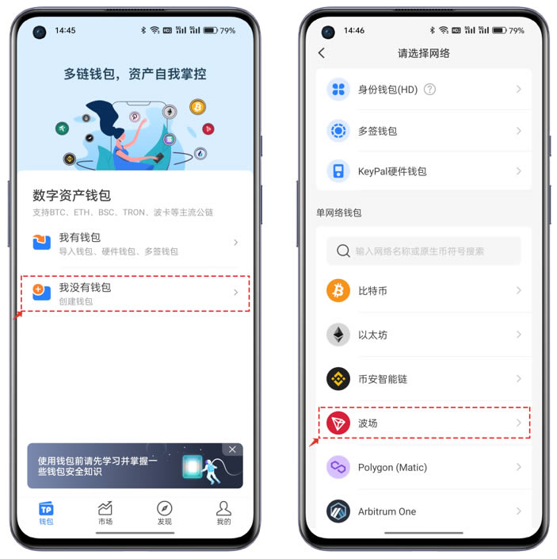

# 如何创建、导入波场TRON钱包？图文操作流程

TRON（TRX）是一种流行的区块链平台，用于去中心化应用和智能合约。TRON钱包用于存储、发送和接收TRX及其相关代币。那么，如何创建波场TRON钱包？下文[**GTokenTool**](https://www.gtokentool.com)将为大家手把手操作，教你快速创建TRON钱包！

## 如何创建TRON钱包？

1、打开TokenPocket，首次使用点击\[我没有钱包]，在列表中选择\[波场]钱包并创建。

<figure><figcaption></figcaption></figure>

2、创建方式分为三种，并且每个创建方式都有其特有的功能；点击\[创建钱包]，钱包名称可以自定义，密码最低8位，建议使用高强度的密码组合，勾选用户协议后点击\[创建钱包]即可跳转下一界面。

**冷钱包：**&#x7528;户在离线设备中创建或导入使用，用来搭配相同地址的观察钱包使用。

**观察钱包：**&#x53EF;以使用任何的符合当前公链的地址导入查看数据，也可以配合冷钱包交互使用。

<figure><figcaption></figcaption></figure>

3、区块链资产安全的核心就是私钥、助记词，私钥可以在创建钱包后导出备份。助记词和私钥一定要使用离线的方式备份和保存，不要发生丢失和泄露。

备份助记词界面底部有一个\[高级设置]这里可以设置Passphrase。Passphrase是加强资产安全的一个附加功能，如果使用这种方式创建钱包，意味着你必须使用正确的助记词+正确的Passphrase才可以导入正确的钱包，从而管理链上的资产。丢失或导入中使用错误任何一项都不能使用正确的地址。

<figure><figcaption></figcaption></figure>

4、TokenPocket提供助记词备份和验证功能，目的是对助记词进行验证保证备份助记词的可靠性。助记词请务必使用离线备份的方式保存。完成助记词验证后即可创建钱包并完成Tron钱包的创建。

<figure><figcaption></figcaption></figure>

5、创建成功后可以先对钱包的功能进行熟悉，底部的\[发现]入口可以查看和使用多种DApp工具。

<figure><figcaption></figcaption></figure>

## 如何导入TRON钱包？

1、打开TokenPocket APP，点击右上角，点击网络选择界面中直接选择波场网络。

<figure><figcaption></figcaption></figure>

2、导入方式中支持多个选项，可以根据自己的实际需求使用。这里使用助记词导入方式来展示，点击助记词导入后在\[导入钱包]界面中可以切换私钥选项，填入助记词或私钥并设置密码后就可以导入钱包使高级模式：可以选择助记词导入类型以及Passphrase的填入。

<figure><figcaption></figcaption></figure>

3、助记词语言可以选择多种类型，根据实际情况填写。Passphrase是在创建过程中设置的参数，必须使用正确的助记词+正确的Passphrase才可以导入正确的钱包和管理链上的资产。

<figure><figcaption></figcaption></figure>

## 如何创建波场多签钱包？

**一些建议：**

阈值、管理地址、权重要认真检查合理设置，一旦完成上链后是不可逆的操作；

新手稳妥起见权限变更按照先active后owner的顺序，当然这会消耗两次的trx；

熟悉操作后，在权限设置中将owner和active甚至新增的权限等功能一并执行，这样更加节约trx。

## 波场钱包权限设置教程

1、打开TokenPocket，点击蓝色区域右上角【详情】，打开【权限管理】菜单。

<figure><figcaption></figcaption></figure>

2、权限管理的界面主要分为三个大类，一类是owner权限管理，包含了权限替换和设置多签， 二类是active 权限管理，包含了权限替换和设置多签， 三类是增加一个active权限，例如能量租赁的自动转出能量的功能就是新增一个active并只授予关于能量的权限来实现的。

2.1、点击owner的权限设置可以看到【权限名称】是可以修改的，不过考虑到单独的修改权限名称也需要花费100trx，所以这个极少有人会这么设置。owner的权限是完整权限，具体的可以通过编辑权限的【权限】列表中查看。

<figure><figcaption></figcaption></figure>

2.2、阈值（最少签名权重和），就是管理地址的权重相加大于或等于阈值时才可以进行上链操作，其中阈值可设置的最大值是100；

设置管理钱包这里默认是当前的地址，后面的1代表了当前的权重参数，后面的垃圾桶标志表示可以删除这个管理地址；添加管理钱包，可以通过自定义填入、钱包导入、扫码导入的方式增加管理地址，增加后默认权重是1，根据实际的情况来进行设置。

owner权限可以进行替换（单签名）或者是设置多个管理地址（多签名），如果设置多签，建议合理的进行设置，例如2/3的设置方式，只需要2个管理地址进行签名即可执行，即便是丢失一个管理地址，依然可以正常的使用。设置好owner权限后点击【保存】就可以保存设置的参数并返回到【编辑权限】的初始界面。

<figure><figcaption></figcaption></figure>

2.3、active的权限设置是同样的操作，唯一不同之处是active可以灵活的设置【权限】，只需要点击【编辑】功能，即可对执行的权限进行设置，建议不熟悉的用户不要贸然的删减，不然会影响一些链上操作的执行。

同样的active也可以直接替换权限地址（单签）也可以设置多个管理钱包(多签名)，设置合理的阈值和管理地址及权重能更安全更灵活的管理资产。设置好active的参数后即可点击底部的【确认】保存参数。

<figure><figcaption></figcaption></figure>

2.4、增加权限功能只适用于active，其操作和上面的内容相同，这种功能使用的比较少，例如在TokenPocket的【能量租赁】服务中，可以增加active的自动执行能量出租的操作。

<figure><figcaption></figcaption></figure>

3、确认好owner和active等参数都设置完毕后，点击底部的【确定升级权限】会弹出安全要点提示，重点要检查自己设置的阈值、权重、管理地址是否正确和合理，点击【了解并继续】后来到了最后的交易详情的执行界面，在这里依然可以在【升级详情】中确认执行的内容是否完整和正确，核对后点击【确定更改】并支付Gas（网络费）后就可以完成波场地址的权限变更操作。

<figure><figcaption></figcaption></figure>

如有不明白或者不清楚的地方，请加入官方电报群：[https://t.me/gtokentool](https://t.me/gtokentool)
