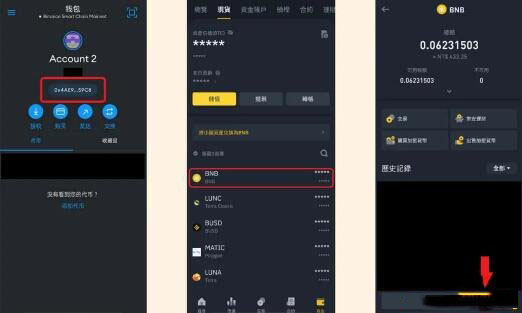

# 如何从币安转账到小狐狸钱包？币安转账到小狐狸钱包的教程

介绍小狐狸钱包充值，教你从交易所转帐到小狐狸钱包，会有详细图文带你一步一步操作，用币安交易所转帐到MetaMask小狐狸钱包作为示范，其他交易所也是一样的流程。

## 小狐狸钱包充值教学

**STEP 1：**&#x5148;将小狐狸钱包转到BNB Chain，点击红色框框地址部分，就会自动帮你复制&#x20;

**STEP 2：**&#x6253;开币安现货钱包，找到你的BNB&#x20;

**STEP 3：**&#x70B9;击” 提现“ (因为我们是要从币安提出现金到MetaMask)

<figure><figcaption></figcaption></figure>

**STEP 4：**&#x70B9;选” 透过加密网络传送“&#x20;

**STEP 5：**&#x628A;你刚刚复制好的钱包地址贴上&#x20;

**STEP 6：**&#x4E3B;网类型选择” BEP20 “

<figure><figcaption></figcaption></figure>

**STEP 7：**&#x518D;次确认你的钱包地址和网络有没有填错，按下” 确认“&#x20;

**STEP 8：**&#x63D0;领处理中&#x20;

**STEP 9：**&#x8FC7;一下就转帐成功啰! 可以到MetaMask 检查是否入帐

<figure><figcaption></figcaption></figure>

## 常见问题

Q：如果我要发送以太币，要如何操作?

流程都一样，只是币种选择” ETH “，网络选择” ERC20 “

Q：手续费会很贵吗?

手续费是依照你选择的主网类型来决定!

如果是要发送BNB币、走BNB Chain的BEP20的话，手续费就很便宜；

或是要发送MATIC币、走Polygon的话，手续费也是相当便宜；

但如果是发送以太币ETH那手续费就会比较贵一点点，因为以太坊每秒能处理的交易量跟其他区块链比起来不高，但是是使用量最高的区块链，所以手续费比较贵。

如有不明白或者不清楚的地方，请加入官方电报群：[https://t.me/gtokentool](https://t.me/gtokentool)
