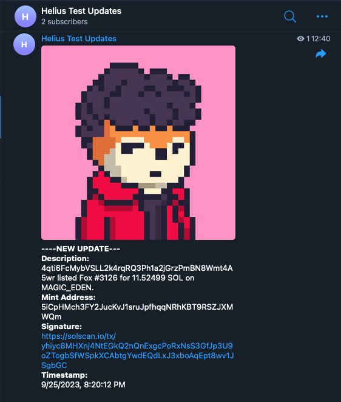
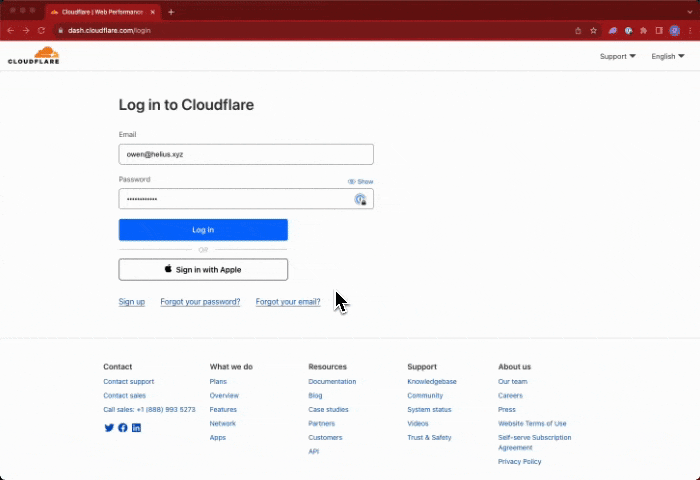

# 如何设置 Solana Telegram 机器人

Solana 区块链上每秒大约发生 400 笔交易。这些交易包括代币转移、NFT 销售、代币交换、竞标、DAO 投票、投注等等。但是面对如此多的数据，您如何跟踪您关心的变化？这就是 webhook 的作用所在。Webhook 允许您跟踪这些变化并随时了解您关心的事情。本指南将向您展示如何设置 Telegram 机器人，以便使用 Cloudflare 工作器将链上更新直接发送给用户或频道 。‍

<figure><figcaption></figcaption></figure>

## 设置 Telegram 机器人的步骤 <a href="#steps-to-set-up-a-telegram-bot" id="steps-to-set-up-a-telegram-bot"></a>

1. 设置 Telegram 频道和 Telegram 机器人。
2. 创建一个 Cloudflare 工作器，作为发送更新的 webhook 和 Telegram 机器人之间的连接。
3. 创建 Helius webhook。
4. 通过 Helius Webhook API 编辑 webhook 跟踪的地址。此步骤仅适用于跟踪整个 NFT 集合。

## **设置 Telegram 机器人** <a href="#set-up-a-telegram-bot" id="set-up-a-telegram-bot"></a>

Telegram 机器人是自动执行某些任务（尤其是更新）的好方法。以下是设置步骤。

1. **与 BotFather 开始对话：**&#x5728; Telegram 搜索栏中搜索“BotFather”，然后单击它即可开始对话。
2. **创建新机器人：**&#x8F93;入并发送“/newbot”。BotFather 现在将指导您命名机器人并为其指定用户名。
3. **访问令牌：**&#x5B8C;成后，BotFather 将提供访问令牌。请安全地记下它，因为我们稍后将在本教程中使用它。

对于频道更新：

1. **创建电报频道：**&#x8F6C;到菜单（☰）并选择“新频道”。
2. **邀请机器人：**&#x8BBE;置好频道后，点击频道名称，选择“管理员”，然后添加您的机器人。
3. 查找聊天 ID：
4. 要确定您频道的聊天 ID，请按以下步骤操作：
5. **发送消息：**&#x9996;先，向您创建的频道发送消息。
6. **使用 Telegram API**：在浏览器中导航到**https://api.telegram.org/bot\<YOUR\_BOT\_TOKEN> /getUpdates，将\<YOUR\_BOT\_TOKEN>**&#x66FF;换为您从 BotFather 收到的令牌。
7. **找到聊天 ID：**&#x5728;返回的数据中，您会发现一个名为聊天的字段，里面有一个id，它是您频道的聊天 ID。
8. 请记住安全地记下此聊天 ID，因为您将需要它进行进一步的配置。

## **创建 Cloudflare 工作器** <a href="#create-a-cloudflare-worker" id="create-a-cloudflare-worker"></a>

Cloudflare 工作者允许您部署在线托管且将永久运行的代码，以便不断警惕来自您的 Web 挂钩的更新。

1. **登录 Cloudflare：**&#x9996;先登录您的 Cloudflare 帐户。如果您还没有帐户，可以免费注册。
2. **访问 Workers 部分：**&#x4ECE; Cloudflare 仪表板，导航到“Workers”选项卡。
3. **创建新的 Worker：**&#x70B9;击“创建 Worker”按钮。这将带您进入 Worker 编辑器。

<figure><figcaption></figcaption></figure>

1. **编辑工人代码：**
2. 在编辑器中，您将看到一个脚本模板。将默认代码替换为您的 Telegram 机器人提供的 Cloudflare 代码。
3. 在代码中找到BOT\_TOKEN和CHAT\_ID的变量。这些是占位符，将用于通过您的机器人将消息发送到正确的聊天。
4. **配置环境变量：**
5. 在 Cloudflare Workers 仪表板中，导航到您的工作器的“设置”选项卡。
6. 在这里，您可以添加机器人的令牌、聊天令牌和 Helius API 密钥作为环境变量。这有助于将敏感数据排除在主代码之外并确保其安全。
7. 确保正确命名这些环境变量以匹配代码中的预期（例如，BOT\_TOKEN，CHAT\_ID等）。
8. **部署 Worker：**&#x786E;保代码和环境变量设置正确后，点击“保存并部署”按钮。您的 Worker 将被部署并分配一个唯一的公共 URL。
9. **记下公共 URL：**&#x90E8;署后，请务必记下分配给您的工作人员的公共 URL。您将使用此 URL 作为 Telegram 机器人的 webhook 端点。

## **Cloudflare Worker 代码：**

```

const TELEGRAM_BOT_TOKEN = BOT_TOKEN;
const TELEGRAM_CHAT_ID = CHAT_ID;
const HELIUS_API_KEY=API_KEY;
const HELIUS_RPC_URL = `https://mainnet.helius-rpc.com/?api-key=${HELIUS_API_KEY}`;

addEventListener('fetch', event => {
  event.respondWith(handleRequest(event.request))
})

async function handleRequest(request) {
  if (request.method === 'POST') {
    const requestBody = await request.json();
    console.log('Received POST request with body:', requestBody);


    //THIS IS FOR NFT UPDATES (comment this section out if you are doing something else)
    // Extract transaction description, timestamp, signature, and mint address
      // const NFTdescription = requestBody[0].description;
      // const NFTtimestamp = new Date(requestBody[0].timestamp * 1000).toLocaleString(); // Convert Unix timestamp to readable date-time
      // const NFTsignature = `https://solscan.io/tx/${requestBody[0].signature}`
      // const NFTmintAddress = requestBody[0].events.nft.nfts[0].mint;
      // const NFTimageUrl = await getAssetImageUrl(NFTmintAddress);// Get NFT image URL
      // // Construct the message
      // const messageToSendNFT = 
      // `----NEW UPDATE---\n`+
      // `Description:\n${NFTdescription}\n` +
      // `Mint Address:\n${NFTmintAddress}\n` +
      // `Signature:\n${NFTsignature}\n` +
      // `Timestamp:\n${NFTtimestamp}`;
      // await sendToTelegramNFT(messageToSendNFT, NFTimageUrl); // Send to Telegram


    //THIS IS FOR TRANSFER UPDATES (comment this section out if you are doing something else)
    // Extract transaction description, timestamp, signature
      const Transferdescription = requestBody[0].description;
      const Transfertimestamp = new Date(requestBody[0].timestamp * 1000).toLocaleString(); // Convert Unix timestamp to readable date-time
      const Transfersignature = `https://xray.helius.xyz/tx/${requestBody[0].signature}`
      // Construct the message
      const messageToSendTransfer = 
      `----NEW UPDATE---\n`+
      `Description:\n${Transferdescription}\n` +
      `Signature:\n${Transfersignature}\n` +
      `Timestamp:\n${Transfertimestamp}`;
      await sendToTelegramTransfer(messageToSendTransfer); // Send to Telegram


    return new Response('Logged POST request body.', {status: 200});
  } else {
    return new Response('Method not allowed.', {status: 405});
  }
}

// This function is used to send NFT Updates to the bot
async function sendToTelegramNFT(message, imageUrl) {
  const telegramUrl = `https://api.telegram.org/bot${TELEGRAM_BOT_TOKEN}/sendPhoto`;
  const response = await fetch(telegramUrl, {
    method: 'POST',
    headers: {
      'Content-Type': 'application/json',
    },
    body: JSON.stringify({
      chat_id: TELEGRAM_CHAT_ID,
      photo: imageUrl,
      caption: message,
      parse_mode: "HTML"
    }),
  });
  const responseData = await response.json();

  if (!response.ok) {
    console.error('Failed to send photo to Telegram:', responseData);
  }
}


//This function is used to send Transfer Updates to the Bot
async function sendToTelegramTransfer(message) {
  const telegramUrl = `https://api.telegram.org/bot${TELEGRAM_BOT_TOKEN}/sendMessage`;
  const response = await fetch(telegramUrl, {
    method: 'POST',
    headers: {
      'Content-Type': 'application/json',
    },
    body: JSON.stringify({
      chat_id: TELEGRAM_CHAT_ID,
      text: message, 
      parse_mode: "HTML"
    }),
  });
  const responseData = await response.json();

  if (!response.ok) {
    console.error('Failed to send message to Telegram:', responseData);
  }
}


//This function gets images associated to NFTs that are features in updates.
async function getAssetImageUrl(mintAddress) {
  const response = await fetch(HELIUS_RPC_URL, {
    method: 'POST',
    headers: {
      'Content-Type': 'application/json',
    },
    body: JSON.stringify({
      jsonrpc: '2.0',
      id: 'my-id',
      method: 'getAsset',
      params: {
        id: mintAddress,
      },
    }),
  });
  const { result } = await response.json();
  return result.content.links.image;
}

```

## **设置 Helius Webhook** <a href="#set-up-a-helius-webhook" id="set-up-a-helius-webhook"></a>

Helius webhook 弥补了 Solana 区块链和 Telegram 频道之间的差异。在此示例中，我将设置一个 webhook 来跟踪某个钱包进行的所有交易。

1. **注册：**&#x8BBF;问dashboard.helius.dev并创建一个免费帐户。
2. **创建 Webhook：**&#x5728;您的仪表板中，选择创建一个新的 webhook。您可以选择决定其类型 - 原始、增强、Discord 或帐户。对于特定分类的更新，建议使用“增强”。选择此项时，请指定您感兴趣的更新，例如NFT\_SALES或NFT\_LISTING。
3. **提供 Worker 链接和 Solana 地址：**&#x786E;保您提供已部署 Cloudflare Worker 的链接。此外，请提及您希望监控的特定 Solana 帐户地址（可以是用户的钱包或集合中的铸币列表）。

<figure><figcaption></figcaption></figure>

如有不明白或者不清楚的地方，请加入官方电报群：[https://t.me/gtokentool](https://t.me/gtokentool)
