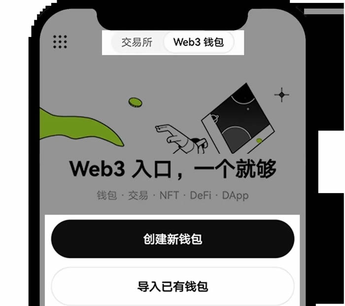

# 如何在Web3钱包铭刻BRC-20？在OKX Web3钱包铭刻BRC-20教程

## 如何在Web3钱包铭刻BRC-20？

1、登录 OKX Web3 钱包，或者在【钱包管理】-【添加钱包】导入 BTC 钱包。铭刻 BRC-20，需要您的钱包持有一定数量的 BTC，您可以通过在钱包内交易买入 BTC，或向钱包内转入 BTC。

<figure><figcaption></figcaption></figure>

<figure><figcaption></figcaption></figure>

<figure><figcaption></figcaption></figure>

<figure><figcaption></figcaption></figure>

2、点击【市场】-【Ordinals】-【铭刻】，在BTC通用铭刻页面，您可以铭刻 BRC-20、图片或文本。选择【BRC-20】，【类型】选择【铸造】，输入四位代币代码，即您要铭刻的【币种】如csas （仅作为示例，不构成投资建议），填写铸造【数量】、【重复次数】以及【接收地址】，点击【下一步】-【确认】。

<figure><figcaption></figcaption></figure>

<figure><figcaption></figcaption></figure>

<figure><figcaption></figcaption></figure>

<figure><figcaption></figcaption></figure>

3、铭刻后的 BRC-20 ，您可以在首页，点击【币种管理】，输入 BRC-20 代币名称，点击添加按钮【+】，返回首页，在币种中，能看到铭刻的BRC-20代币和数量。

<figure><figcaption></figcaption></figure>

<figure><figcaption></figcaption></figure>

<figure><figcaption></figcaption></figure>

4、系统默认地址为您的Web3钱包 BTC Taproot 地址，您可在 BTC 资产页面查看【我的 Bitcoin 地址】。如果您的BRC-20资产不在 Taproot 默认地址，请点击右上角图标，查看其他类型的 Bitcoin 地址。

<figure><figcaption></figcaption></figure>

<figure><figcaption></figcaption></figure>

如有不明白或者不清楚的地方，请加入官方电报群：[https://t.me/gtokentool](https://t.me/gtokentool)
