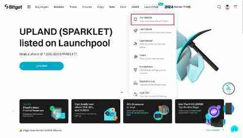

# 什么是Bitget盘前交易？如何使用Bitget盘前交易？

## 什么是Bitget 盘前交易？

bitget (官方下载 官方注册)盘前交易是一个创新的场外交易（otc）平台，专为在bitget 正式上架之前进行新币交易而设计。它为买家和卖家提供了聚集在一起进行点对点交易的机会，也为早期采用代币和有竞争力的定价奠定基础。

<figure><figcaption></figcaption></figure>

## Bitget 盘前交易如何运作？

Bitget 盘前交易的运作遵循一个简单而强大的原则：使用户能够在新币正式上架交易之前，提早进行交易。让我们来了解它的运作原理：

### 新币上架

Bitget 盘前交易专门为尚未正式开放现货交易的新币提供早一步交易的平台，这有助于用户能够提早进场，并吃到第一波红利。

### 点对点交易

买家和卖家可以直接在平台上互动，设定他们偏好的交易价格和数量。这种点对点模式创造了一个动态的交易环境，并促进有效的价格发现。

### 下达订单

卖家可以按照自己想要的价格在平台上列出他们的新代币，而买家可以根据他们想要购买的代币数量下达订单。或者，买家可以从市场上现有的卖单中进行选择。

## 两种结算货币选择

Bitget 盘前交易允许用户使用项目币种或稳定币（USDT）作为结算货币，为交易活动提供更大的灵活性。

币种交割：依照「一手交钱、一手交货」的原则来执行交割结算，如果卖方未准备足够的项目币种交割，则保证金将被没收，作为违约赔付。

USDT 交割：盘前交易的新选择，这也是Bitget 盘前交易提供的第二种交割模式。订单会以最后一分钟的平均指数价格作为交割执行价结算。在买卖双方中，亏损的一方会把亏损金额结算给盈利的一方。

在不包括交易费用的情况下，双方的最大利润或损失最多可达其保证金的100%。

### 范例：

用户以10 USDT 买入10 枚代币（订单A），以15 USDT 卖出10 枚代币（订单B）。

交割时，系统会根据最后1 分钟的指数平均价格（假设为5 USDT）来计算执行价格。

### 计算过程：

**订单A 的盈亏：**（5 - 10）x 10 = -50 USDT

**订单B 的盈亏：**（15 - 5）x 10 = 100 USDT

用户在该盘前交易项目的总盈亏为50 USDT。

### 交易保障

为确保交易顺利进行，平台会预先冻结每笔订单所需的资金作为交易保障，降低了因资金不足而导致交易失败的风险。

### 交割完成

在指定的交割时间之前，卖家必须确保其现货帐户中有所需数量的新代币。交割完成后，对应的代币将转入买方现货帐户，扣除费用后资金会转入卖方帐户。

### 交割结果

交易时间结束后，会显示用户的交割资讯总览。其中包括买入和卖出数量、平均价格和总交易量。交割完成后，币种交割的收入和支出，以及USDT 交割的盈亏会在结果中显示。

## Bitget 盘前交易的优势

Bitget 盘前交易为寻求早期购买新币的投资者提供了一系列优势：

### 抢先体验

用户可以在新代币于Bitget 正式上架之前取得，从而抢占获利先机。

### 价格发现

透过开启点对点交易，Bitget 盘前交易促进了高效的价格发现，使用户能够为其交易建立最佳价格。

### 流动性

该平台透过预先冻结每笔交易的资金来确保流动性，使买卖双方能够顺利、安全地执行交易。

### 市场影响力

早期参与盘前交易可以激发社群 交易兴趣、并吸引早期采用者，一旦该资产在Bitget 现货交易中上架，就有可能将自身定位为该资产的主要交易市场。

## 如何使用Bitget 盘前交易？

本指南将提供基本步骤，引导您有效使用Bitget 盘前交易并获得最佳交易体验。

### 建立盘前交易订单

步骤1：前往Bitget 网站，点击「新币专区」并选择盘前交易。如果您使用的是Bitget 手机App，请进入主画面，点击「更多」，然后点击盘前交易图示。

<figure><figcaption></figcaption></figure>

步骤2：选择您要交易的代币。

<figure><figcaption></figcaption></figure>

步骤3：在该页面中，您可以在画面右下角找到该代币的历史价格、交易历史、市场价格走势以及深度等资讯。

<figure><figcaption></figcaption></figure>

步骤4：

作为挂单方（Maker）：

● 点击「发布订单」。

<figure><figcaption></figcaption></figure>

您将看到关于不同交割场景的通知。您可以从4 个选项中进行选择：

○ 有足够的交割资产（币种交割模式下）

<figure><figcaption></figcaption></figure>

○ 挂单方没有足够的交割资产（币种交割模式下）

<figure><figcaption></figcaption></figure>

○ 交割执行价格低于最大收益交割价格（USDT 交割模式下）

<figure><figcaption></figcaption></figure>

○ 交割执行价格大于或等于最大亏损交割价格（USDT 交割模式下）

<figure><figcaption></figcaption></figure>

● 点击「确认」以继续。

● 指定您要「买入」还是「卖出」。在弹出视窗中输入价格和金额，然后点击「确认」。

<figure><figcaption></figcaption></figure>

● 在确认订单之前，请查看订单详细资讯和费用。如果挂单方订单被吃单方成交后，订单剩余的部分已不足最小下单价值（通常是5 USDT），这时挂单方订单会因无法继续成交，而自动变为历史订单。

作为吃单方（Taker）：

● 查看「买入」或「卖出」栏中的挂单列表，然后选择您偏好的订单。

<figure><figcaption></figcaption></figure>

● 选择您偏好的交割方式（类似上述的挂单方部分），然后点击「确定」。

● 输入您想要交易的金额，然后点击「确认」。

<figure><figcaption></figcaption></figure>

● 请注意，您必须履行挂单方订单中指定的全部价格和数量。不允许订单部分完成。

## 履行盘前交易订单

作为买家，一旦您的订单被撮合，只需等待结算时间，即可进行代币交割。作为卖家，请依照以下步骤履行盘前交易订单：

**步骤1：**&#x5C06;必要的代币充值至您的Bitget 帐户。请确保验证充值链和地址，以防止任何资产损失。或者，您可以在现货市场上购买所需的币种。

**步骤2：**&#x5728;结算期间内将指定金额转入您的帐户，确保及时、成功地完成交割。

## 取消盘前交易订单

请注意，只有不完整的订单才能取消。等待交割的订单无法取消。

若要取消特定订单，请前往「有效订单」并点击对应操作栏位中的「取消」。若要批次取消订单，请使用「全部取消」选项。

## 查看有效和过去的盘前交易订单

若要查看您的有效订单和过去的盘前交易订单，请点击「我的订单」。使用币种/方向、交割数量、单价（USDT）、交割状态和交割方式的下拉式选单，以排序和查看过去的订单。您也可以在「目前订单」、「历史订单」和「交割纪录」之间切换，以更好地进行搜寻。

请追踪您的盘前交易订单的结算时间。请注意，如果卖家选择「币种交割」，则必须确保在结算期结束前，自己的帐户中持有所需的代币，以确保交割成功。如果是「USDT 交割」订单，卖家则无需准备代币，直接在订单完成时以USDT 保证金结算盈亏即可。

如有不明白或者不清楚的地方，请加入官方电报群：[**https://t.me/gtokentool**](https://t.me/gtokentool)
