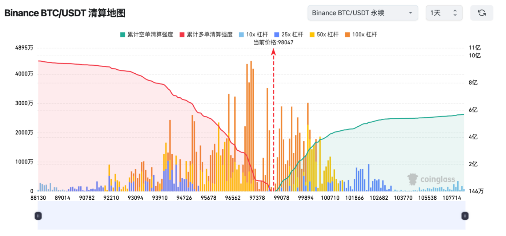

# 什么是合约清算？

合约清算，也叫强制平仓，是在交易者亏损超过保证金时，交易所为防止进一步损失而强制平掉其仓位的操作。清算可分为部分清算和全部清算，其中部分清算可以保留一部分仓位，而全部清算则完全关闭仓位。清算的触发条件通常是账户保证金不足以支撑最低要求，且会自动进行。此机制旨在保护交易者避免更大亏损，但也意味着交易者可能错失市场反弹的机会。

## 什么是合约清算 

<figure><figcaption></figcaption></figure>

合约清算，也叫强制平仓，是交易所为防止交易者因亏损而无法还款而采取的强制性操作。通常出现在永续合约交易、杠杆交易和保证金交易等高风险投资场景中。清算的核心触发条件是交易者的保证金不足以支撑其开仓所需的最小保证金水平。当合约交易者的亏损过大，导致保证金不足时，交易所会根据预设的规则强行平掉交易者的仓位。

例如，假设你在交易中使用了10倍杠杆并开了一个BTC的多头仓位。如果BTC价格下跌10%，而你没有追加保证金，你的仓位可能就会面临被清算的风险。在这种情况下，交易所会自动卖出你的头寸以避免进一步的亏损。

## 清算的分类 

清算可以分为部分清算和全部清算：

* 部分清算：当账户的初始保证金尚未用完时，交易所会只清算一部分仓位。这种情况下，如果市场价格反转，交易者有可能弥补损失，继续维持仓位。但如果价格继续下跌，剩余的仓位可能会面临更大的风险。
* 全部清算：当交易者的亏损达到一定程度，无法再维持最低保证金要求时，交易所会直接清算全部仓位。这可以帮助交易者避免“穿仓”（即账户余额变为负值），但也意味着交易者错失了后市反弹的机会。

## 清算的意义 

虽然清算对交易者来说通常意味着损失，但它有其正面意义。它可以有效防止交易者因过度杠杆而发生更严重的亏损，尤其是在极端市场波动时。例如，在市场大跌时，如果不进行清算，交易者的亏损可能会无限放大，甚至导致账户“爆仓”并背负额外的债务或穿仓。

清算机制通过保护交易所和市场的整体稳定，避免了交易者亏损扩大的风险，防止了市场崩溃的连锁反应。

## 清算价格的计算 

清算价格的计算并不是一个简单的过程，它需要综合考虑杠杆倍数、入场价格、仓位大小以及维持保证金比率等因素。以下是一般情况下计算清算价格的公式：

多头仓位清算价格：

<figure><figcaption></figcaption></figure>

空头仓位清算价格：

<figure><figcaption></figcaption></figure>

其中，

* 入场价格：交易者开仓时的价格。
* 初始保证金：开仓时需要提供的抵押品比例，通常由杠杆倍数决定。
* 维持保证金：保持仓位所需的最低保证金比例。
* 持仓大小：合约的实际规模，通常以合约单位来表示。

实际计算时，交易所可能会加入额外因素，如资金费率、费用和其他保证金要求，因此了解具体交易所的规则十分重要。

## 清算的机制和费用 

以多头仓位为例，假设你以100美元作为初始保证金，使用10倍杠杆开仓，借入900美元，总头寸为1000美元。如果市场价格上涨10%，你将获得100美元的利润。如果价格下跌10%，你的总头寸将变为900美元，系统会判断是否进行清算。

当亏损达到一定程度时（比如10%），如果未及时追加保证金，交易所将强制平仓。强制平仓不仅会关闭仓位，还可能会产生额外的费用，这些费用是为了激励交易者在亏损发生前主动平仓。

以下是清算的流程：

1. **触发条件：**&#x5F53;账户的保证金率（即保证金与仓位价值的比率）下降到一定水平时，系统会触发强制平仓。例如，当保证金率低于100%时，系统会开始平仓。
2. **撤单：**&#x7CFB;统会取消账户中的所有未成交挂单（包括策略挂单），并开始强平处理。
3. **阶梯式平仓：**&#x7CFB;统会逐步降低仓位的风险限额，并在达到清算点时开始强制平仓。这个过程中，系统会检查保证金率是否回升，如果回升则停止平仓操作。
4. **清算价格和破产价格：**&#x5F53;市场价格触及清算价格时，系统会以市场价出售仓位。如果实际成交价格优于破产价格，交易所会使用保险基金补偿差额；如果价格低于破产价格，则需要动用风险准备金池。

## 如何应对清算风险？ 

为了避免强制平仓，交易者可以采取以下措施：

* **保持充足的保证金：**&#x4FDD;持保证金的足够水平是防止清算的首要措施。如果市场出现不利波动，追加保证金可以避免强制平仓。
* **使用合理的杠杆：**&#x9AD8;杠杆虽能放大收益，但也加大了风险。合理使用杠杆，并根据市场波动调整仓位，是降低清算风险的有效方式。
* **使用止损单：**&#x6B62;损单可以帮助交易者在市场价格波动时自动退出仓位，减少损失。

## 总结 

合约清算是一项重要的风险控制机制，它可以保护交易所和市场的稳定，防止交易者的亏损无限扩大。在高杠杆的交易环境中，清算为交易者提供了“止损”的功能，避免了因过度杠杆带来的更大风险。然而，清算也意味着交易者可能错失市场反弹的机会，因此在进行合约交易时，务必谨慎管理风险，合理设置仓位和保证金，以避免被强制平仓。

通过理解清算机制和合理操作，交易者可以更好地规避爆仓风险，提高交易的安全性和盈利机会。

如有不明白或者不清楚的地方，请加入官方电报群：[**https://t.me/gtokentool**](https://t.me/gtokentool)
