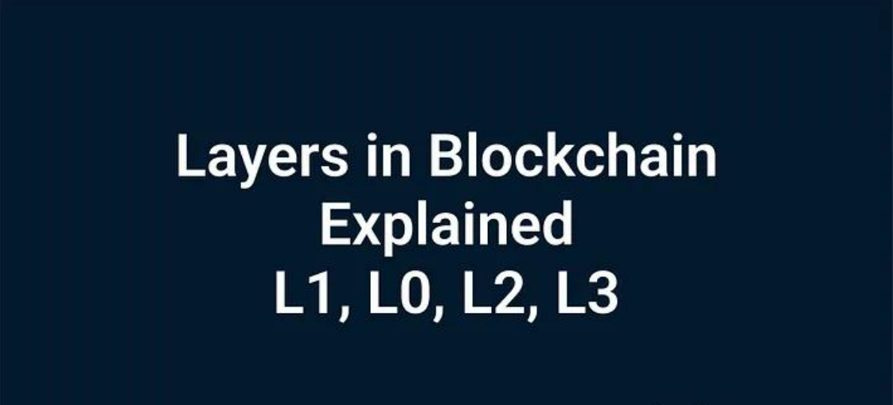

# 什么是 L0、L1、L2 和 L3 区块链层以及为什么需要它们

<figure><figcaption></figcaption></figure>

层的概念是区块链的一种分类，对于快速了解特定项目如何融入整个生态系统必不可少。在本文中，我们将分析什么是层 L0、L1、L2 和 L3，为什么需要它们并考虑示例。

### 为什么需要分层，为什么我们不能局限于一个区块链

所有计算机网络都依赖于数据传输带宽，区块链网络也不例外。然而，与中心化网络相比，去中心化网络更容易出现带宽扩展问题。

区块链网络由节点（网络上存储整个交易账本的计算机）组成。这意味着每个节点必须使用大量计算资源来提供对注册表的访问并维持共识（将新交易块添加到注册表的协议）。区块链越分散，它拥有的节点就越多。虽然这种冗余对网络安全有利，但对网络速度不利。这是因为许多节点都参与了交易验证。反过来，少数节点会增加网络的脆弱性。通过控制 51% 的节点，黑客将能够随心所欲地操纵网络。

<figure><figcaption></figcaption></figure>

因此，目前不可能同时创建一个完全去中心化、可扩展且安全的区块链，这个问题被称为区块链三难困境。

区块链三难困境：假设去中心化网络在任何时候只能提供去中心化、安全性和可扩展性三个好处中的两个。

### L1

<figure><figcaption></figcaption></figure>

第一层的区块链包括无需其他网络参与即可进行交易的区块链。第 1 层区块链遭受区块链三难困境，通常只能很好地实现三难困境的三个属性中的两个（去中心化、安全性和可扩展性）。为了解决这个问题，有 L2 解决方案。同样值得注意的是，由于第一层区块链的数量不断增加，存在将资产从一个区块链转移到另一个区块链的问题，针对此问题有一个 L0 层。

示例

* 比特币
* 以太坊
* TON

让我们下降一级。

### L0

<figure><figcaption></figcaption></figure>

L0 层的发展有助于区块链相互交互，即：

* 允许您在不同的区块链之间转移资产
* 允许开发人员同时在多个区块链上开发一个应用程序（或者至少由于标准化而简化在多个区块链上的开发）
* 由于 L0 中使用的“通信”协议（例如，IBC） ，跨链交易所的交易快速且廉价

示例

Polkadot是一种协议，通过“连接” Polkadot 的“主网”（中继链）网络，允许任何类型的数据或资产在区块链之间转移。

Cosmos是一个能够去中心化交互的区块链网络，这是因为网络区块链是使用 Cosmos 开源工具 Tendermint、Cosmos SDK 和 IBC 创建的，并且可以相互交互。

### L2

<figure><figcaption></figcaption></figure>

L2 层通常被称为与 L1 的第三方集成，它解决了 L1 的区块链三难困境之一。最常见的是扩展问题。

对于此类第三方集成，使用以下技术解决方案：

-状态通道- 在区块链外部交换交易，然后将结果写入区块链本身（通常由多重签名智能合约实现）

-嵌套区块链- 在 L1 之上运行 L2 区块链（例如，由于共识机制安全性较低，因此更具可扩展性）

-Rollups - 合并多笔交易并在 L1 网络中处理它们

-侧链是嵌套区块链和状态通道的混合体，用于一次处理大量交易。

示例

Polygon是针对以太坊 L1 网络的基于侧链的扩展解决方案。

Optimism是一个基于 Rollup 的、针对 L1 以太坊网络的扩展解决方案。

### L3

<figure><figcaption></figcaption></figure>

L3 层通常称为应用层。此层托管去中心化应用程序以及使应用程序正常运行的协议。

示例

Uniswap是一个去中心化交易所

Orbs是跨链应用程序的单一后端

全部的

<figure><figcaption></figcaption></figure>

当然，这种分类并不总是方便的；有些应用程序可以同时归入多个层。例如，OmniLayer 平台是为交易自定义数字资产和货币而创建的，建立在比特币之上，可以归入 L2 和 L3 层。但尽管如此，按层分类可以让你估计你第一次听说的项目在区块链生态系统中的位置。

如有不明白或者不清楚的地方，请加入官方电报群：[https://t.me/gtokentool](https://t.me/gtokentool)
