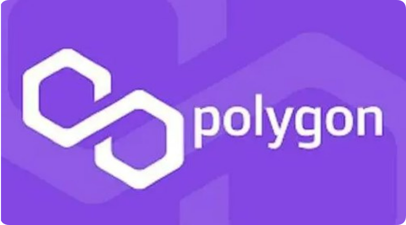

# 什么是马蹄币？马蹄币在哪个交易所买？

马蹄币是一种去中心化、匿名、快速且便宜的加密货币，其独特之处在于马蹄形状的图案。它可用于支付、价值储存、智能合约和 nft。马蹄币因其去中心化特征具有抗审查性，且具有成为广泛接受的加密货币的潜力。

<figure><figcaption></figcaption></figure>

## 什么是马蹄币？

马蹄币是一种加密货币，它使用去中心化的区块链技术。其名称源于其独特的设计，包括一个马蹄形状的图案。

### 马蹄币的主要特点：

* **去中心化：**&#x9A6C;蹄币不受任何中央机构或政府控制，由其用户集体管理。
* **匿名：**&#x9A6C;蹄币交易是匿名的，这意味着交易者身份无法追溯。
* **快速且便宜的交易：**&#x9A6C;蹄币区块链每秒可以处理大量的交易，交易费用也很低。
* **抗审查：**&#x7531;于马蹄币去中心化的特性，它不受政府或其他实体的审查。

### 马蹄币的用途：

* **作为交换媒介：**&#x9A6C;蹄币可用于在个人和企业之间进行支付。
* **价值储存：**&#x9A6C;蹄币由于其有限的供应和不断增长的需求，而被一些投资者视为一种价值储存。
* **智能合约平台：**&#x9A6C;蹄币区块链可以用来创建和执行智能合约，这是自动执行协议的程序。
* **非同质化代币（NFT）：**&#x9A6C;蹄币可以用来创建和交易NFT，这是代表独特数字资产的所有权的代币。

## 马蹄币在哪个交易所买

马蹄币可在binance、huobi、okex、gate.io、kucoin等交易所购买。购买步骤包括注册交易所账户、充值资金、搜索马蹄币、输入订单、确认交易。

### 马蹄币可在以下交易所购买：

* 币安
* 火币
* OKEx
* Gate.io
* KuCoin

### 详细指南：

1. 注册交易所账户

首先，需要在所选交易所注册一个账户。填写基本信息并完成 KYC 程序。

2. 充值资金

一旦注册成功，需要为账户充值资金。支持的法币和加密货币因交易所而异。

3. 搜索马蹄币

在交易所页面上，搜索“马蹄币”或其交易对（如 BTC/HUSD）。

4. 下单购买

找到交易对后，输入购买数量和价格。可以选择限价单或市价单。

5. 确认交易

仔细检查订单信息，然后点击“购买”或“卖出”按钮。交易完成后，马蹄币将存入你的交易所钱包中。

### 注意事项：

* 马蹄币的可用性可能因交易所而异。
* 购买前，请务必研究马蹄币并了解其风险。
* 在进行任何交易前，请确保了解交易所的费用和条款。

如有不明白或者不清楚的地方，请加入官方电报群：[**https://t.me/gtokentool**](https://t.me/gtokentool)
