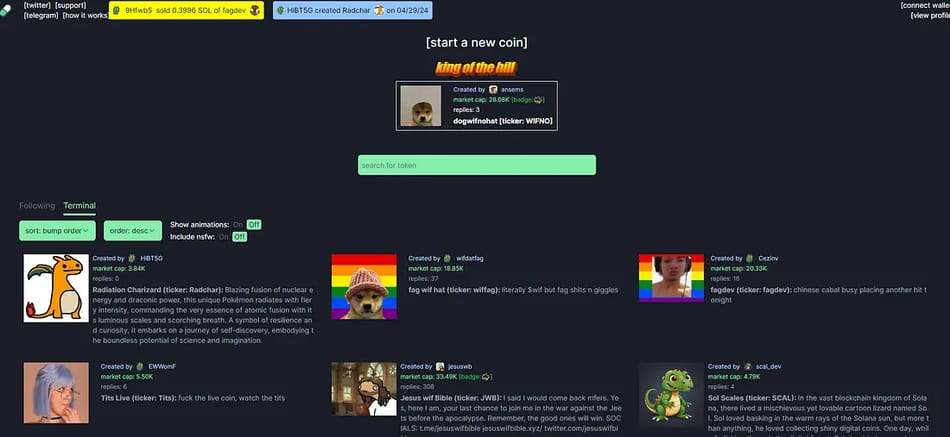
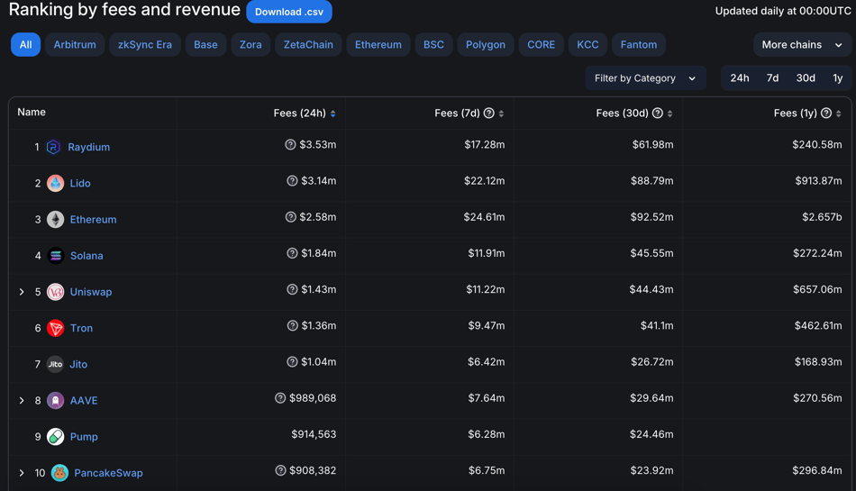

# 什么是Pump.fun? Solana上的一键式迷因币创建平台

## 介绍 

Pump.fun 是一个基于 Solana 的平台,允许用户轻松创建和交易迷因币。该平台于2024年1月推出,已迅速在加密社区内,特别是在迷因币爱好者中崭露头角。它简单易用的界面和低成本的代币创建过程,使其成为资深加密交易者和新手的热门选择。到2024年中旬,Pump.fun 拥有超过111,000名粉丝,在其平台上创建了100多万枚迷因币。

## 核心功能 

Pump.fun 提供了一系列功能,旨在简化迷因币的创建和交易,使其适合广泛受众。以下是其主要产品和特点:

**简易迷因币创建**

用户只需输入代币的名称、交易代码和图像,就可以创建自己的迷因币。这个过程简单明了,几乎不需要任何技术知识。

部署一个代币的成本约为0.02 SOL(约合3美元),对用户来说是可承担的,可以尝试创作自己的代币。

<figure><figcaption></figcaption></figure>

**Bonding Curve 模型**

Pump.fun 采用 Bonding Curve 模型来确定代币价格。随着更多人购买一种代币,其价格将沿着预定曲线增加。一旦一种代币的市值达到69,000美元,该平台会自动将价值12,000美元的流动性存入去中心化交易所 Raydium。这一步骤对于确保代币能够有效交易至关重要,使用户能够在流动性市场上买卖自己的代币。

Bonding Curve 模型允许根据实时需求进行动态定价。随着代币的买卖,价格会相应调整,确保市场反映了当前的交易活动。这种方法降低了价格操纵的风险,促进了更健康的交易环境。

**支持的区块链**

尽管 Pump.fun 主要在 Solana 网络上运营,但也已经集成了对 Base 和 Blast 网络的支持。这种跨网络支持增强了该平台对更广泛加密社区的吸引力和可访问性。

**低交易费用**

Pump.fun 建立了一个简单明了且富有竞争力的费用结构,以促进其平台上迷因币的创造和交易。

代币创建费用:用户可以在 Pump.fun 上以约0.02 SOL(约合3美元)的费用创建自己的迷因币。这种低成本使用户能够启动自己的代币而不会面临重大的经济障碍。

交易费用: Pump.fun 对其平台上的所有交易收取1%的费用。这一费率相对较低,有助于控制用户的交易成本,同时确保了平台的经营可持续性。

**防范市场操纵的措施**

Pump.fun 包括一些保护措施来防范诈骗行为,例如 rug pulls。每一个发行的代币都要经过公平发行的过程,没有预售或团队配额。

该平台还采用了一种代币销毁机制,一旦达到某些市值里程碑,就会销毁部分流动性,帮助维持健康的代币生态系统。

**社区参与**

Pump.fun 内置了一个社区讨论板,用户可以在此与潜在投资者互动并推广自己的代币。这一功能有助于驱动新推出代币的参与度和关注度。

### Pump.fun 有没有自己的代币? 

目前 Pump.fun 还没有宣布推出自己的原生代币的计划。该平台目前在没有原生代币的情况下运营,主要通过交易费用和代币创建费用(以SOL支付)来获取收益。

当前的收益模式:

* 交易费用:Pump.fun 对其平台上的交易收取1%的费用。
* 代币创建费用:用户需支付约0.02 SOL来在 Pump.fun 上创建和部署新代币。
* 上市费用:当一枚代币达到一定的市值时,还需支付额外的费用才能在 Raydium 等去中心化交易所上市。

<figure><figcaption></figcaption></figure>

Pump.fun 利用了迷因币日益增长的热潮,创造非常显著收益。该平台每天产生近100万美元的费用收入,使其成为加密领域收入最高的协议之一。由于没有自己的代币,所有这些收益目前都流入了这个项目本身。

尽管目前没有推出 Pump.fun 原生代币的计划,但该平台在迷因币领域的快速增长和广泛认可,可能会导致未来出现新的发展,包括引入自有代币的可能性。

## Pump.fun 上推出的热门迷因币 

自2024年1月推出以来,Pump.fun 已成为创建和交易迷因币的领先平台,累计产生了超过100万枚代币。该平台特别吸引了名人和 KOL 的关注,创造了一些备受瞩目的迷因币。

**JENNER (凯特琳·詹纳的迷因币)** 2024年5月26日,由凯特琳·詹纳推出的 JENNER 代币凭借广泛的社交媒体推广迅速获得关注。它在推出不久就达到了约4000万美元的市值,展示了名人背书在迷因币领域的力量。

**Mother Iggy (艾格·阿扎利亚的迷因币)** 饶舌歌手艾格·阿扎利亚也通过她的迷因币 Mother Iggy(MOTHER) 进入了加密圈。她的参与引起了粉丝群体的巨大兴趣,利用了名人背书代币在迷因币热潮高涨时期的优势。

**政治主题迷因币(Doland Tremp 和 Jeo Boden)** 除了名人代币,Pump.fun 还推动了以政治人物为主题的迷因币,如 Doland Tremp 和 Jeo Boden。这些代币利用政治人物的公众形象,吸引了特定人群的关注和参与。

## 如何使用 Pump.fun 创建迷因币? 

使用 Pump.fun 创建迷因币是一个简单有趣的过程。以下是一个详细的指南。

步骤1: 连接您的钱包

1. 访问 PPump.fun网站。
2. 点击页面右上角的钱包连接按钮,连接一个兼容 SSSolana的钱包(如Phantom 或 Solflare)。
3. 确保您的钱包里有足够的 SOL 代币来支付创建费用(约0.02 SOL)。

步骤2: 开始创建您的迷因币

1. 点击"创建新币"按钮。
2. 填写以下必填信息:
   1. 名称:为您的迷因币选择一个引人注目的名称。
   2. 交易代码:创建一个简短的交易代码(如 Dogecoin 的"DOGE")。
   3. 描述:简要描述您的代币。
   4. 图像:上传一个吸引人的图像来代表您的迷因币。
3. 支付约0.02 SOL的小额费用来部署您的代币。

<figure><figcaption></figcaption></figure>

创建完您的迷因币后,它将立即在平台上可供交易。您可以使用基于供给和需求的 bonding curve 机制来买卖代币。

如有不明白或者不清楚的地方，请加入官方电报群：[https://t.me/gtokentool](https://t.me/gtokentool)
