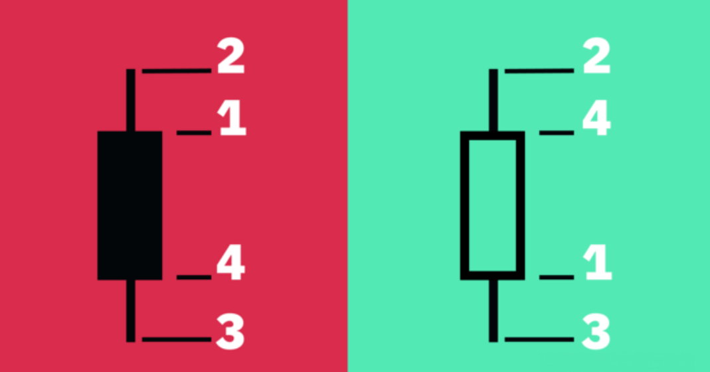

# ​什么是k线图？如何看懂加密货币k线图？

交易和投资的本质是与概率和风险管理相关的游戏。因此，读懂K线图几乎是所有投资方式的关键。本文将解读什么是K线图以及如何读懂它们。

## 什么是K线图？

K线图是一种以图形化方式呈现给定时间范围内资产价格变化的金融图表。顾名思义，它由许多烛台图案组成，每个烛台图案表示一段相同的时间。烛台图案可以代表任何虚拟的时间范围，短到数秒，长到数年。

K线图的历史可以追溯到17世纪。人们通常认为是一位名叫Homma的日本米商发明了这种图表工具。他的想法为我们如今使用的现代K线图奠定了基础。许多后来者对Homma的发明进行了优化和改进，最著名的当属现代技术分析奠基人之一——查尔斯·道。

虽然K线图可用于分析其他任何类型的数据，但其主要用途是简化金融市场分析。如果运用得当，它可以帮助交易者评估价格波动结果的概率。交易者和投资者能够以此为依据，通过市场分析形成个人观点。

## K线图的工作原理是什么？

创建烛台图案时需要以下价格点：

**开盘价** – 在特定时间范围内，资产的第一个交易价格数据。

**最高价** – 在特定时间范围内，资产的最高交易价格数据。

**最低价** – 在特定时间范围内，资产的最低交易价格数据。

**收盘价** – 在特定时间范围内，资产的最后一个交易价格数据。

<figure><figcaption></figcaption></figure>

该数据集通常被统称为“OHLC值”。开盘价、最高价、最低价和收盘价之间的关系决定了烛台图案的整体外观。

开盘价和收盘价的间距称为“实体”，而实体与最高/最低价的距离称为烛芯或影线。蜡烛图案高低点的间距称为烛台范围。

## 如何读懂K线图？

许多交易者认为，虽然各种图表提供的信息类似，但K线图比传统的条形图和折线图更加通俗易懂。通过K线图，交易者可以轻松查看价格数据，整个价格走势一目了然。

烛台图案实际显示的是在一定时期内，多头与空头的博弈。一般来说，烛台越长，在所选时间范围内的买卖压力就越大。如果烛台很短，则表明所选时间范围内的最高价（或最低价）接近收盘价。

颜色和设置可能随制图工具的变化而有所不同。在通常情况下，如果主体为绿色，表示资产的收盘价高于开盘价；红色则表示价格在所选时间范围内下跌，即收盘价低于开盘价。

部分图表专家更喜欢用黑白色表示，即图表不使用绿色和红色，而是以空心表示价格上涨并使用黑色实心表示价格下跌。

## K线图无法提供哪些信息？

K线图有助于大致了解价格走势，但可能无法为综合性分析提供所有必要数据。例如，K线图无法详细展示开盘和收盘之间的变化情况，只能显示两点之间的间距（以及最高和最低价格）。

例如，虽然K线图的烛芯确实显示了该时间段内的最高点与最低点，但我们无法判断哪个价格点是先出现的。然而，大多数图表工具支持更改时间范围，交易者可以放大查看更短时间范围的趋势，了解详细信息。

K线图也可能包含许多市场干扰信息，这一点在时间范围较短的图表中尤其明显。而且，K线变化很快，解读难度比较大。

## 什么是平均K线图(Heikin-Ashi)？

目前，我们已经讨论了起源于日本的传统K线图。但是，还有其他方法可以计算K线图数据。比如说平均K线图(Heikin-Ashi)技术。

Heikin-Ashi在日语中代表“平均标准”。此类K线图基于一种使用平均价格数据的改进型公式，主要目标是消除价格波动并滤除市场干扰信息。因此，借助平均K线图可以更加轻松地判断现货市场趋势、价格形态以及潜在的逆转。

交易者经常将平均K线图与常规K线图相结合，这样避免被错误信号误导并增加找出市场趋势的机会。在平均K线图中，不含下烛芯的绿色阳烛通常表示强劲的上升趋势，而不含上烛芯的红色阴烛可能表示强烈的下降趋势。

虽然平均K线图是一种强大的工具，但和其他技术分析手段一样，依然存在相应的局限性。由于此类图表使用的是平均价格数据，可能需要放在更长的时间跨度里才能看出发展形态。此外，它们不会显示价格差距并且可能掩盖其他价格数据。

## 总结

K线图是所有交易者和投资者最常用的基本工具之一。通过该图表，除了可以清晰查看给定资产的价格走势之外，还可以灵活地分析不同时间范围内的数据。

如果能够对K线图和形态开展广泛研究，擅长分析，又具有足够的实践经验，交易者可能就会在市场交易中占据先机。然而，多数交易者和投资者认为，单纯依靠K线图并不科学，必须与其他方法（例如基本面分析）相结合，才能做出正确的判断。

如有不明白或者不清楚的地方，请加入官方电报群：[https://t.me/gtokentool](https://t.me/gtokentool)
