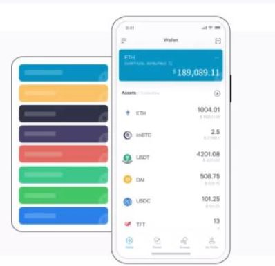

# shib怎么提现到imtoken钱包 如何查看shib币钱包地址

shib一波一波的暴涨，对于一应上车的玩家来说是一件非常开心的事情。目前很多玩家都想将shib储存到数字钱包imtoken里面，那么操作呢？目前虚拟币提现一个重要的步骤就是钱包支持，shib币同样也不例外，那么shib币怎么提到imtoken钱包？shib币钱包地址怎么看呢？

## shib币怎么提币到imtoken钱包

第一步，通过下载imToken钱包

<figure><figcaption></figcaption></figure>

第二步，打开APP，点击我的，右下角创建钱包：

<figure><figcaption></figcaption></figure>

选择ETH

<figure><figcaption></figcaption></figure>

点击创建钱包：

<figure><figcaption></figcaption></figure>

设置好钱包名称和密码：

<figure><figcaption></figcaption></figure>

用纸把助记词抄写下来，请勿复制、截图等方式，不要让任何人知道；

<figure><figcaption></figcaption></figure>

这样钱包就创建好了：

<figure><figcaption></figcaption></figure>

第三步，将交易所购买到的shib转到钱包：

点开“k君”，复制地址（点击一下地址可直接复制）：

<figure><figcaption></figcaption></figure>

打开交易所现货账户，找到shib币，点击提现：

<figure><figcaption></figcaption></figure>

复制粘贴复制好的钱包地址，点击“申请到提现地址”即可完成提币到钱包。

<figure><figcaption></figcaption></figure>

以上就是整个imToken提币的整个流程，同理，钱包转账到交易所套现，反过来即可。

## shib币钱包地址怎么看

以tokenpocket钱包为例，大家在创建了shib钱包之后（创作过程和imToken钱包是一样的，大家可以试一下），点开 SHIB 详情页，点击收款 ，获取收款地址和收款二维码 ，如图：

<figure><figcaption></figcaption></figure>

<figure><figcaption></figcaption></figure>

以上就是[**GTokenTool**](https://www.gtokentool.com)给大家分享的如何将shib储存到imtoken钱包的详细步骤了，如果大家有需要将shib存储打imtoken钱包里面，就按照此方法步骤。

如有不明白或者不清楚的地方，请加入官方电报群：[https://t.me/gtokentool](https://t.me/gtokentool)
