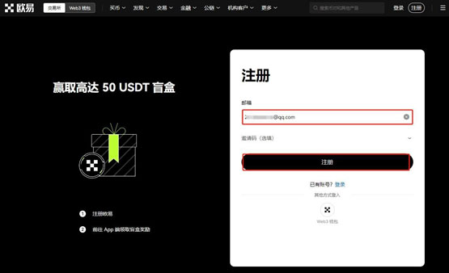

# 手把手教你购买PEPE币？一文读懂

当前最热门的币种之一就是PEPE币，不断上涨的价格以及不断刷新的最高价，无一不让投资者折服，进行大量的投资、交易。PEPE币是一种基于图像的数字货币，其爆炸性的增长和令人印象深刻的市场表现吸引了加密货币世界。但对于投资者来说，尤其是新手，想要进行PEPE币的投资，就需要了解PEPE币怎么买？最方便。就目前来看，主要就是在欧易、币安、火币等等22家交易所内进行。

## PEPE币价格最新行情

＄0.000010 ≈ ¥0.000072

<figure><figcaption></figcaption></figure>

## PEPE币怎么买？

购买PEPE币主要就是在上线的欧易、币安、火币等等22家交易所内进行，下文就是在欧易交易所购买PEPE币的详细教程：

1. 打开欧易OKX交易所官网，在首页输入邮箱，点击“注册”

<figure><figcaption></figcaption></figure>

2. 向右滑动滑块，完成拼图进行验证，然后输入邮箱收到的验证码，验证码有效时间为10分钟

<figure><figcaption></figcaption></figure>

3. 而后输入手机号，点击“立即验证”

<figure><figcaption></figcaption></figure>

4. 输入手机收到的六位数字验证码，有效时间同样为10分钟

<figure><figcaption></figcaption></figure>

5. 选择居住国家/地区，勾选服务条款、《风险与合规披露》及隐私政策与声明

<figure><figcaption></figcaption></figure>

6. 创建密码需要符合长度为 8-32 个字符、1 个小写字母、1 个大写字母、1 个数字、1 个符号，如：!@ # $ %等条件

<figure><figcaption></figcaption></figure>

7. 登录账号后，找到首页的“用户中心”图标，进入身份认证页面

<figure><figcaption></figcaption></figure>

8. 可根据不同需求进行不同等级认证(注意：视频认证需在APP上进行操作)

<figure><figcaption></figcaption></figure>

9. 进行交易前需要拥有USDT，可在C2C买币进行交易，根据需求选择合适商家，点击“购买”，而后根据提示进行付款、等待商家放币(若是长时间没有收到币种，可联系客服进行处理)

<figure><figcaption></figcaption></figure>

10. 点击首页的“交易”——“币币”进入交易页面

<figure><figcaption></figcaption></figure>

11. 在搜索框输入PEPE，选择PEPE/USDT交易对，可以看到PEPE实时行情

<figure><figcaption></figcaption></figure>

12. 输入买入PEPE数量，点击买入PEPE就可以了

<figure><figcaption></figcaption></figure>

## PEPE币能买吗？

PEPE币可以买，根据官方数据记载，当前PEPE币的价格为0.000017美元，高于发行价0.00000000001美元，投资回报为+1700999.00倍，且最高价不断刷新，市值为7,128,592,050美元。总体来看当前PEPE币的市场发展非常乐观。建立在以太坊区块链上的最受欢迎的模因币之一是PEPE币，在到2023年4月，PEPE币就已经获得了极大的人气，很快成为交易量最大的加密货币之一。而狗狗币花了大约四年时间才达到10亿美元的市值。然而PEPE币在创建后仅三周就超过了这一点。

最初PEPE币是用一种表示形式构建的，它在每次市场活动中都会销毁一定比例的代币。目标是创造限制，并在一段时间后提高剩余硬币的价格。当该项目被引入时，该团队还建立了一种机制，通过该机制，每次PEPE币销售中的一些资金都会分配给已经拥有一些代币的个人。这是一个属性，旨在鼓励消费者忠诚度和促进保持投资。

PEPE币的价格是由市场供需决定的，投资者可以通过购买和持有PEPE币来参与其中。随着时间的推移，如果PEPE币的需求增加，其价格可能会上涨，从而实现投资者的利润。虽然PEPE币的价格波动性较高，但对于一些投资者来说，这也是一种机会。他们可以通过买入低价并在价格高涨时卖出来实现盈利。

如有不明白或者不清楚的地方，请加入官方电报群：[**https://t.me/gtokentool**](https://t.me/gtokentool)
