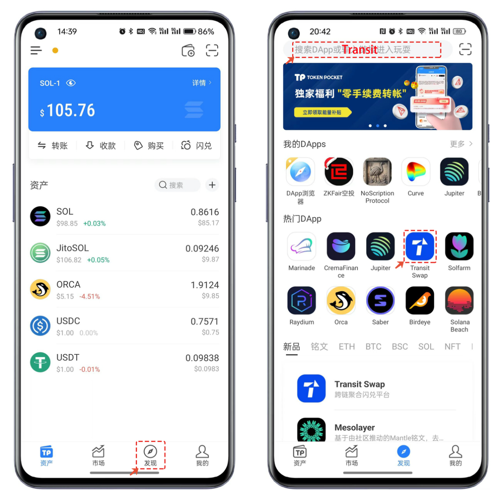

# TokenPocket使用Transit Swap兑换SOL资产

## Transit Swap兑换教程

1、打开TokenPocket，点击【发现】，在热门DApp中打开【Transit Swap】。

<figure><figcaption></figcaption></figure>

2、Transit Swap的界面非常的简介，设置需要兑换的代币种类和数量即可直接兑换，这里的【聚合路径】显示当前支持所在SOL公链中的流动性资金池情况，如果需要大额度的兑换，它可以在聚合资金池中分批的买入，以达到购买数量的最优和手续费用的最低。

<figure><figcaption></figcaption></figure>

3、除了支持同链的Swap之外，Transit Swap还支持不同公链的跨链兑换功能，只需要修改不同公链的代币，并设置好数量就可以选择自定义收款地址，或者选择当前钱包中已导入的地址收款。

<mark style="color:red;">**请一定注意：不要使用合约地址，例如交易所地址进行收款。**</mark>

<figure><figcaption></figcaption></figure>

4、Transit Swap右上角菜单中集成了所有功能，可以点击查看。Transit Swap还支持了【市场】的功能。

<figure><figcaption></figcaption></figure>

5、在市场中选择自己关注的Token，例如这里使用Cake代币作为演示，点击代币后可以查看其价格走势的K线和一切其他的信息，点击【交易】就会自动跳转到兑换界面，因为是属于非SOL链的代币，所以默认为跨链兑换方式，设置数量和收款地址后点击【确认兑换】。

<figure><figcaption></figcaption></figure>

如有不明白或者不清楚的地方，请加入官方电报群：[**https://t.me/gtokentool**](https://t.me/gtokentool)
