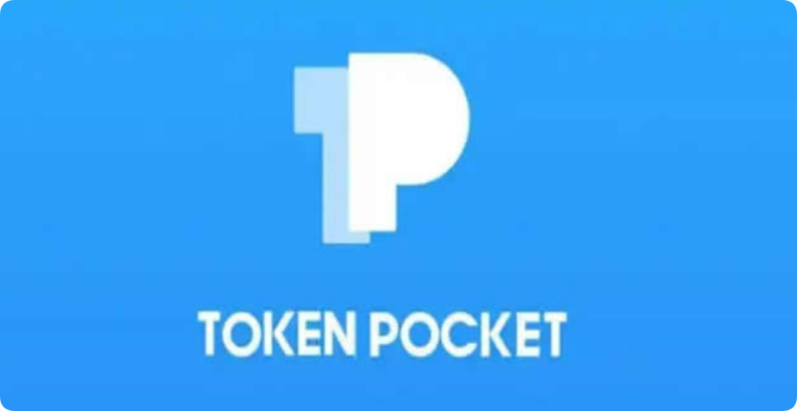
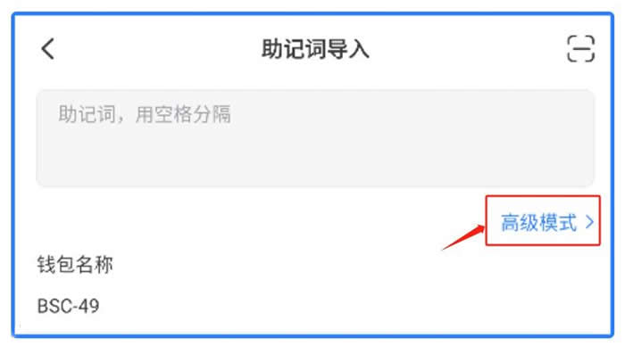

# TP钱包怎么用助记词找回密码？

随着数字货币的普及和应用，越来越多的人开始使用数字钱包进行数字资产的存储和管理。TP钱包就是受用户喜爱的钱包之一，TP钱包是一款能够能够满足用户的交易需求、安全需求以及应用需求的去中心化钱包。然而，有时候用用户可能会遇到一个尴尬的问题，就是忘记了TP钱包的密码。接下来[**GTokenTool**](https://www.gtokentool.com)就为大家介绍一下TP钱包怎么用助记词找回密码？希望可以对大家使用钱包能有所帮助。

<figure><figcaption></figcaption></figure>

## TP钱包怎么用助记词找回密码？

TP钱包是一款十分方便的钱包，如果忘记了密码可以用助记词找回密码，以下是TP钱包用助记词找回密码详细教程：

1、助记词导入界面点击【高级模式】

<figure><figcaption></figcaption></figure>

2、在高级模式中的【选择地址路径】并设置正确的地址路径导入钱包即可。

<figure><figcaption></figcaption></figure>

3、打开TokenPocket，点击【详情】功能，在钱包详情列表中选择【重置密码】，使用该钱包地址对应的私钥或助记词填入重置密码。

<figure><figcaption></figcaption></figure>

## TP钱包(TokenPocket)简介

TokenPocket是一个多区块链加密货币钱包和dAppstore。TokenPocket可在安卓、iOS和桌面上使用，它支持大多数主要的区块链和加密货币。TokenPoket以支持EOS区块链开始，但后来扩展到了更多的区块链和生态系统。如果您希望您的代币在TokenPocket上列出，只需通过Telegram联系团队即可。可以在TokenPocket上找到的区块链ETH、EOS、BOSCore/BOS、TronIOST、Cosmos、Binance等Tokenpocket支持与这些区块链相关的所有加密货币和dApp。

TokenPocket有两个版本供iOS用户使用，第一个是TokenPocket钱包，用户可以直接从AppStore下载。另一个，称为TokenPocketPro，在AppStore上不可用，您须使用test flight下载它。TokenPocketPro包含一个dApp商店，用户可以通过它访问TokenPocket支持的区块链上的所有dApp。

希望通过以上内容可以帮助大家了解TP钱包怎么用助记词找回密码。TokenPocket不仅仅是一个钱包，它还是一个dAppstore、一个方便的区块链工具包以及涵盖了区块链和所有加密货币的一站式商店，同时它也是获取最新区块链和加密货币新闻的最佳场所之一。另外，如果在找回密码的过程中遇到困难或需要额外的帮助，建议访问TP钱包的官方网站或联系他们的客户支持，以获取更具体的指导和支持。此外，请务必小心保管自己的助记词和新密码，以确保自己的数字资产安全。

如有不明白或者不清楚的地方，请加入官方电报群：[https://t.me/gtokentool](https://t.me/gtokentool)
