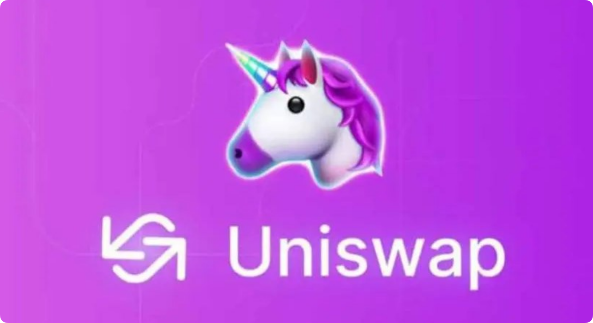

# Uniswap V3怎么使用？手把手教你如何使用Uniswap V3

<figure><figcaption></figcaption></figure>

## Uniswap V3使用指南

### 什么是Uniswap V3？

Uniswap V3 是一个去中心化交易所 (DEX)，允许用户在以太坊区块链上交易加密货币。它是一个自动做市商 (AMM)，使用数学公式而不是订单簿来设定资产价格。

### 如何使用Uniswap V3？

要使用 Uniswap V3，你需要：

1. 连接一个以太坊钱包（例如 MetaMask）
2. 访问 Uniswap V3 网站或移动应用程序
3. 选择你想要交易的资产对（例如 ETH/DAI）

### 交易

1. **输入交易金额：**&#x8F93;入你要交易的资产金额。
2. **选择价格范围：**&#x9009;择一个价格范围，在这个范围内，你的交易将被执行。
3. **设定滑点容忍度：**&#x6307;定交易在执行前允许的价格变动幅度。
4. **批准交易：**&#x786E;认交易并批准你的钱包进行交易。

### 提供流动性

1. **选择流动性池**：选择你想要提供流动性的资产对。
2. **输入流动性金额：**&#x8F93;入你要提供的两种资产的金额。
3. **设定价格范围：**&#x8BBE;定一个价格范围，让你的流动性在该范围内可用。
4. **批准交易：**&#x786E;认并批准你的钱包提供流动性。

### 其他功能

Uniswap V3 还提供以下其他功能：

1. **集中流动性：**&#x7528;户可以将流动性集中在特定价格范围内，提高他们的收益率。
2. **费用分级：**&#x4EA4;易费用根据交易金额和价格范围而有所不同。
3. **闪兑：**&#x7528;户可以通过一个交易在多个资产对之间进行交易。

### 提示

1. 在交易前了解 Uniswap V3 的所有费用。
2. 设置合理的滑点容忍度以避免不必要的损失。
3. 在提供流动性时仔细考虑价格范围。
4. 确保你的钱包里有足够的 ETH 来支付交易费用。

### Uniswap 最新动态

**当前价格：**&#x37;.18 美元

**交易量（24 小时）：**&#x31;.33 亿美元

**市值：**&#x34;3.07 亿美元

### 价格走势

在过去 24 小时内，Uniswap 价格下跌了 5.26%，原因可能是整个加密货币市场的抛售情绪。

### 影响价格变动的因素

影响 Uniswap 价格变动的因素包括：

1. **市场情绪：**&#x52A0;密货币市场的整体情绪对所有代币的价格都有很大影响。
2. **采用情况：** Uniswap 作为去中心化交易所的日益普及提振了其需求和价值。
3. **技术指标：**&#x6280;术分析可以帮助识别趋势和潜在的反转点，从而影响交易者的决定。

### 未来趋势分析

短期内，Uniswap 价格可能会继续波动。不过，长期来看，前景依然乐观，因为去中心化金融 (DeFi) 行业预计将持续增长。

### 建议行动

对于投资者而言，在对市场做出决定之前，了解影响价格变动的因素并进行自己的研究非常重要。价格波动是加密货币市场的固有属性，投资者应做好准备并相应的调整策略。

### 短期价格预测

短期内，Uniswap 价格预计将在 7 美元至 7.5 美元的范围内波动，但无法提供具体价格目标。

### 指标

1. **价格：**&#x37;.18 美元
2. **交易量（24 小时）：**&#x31;.33 亿美元
3. **流通量：**&#x36; 亿
4. **流通市值：**&#x34;3.07 亿美元
5. **最大供应量：**&#x65E0;限制
6. **总供应量：**&#x36; 亿

如有不明白或者不清楚的地方，请加入官方电报群：[**https://t.me/gtokentool**](https://t.me/gtokentool)
