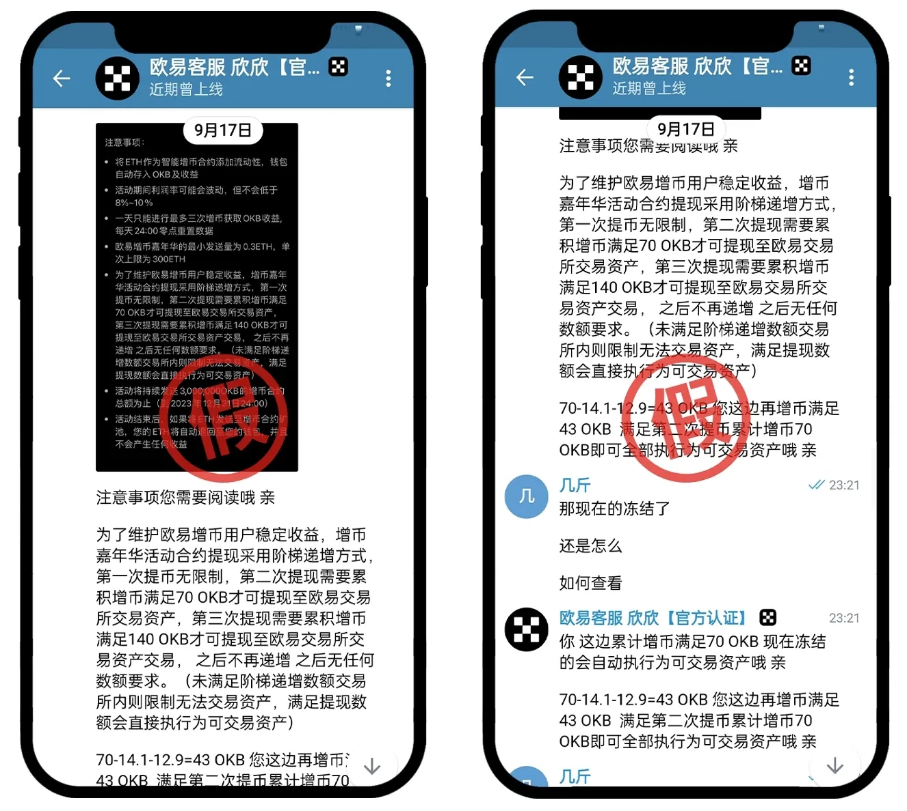

# web3钱包防骗指南 如何防范Web3钱包被盗

Web3钱包是我们参与去中心化世界的桥梁，但却一直有不法分子以挖矿、空投、高盈利的活动等为诱饵，引导用户点击不明链接在恶意站点授权钱包，或骗取助记词/私钥，造成用户资产损失。由于数字资产的匿名性及去中心化，被盗资产往往难以追回，请广大用户提高警惕，谨防被骗。

## 诈骗案例一：引导用户点击不明链接授权钱包

**诈骗手法回顾**

手法一：高收益活动（虚假挖矿、空头等）引导用户打开不明链接，并授权钱包。

手法二：打着官方的旗号，引导用户授权钱包。

手法三：推送不明链接/活动到钱包地址，引导用户授权Web3钱包。

<figure><figcaption></figcaption></figure>

<figure><figcaption></figcaption></figure>

## 诈骗案例二：恶意更改权限

此诈骗手法，多发生于一些通过TRC链进行充值的过程中，例如利用“贪小便宜”的心理，不法分子以很低的价格诱导用户购买加油卡、礼品卡等，或者使用一些验证码平台充值，当用户使用提供的链接进行充值时，不法分子就会调用恶意更改权限的代码，获取用户密码签名，从而获取钱包地址的控制权限。

<figure><figcaption></figcaption></figure>

**诈骗手法回顾**

第一步：通过“利诱”等各种方式引导用户点击第三方链接，并从充值入口跳转到钱包，通过恶意代码直接填写Token的合约地址。

第二步：在操作转账的过程中，会有更改权限的作用和风险的提示，若继续进行了操作，就会导致恶意更改权限。这时再进行转账就会看到错误的提示信息，实际上已经失去了对改地址的控制权。

## 诈骗案例三：利用相似的地址干扰用户

**诈骗手法回顾**

利用相似的地址干扰用户：利用地址“生成器”生成和用户收款地址非常相似的地址，误导用户复制错误地址，导致资产的丢失。

## 诈骗案例四：泄露钱包助记词/私钥给骗子

诈骗手法回顾骗子引导用户共享屏幕，以带用户投资，低价买卖商品、私下买卖币为由指导用户创建钱包，在骗子引导下泄露助记词/私钥，导致钱包被盗，资产丢失。

## 如何防范？

请一定要了解清楚项目背景，若遇到不明的活动，建议第一时间联系官方客服确认。

请不要点击不明链接，授权Web3钱包到未知风险的第三方应用

请勿轻易点击或者参与钱包中收到的不明链接/不明空投活动，定期检查Web3钱包是否授权过陌生站点，及时取消授权。

硬件上，要尽量避免使用联网设备保存、传输私钥或者截屏、拍照保存私钥。

请不要将私钥导入未知的第三方网站，不要下载与使用第三方提供的未知来源钱包应用；发现异常，及时查杀您的设备是否中木马病毒。

不要向他人泄露私钥、密码、助记词等，尽可能采用物理介质备份这些数据，例如抄在纸上，存储在不联网的不要复制不明的链上地址进行转账，提币之前请从头到尾完整的核对地址是否正确，确保地址无误后再进行相关的操作。

如果发现异常，请第一时间中止交易。

请不要点击网络上虚假宣传的各类礼品卡、加油卡、充值卡等网站链接，更不要参与这些网站上的充值，尤其是提供充值跳转服务的链接，一旦您点击不明链接进行转账，极有可能造成您的地址权限被恶意更改，造成资金损失。正常的充值类服务，只需要使用对方的收款地址转账就可以完成操作。

## 如果你钱包被盗了，你该怎么做？

1. 如果发现钱包被盗，请尽快转出剩余资产至安全地址上
2. 请删除此钱包，若需要使用您可以重新创建新的钱包使用

钱包删除路径：在Web3钱包首页面，点左上角小人头-点击钱包管理-点击右上角钱包管理选择编辑钱包-点击对应钱包前面的红色减号标识-点击删除。

3. 请您一定正确妥善地备份好钱包的助记词和地址私钥，切勿截屏保存助记词，连接网络的设备存在数据泄露的可能，建议您将助记词抄写下来，并保存在安全的地方，同时切勿授权陌生的第三方项目软件登录您的钱包，以防信息泄露造成您的资产损失。

## web3钱包防骗指南

最近在社群看到很多人都遇到过被钓鱼的问题，本篇文章总结了几种保护钱包安全的方法。

1. 将私钥和助记词存储在安全的位置，建议是写在纸上放在安全的地方，如果必须在线存储的话，可以使用一些密码管理器工具。
2. 切勿与任何人共享你的私钥或助记词。（相当于不要把密码轻易告诉别人）
3. 保护你的钱包密码。 如果你的钱包有单独的密码，任何拥有该密码的人都可以获得私钥。
4. 将大量的资产从日常使用的热钱包中转出来放进冷钱包或其他热钱包里，鸡蛋不要放在同一个篮子里同理。
5. 在采取任何操作之前，检查网站 URL、电子邮件。 骗子会假装是一个看起来非常可靠的平台来钓鱼。
6. 关闭Discord DM，不要与钱包中的未知资产进行交互。 在dis上的dm是非常非常常见的诈骗手段，只要记住没有人会很热心地私聊你并且教你解决问题。

## 常见的诈骗手段

骗子主要诱骗的是你的私钥或助记词。以下为案例

1. 假提示：例如，“您的Metamask帐户已被黑客入侵。

① 始终先验证网站 URL、电子邮件地址。

② 没有平台会要求提供私钥或助记词。

2. 假的空投：例如，“我们给你一个免费的NFT，以表彰你对社区的忠诚”或“你的钱包里有18.2万美元的 http://akSwap.io。”

① 关闭dis的dm功能。

② 不要点击钱包中未知的加密货币或NFT。

3. 伪造的冷钱包：例如，“更换您的分类以保护您的资金安全。”

以上就是常见的一些案例，目前web3处于高速发展的阶段，也是最有利于黑客发展的时期，大家都要记得保护好自己的钱包。

如有不明白或者不清楚的地方，请加入官方电报群：[https://t.me/gtokentool](https://t.me/gtokentool)

