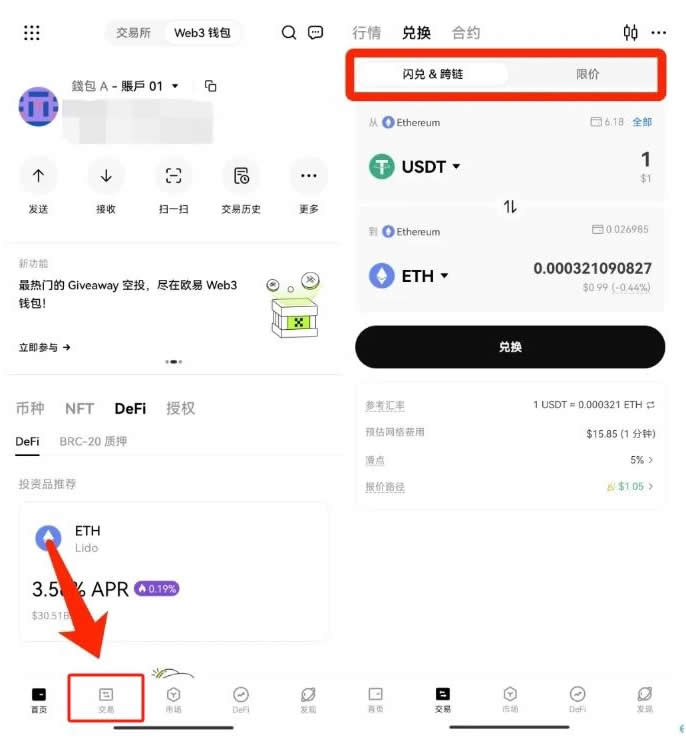

# Web3钱包里的币怎么交易？Web3钱包交易操作教程

Web3钱包是专为与去中心化应用(dApps)和区块链网络互动而设计的数字钱包，是Web3生态系统的重要组成部分，提供了用户与区块链和加密资产交互的界面。随着技术的发展，很多Web3钱包的功能已经不仅仅局限在加密资产的管理和存储了，有的钱包已经支持币的交易。但对于一些新手用户来说，还是不知道Web3钱包里的币怎么交易？其实操作起来很简单，主要就是钱包里需要拥有一定的币。下面[**GTokenTool**](https://www.gtokentool.com)为大家详细说说Web3钱包交易全教程。

## Web3钱包里的币怎么交易？

Web3钱包里的币交易相对来说还是比较简单的，主要就是下载并拥有一个珍贵的Web3钱包（推荐okx web3.0钱包、tronlink、imtoken，也可以用海外的trust wallet，bitget wallet等），对于币的买卖推荐使用交易所，一般选择币安、欧易、gate.iobitget、bybit这几个最好。下文以欧易钱包为例，详解讲解Web3钱包交易教程：

### 一、可以通过币币兑换

1、登录欧易APP，选择首页上方【Web3钱包】，点击【创建钱包】、在弹出的【设置密码】中，输入密码并进行确认，可以创建成功。

<figure><figcaption></figcaption></figure>

2、在钱包首页，备份钱包的助记词，并进行验证后，就可以使用了。

<figure><figcaption></figcaption></figure>

3、点击【接收】，选择转入币种，会弹出收款地址，复制地址粘贴到其他平台或者钱包的提币界面，便可以将数字资产成功充入Web3钱包。

<figure><figcaption></figcaption></figure>

4、进入【Web3钱包】-【交易】页面。在闪兑/限价页面选择币种触发询价，对GAS费、滑点限制等进行单独设置。

<figure><figcaption></figcaption></figure>

5、询价结束并完成授权后，您可点击「币币兑换」按钮发起交易，之后在二次弹窗中确认交易信息，点击「确认兑换」按钮并在钱包中确认以完成交易。此外，若此过程中交易价格发生变化，您须在二次弹窗中点击「接受」按钮接受新的报价后，点击「确认兑换」并在钱包中确认以完成交易。

### 二、通过将web3的币转到交易所中买卖即可

通过 提取 web3的币提到交易所中，然后交易即可。

## 欧意钱包地址怎么看呢？

看欧意钱包地址还是比较简单的，但要注意再进行转账时网络的正确以及地址输入的正确。下文是看欧意钱包地址的具体教程：

1、打开欧易官网，点击【资产管理】—【充币】

<figure><figcaption></figcaption></figure>

2、打开页面后【选择币种】，搜索或者直接点击要充币的数字资产(以XRP为例)，选择【充币网络】

<figure><figcaption></figcaption></figure>

3、选择的币种网络若需要填写标签(又名Tag/Memo，通常是一串数字)，系统会有提醒，点击【我已知晓】

<figure><figcaption></figcaption></figure>

4、就可查看并复制该币种的【充币地址】与【标签】。注：复制地址/标签之后，可以打开其他平台或钱包，选择提币/提现，将刚刚在欧易复制的地址/标签粘贴进去，按照提示填好相关信息并确认即可完成充币。

<figure><figcaption></figcaption></figure>

## 欧意钱包怎么转到交易所账户？

欧易钱包转到交易所账户还是很简单的，但需要拥有一个欧易钱包账户，下文是具体欧意钱包转到交易所账户的详细教程：

1、进入欧易官网(点击注册)，点击【资产管理】，选择想要划转的币种，填写数量-【确认】，将所需进行交易的数字资产从【资金账户】划转到【交易账户】

<figure><figcaption></figcaption></figure>

2、点击划转记录，就可以查看历史划转记录

<figure><figcaption></figcaption></figure>

## WEb3钱包余额不足以支付怎么回事？

根据资料分析来看，WEb3钱包余额不足以支付可能是因为金额过大超过了可以使用的UTXO之和、当前有Pending中的交易以及余额均为占用的UXTO等，下图以BTC为例，分析其原因以及解决步骤：

<figure><figcaption></figcaption></figure>

## Web3钱包交易合法吗？

Web3钱包交易的合法性取决于多个因素，包括所在国家或地区的法律规定、所涉及的加密货币或代币的性质以及具体的交易类型。在美国，加密货币交易是合法的，但需要遵守证券交易委员会(SEC)和金融犯罪执法网络(FinCEN)的规定。交易所必须进行KYC(了解你的客户)和AML(反洗钱)程序。

欧盟国家对加密货币的监管也在加强，要求交易所和钱包服务提供商进行KYC和AML合规。中国对加密货币交易和相关活动采取了严格的禁令，禁止加密货币交易所和ICO(首次代币发行)。日本和韩国这些国家允许加密货币交易，但实行严格的监管和许可制度。

投资者使用Web3钱包之前，应了解所在国家或地区关于加密货币的法律和监管要求。选择遵守KYC和AML规定的交易所和钱包服务提供商。保持所有交易的详细记录，以便于税·务申报和合规检查。

以上全部内容就是对Web3钱包里的币怎么交易这一问题的解答，Web3钱包是通向去中心化世界的门户，提供了管理加密资产和与区块链应用互动的便捷方式随着技术的发展，Web3钱包的发展方向包括更好的用户体验、更广泛的多链支持、增强的安全性和隐私保护功能，以及与传统金融系统的更多集成。需要注意的时，虽然它们带来了极大的便利和控制权，但用户也需要意识到安全管理私钥的重要性，并采取适当的保护措施。

如有不明白或者不清楚的地方，请加入官方电报群：[**https://t.me/gtokentool**](https://t.me/gtokentool)
