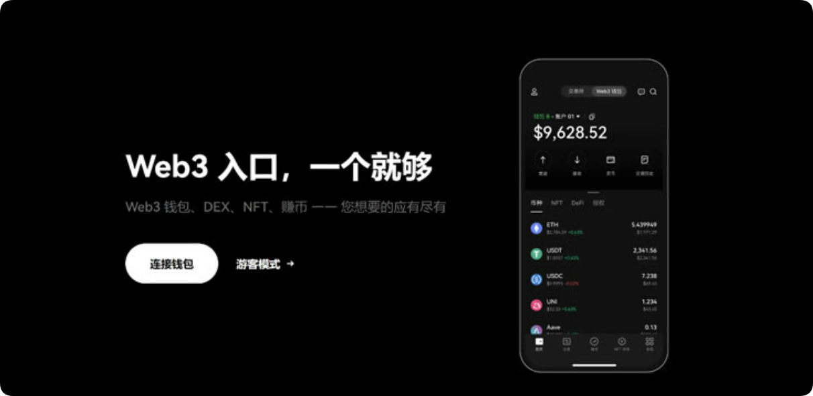

# Web3钱包无私钥钱包安全吗？

钱包是用户进入Web3世界的关键，但行业发展至今，用户依旧需要记住并小心保管着长长一串的私钥和助记词，基于这个背景下无私钥钱包诞生，但私钥和助记词的重要性也让用户对于Web3钱包无私钥钱包安全吗？存疑，究竟这个Web3钱包无私钥钱包可靠吗？是用户急需了解的问题。就目前来看，Web3钱包无私钥钱包是安全的，也是可靠的，这主要得益于多方安全计算技术。接下来[**GTokenTool**](https://www.gtokentool.com)为大家详细说说。

<figure><figcaption></figcaption></figure>

## Web3钱包无私钥钱包安全吗？

Web3钱包无私钥钱包安全，Web3钱包无私钥钱包将MPC(多方安全计算)技术和区块链签名结合，使多个参与者能够在不泄漏任何一方持有的私人信息或秘密数据的情况下联合计算。通过分布式密钥生成技术各自生成私钥碎片，任一方或机器都无法控制完整私钥。对交易进行签名时，需要多方共同参与计算，从而形成一个完整的签名。

多方安全计算(MPC)会在不暴露每一份密钥碎片的情况下，对签名碎片进行汇总，从而形成一份完整的多方签名。其他人也可以轻易的验证这份完整的多方签名与钱包地址的对应关系，从而判定交易有效。

没有生成一个单独的私钥，而是将私钥分解成多个碎片并储存在不同的地方，即使你手上的那个碎片被盗取，他人也无法通过单个碎片来控制钱包内的资产，同时，如果你发现密钥碎片丢失或者被盗，MPC还可以执行密钥碎片的刷新功能:用新的密钥碎片，来替换每个人手上原有的密钥碎片。此时被盗或丢失的密钥碎片等于被“挂失”，失去了效力和价值。

无私钥钱包旨在改进数字资产的安全性和可管理性，以便更多人能够安全地参与加密货币生态系统，而无需担心私钥管理问题。需要注意的是，具体的无私钥钱包技术和实现方式可能会因项目和平台而异。因此，如果对无私钥钱包感兴趣，建议深入研究具体的项目或技术，以了解它们是如何实现无私钥管理的，并评估其安全性和可行性。

## Web3钱包无私钥钱包可靠吗？

Web3钱包无私钥钱包可靠，Web3钱包无私钥钱包的可靠性取决于多个因素，包括所使用的技术、应用程序的安全性、用户的安全意识以及整体的区块链网络安全状况。

Web3无私钥钱包依赖于与区块链网络的直接交互，因此所使用的Web3技术必须是可靠且经过安全审查的。常见的Web3技术包括Web3.js(用于以太坊)、Web3.py(用于以太坊)、Polkadot.js(用于波卡网络)等。这些技术如果由官方或者社区维护，并且经过广泛的测试和审查，就可以认为是相对可靠的。

用户在使用Web3无私钥钱包时需要选择安全可靠的应用程序或服务。这些应用程序必须经过严格的安全审查，并且提供可靠的用户支持和保障措施。选择由知名机构或社区维护的应用程序，或者是官方推荐的应用程序，可以提高可靠性。即使是使用了可靠的技术和应用程序，用户的安全意识也是至关重要的。用户应该保持警惕，不要泄露私密信息，定期更新软件和操作系统，避免使用不信任的网络连接，以及备份重要的信息如助记词等。

区块链网络的安全性也会影响到Web3无私钥钱包的可靠性。如果所使用的区块链网络具有强大的安全保障机制、活跃的社区和开发者支持，并且没有受到过大规模的攻击或漏洞问题，那么相应的Web3钱包也会更加可靠。

以上全部内容就是对Web3钱包无私钥钱包安全吗以及Web3钱包无私钥钱包可靠吗这两个问题的解答，Web3无私钥钱包可以提供一定程度的安全性和可靠性，但仍然需要用户谨慎管理并采取适当的安全措施，并保持良好的安全习惯和意识。小编建议用户应该始终保持警惕，避免暴露私密信息或操作于不信任的环境中，同时定期更新相关技术和软件以确保安全性。如果有重要的数字资产需要管理，建议使用备份助记词的方式来增加安全性。

如有不明白或者不清楚的地方，请加入官方电报群：[**https://t.me/gtokentool**](https://t.me/gtokentool)
