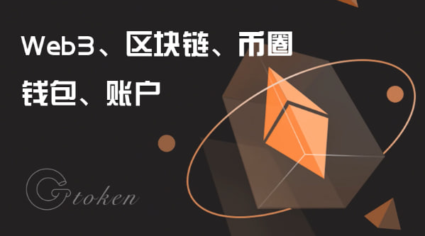
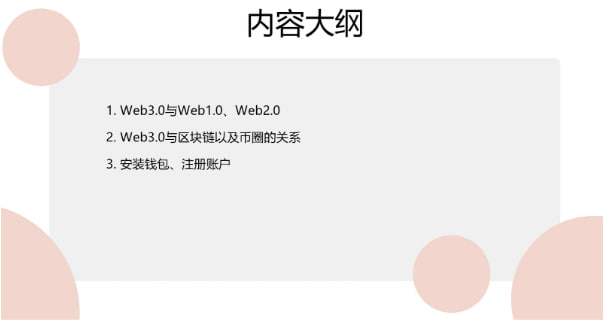
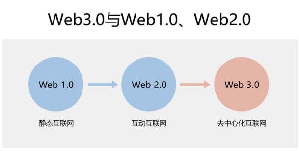
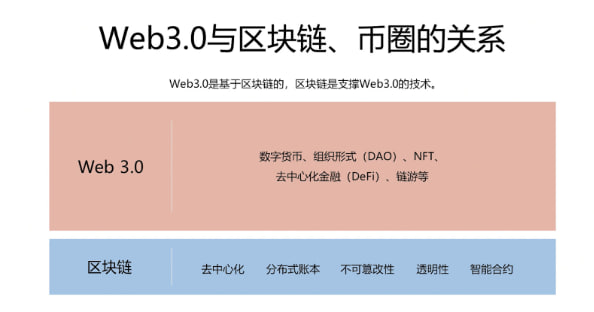

# WEB3、区块链、币圈、钱包、账户

<figure><figcaption></figcaption></figure>

大家好，欢迎来到G TOKEN的教程，今天来讲一下WEB3、区块链、币圈、钱包、账户，分别是什么以及它们之间的关系。

\

<figure><figcaption></figcaption></figure>

先看一下大纲，第一个WEB3.0与WEB1.0 WEB2.0的区别。然后第二个部分，讲一下WEB3.0包含的内容、区块链的功能、WEB3.0与区块链以及币圈的关系。最后是怎么安装钱包、注册账户。

\

<figure><figcaption></figcaption></figure>

说到Web 3.0，就会想到Web 1.0和Web 2.0。

Web 1.0是最早期的互联网，最大的特点是静态网页基本上只能看，用户很少能跟网站做互动，比如像一些静态的个人主页，基本的新闻网站之类的，点击去看看就没有别的能操作的。

到了Web 2.0，就开始有了很多互动，用户不再只是内容消费者，用户可以自己生成内容，成为创作者，像b站YouTube这样。然后用户之间也可以互动，出现了很多社交媒体，比如微博知乎Facebook等等。除此之外还有一些购物平台。但是随着互动的增加，用户数据被大量收集和使用，数据隐私和安全就成了问题。

而在Web 3.0，用户的个人信息得到很大的保护，基于区块链的身份验证系统，能够使用户

在不暴露个人信息的情况下完成认证。也就是说，我们可以在需要服务时，证明自己的身份，但不用将个人信息交给第三方，数据由用户自己控制，这就是去中心化。Web3.0也带来了新的盈利模式，像代币经济和去中心化金融等。

\

<figure><figcaption></figcaption></figure>

根据上一篇我们了解了，Web3.0其实是一种互联网模式。在这种模式下包含了些什么呢？

数字货币，就是加密货币代币等组织形式。DAO是一种自制管理的组织形式，没有中心化的领导和管理结构，决策权是分散在组织的所有成员中的。NFT也叫非同质化代币。还有去中心化金融、链游等等这些。

\
那Web 3.0与区块链币圈有什么关系呢？Web 3.0是基于区块链的，区块链是支撑Web 3.0的技术。

那它有哪些功能来支撑Web 3.0呢？这里主要列了五点，去中心化、分布式账本、不可篡改性、透明性、智能合约。

举个例子，方便大家更好的理解。假设我进行了一笔交易，去中心化就是这笔交易的数据，它的添加和验证，是由网络中的节点通过算法来完成，没有第三方。分布式账本，就是我这笔交易数据会被记录在多个节点上，每个节点都持有完整的这个数据副本，这种分布式结构提高了系统的安全性。不可篡改性，是说数据一旦被记录在区块链上，就不能篡改或删除了。透明性，所有交易记录都是公开的，任何人都可以查看，区块链提供了一种，安全和透明的数据存储和管理方式，使Web 3应用能够安全地处理用户数据。智能合约，能够让Web 3应用自动执行和验证各种操作，减少对人工的消耗和依赖。

当然，这些特性不仅仅只是针对交易，在区块链中的所有数据都是适用的，比如创建代币、NFT这之类的。

\

讲完了Web3.0与区块链，那币圈呢？币圈主要是加密货币代币、NFT去中心化金融等等。这些其实包含在Web3.0之内的，所以它也和Web3.0一样，是基于区块链的。

\

最后一个部分是安装钱包，注册账户，为什么要讲这两个呢？因为钱包是我们连接到区块链的工具，而账户相当于是每个人的身份认证。

现在的主流钱包，都是以浏览器插件为主，这样不管是电脑端还是手机上交易，都很方便

视频教程地址：[https://youtu.be/G2Xzu8Lx6mQ](https://youtu.be/G2Xzu8Lx6mQ)

\
