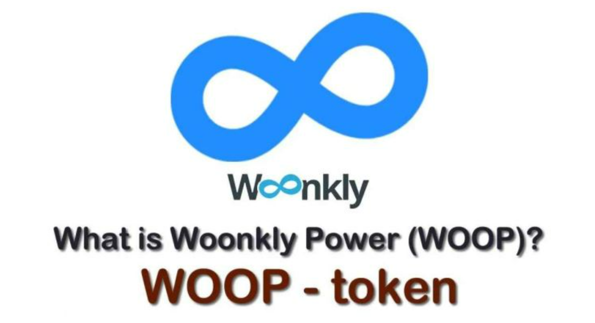

# WOOP是什么币种？WOOP币怎么样？

WOOP币的英文全称是Woonkly Power，其实这个Woonkly是一款DEFI协议，用以实现去中心化社交网络。在这个网络中，广告商投资在帖子广告上的资本与与该内容(帖子、照片、视频、播客)互动的人共享；所有这些都是使用Woonkly的主网络(Hyperledger BESU和Polkadot)与币安智能链(BSC)连接，100%在区块链上创建和工作，使用Viral Power，内容创建者可以将代币分发给用户。那么究竟这个WOOP是什么币种？大家想知道WOOP币怎么样？下面[**GTokenTool**](https://www.gtokentool.com)为大家介绍一下。

<figure><figcaption></figcaption></figure>

## WOOP是什么币种？

WOOP币就是Woonkly Power这一项目中的原生代币，而这个Woonkly Metasocial Network是一个去中心化社交网络，所有帖子都直接转换为NFT，用户可以完全控制他们的数据，并且内容不会上传到服务器，而是通过IPFS(星际文件系统)上传到用户的计算机，从而允许创建一个由创作者、影响者、人才、用户和虚拟世界组成的分散式全球目录，彼此互动并创造新的内容货币化方式。

创作者可以上传他们的视听作品并为其设定版税。几乎任何类型的媒体文件都有资格转换为NFT。从歌曲到视频剪辑，从播客到书籍，从自拍到虚拟世界。Woonkly的使命是让创作者、影响者、人才、游戏玩家、虚拟世界、用户和游戏有一个参考点，以去中心化的方式货币化和社交。

它的愿景是成为现实与虚拟世界之间的世界目录，将国际上的创作者、影响者和品牌与虚拟世界、游戏 赚钱游戏和用户联系起来。目前，Woonkly在2个区块链、BSC网络和以太坊网络上工作。它将很快被包含在Avalanche和Solana网络中，并且在未来，它将迁移到自己的公共区块链。

## WOOP币怎么样？

根据官方数据得知WOOP币目前并不受投资者欢迎，从其交易记录来看，WOOP币不受投资者欢迎，该项目流动性较低，没有投资价值。

作为Woonkly在BSC上创建的实用代币，Woonkly Power(WOOP)将社交网络中的NFT买卖佣金、广告收入或平台提供的任何其他服务的佣金降低50%。它也是唯一可以买卖Woonkly.com Super Powers的代币，也是Woonkly Gallery House和Woonkly Creators House等项目的唯一代币。

WOOP的总供应量为10亿(即1,000,000,000)，其中41.5%目前归社区所有，40%分配给团队和顾问，15%用于奖励生态、营销和运营，1%为为锁定12个月的流动性提供，其余2.5%为交易所的流动性提供。10亿个WOOP是预挖的，不能再创造了，这意味着流通中的WOOP数量是有限的且非通胀的。

上述内容就是对于WOOP是什么币种以及WOOP币怎么样这两个问题的详细阐述。Woonkly是一种DeFi协议，它支持去中心化社交网络，其中广告商投资于帖子广告的资金与与该内容(帖子、照片、视频、播客)交互的人共享；所有这些都使用我们自己的主网(Hyperledger BESU和Polkadot)与币安智能链(BSC)连接，在区块链中创建和运行100%。集中式交易所列表可以为加密项目创造奇迹，因此在Binance上寻找新的加密货币可能是一种很好的投资技术。

如有不明白或者不清楚的地方，请加入官方电报群：[https://t.me/gtokentool](https://t.me/gtokentool)

