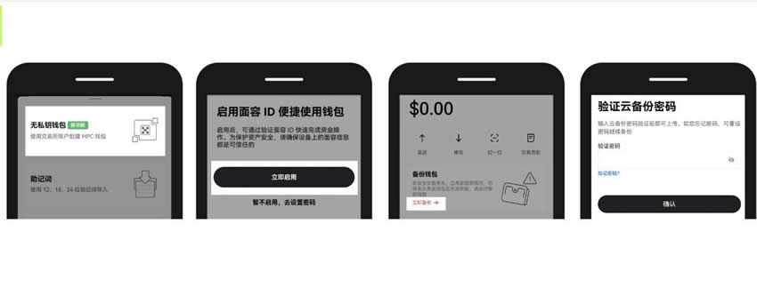

# 无私钥钱包怎么导入新钱包？无私钥钱包导入新钱包教程

技术的发展并没有让钱包的私钥得到很好的解决，用户在使用加密钱包依旧需要小心保管私钥和助记词，而无私钥钱包的推行就旨在解决这一问题。无私钥钱包通常是指一种加密货币钱包，它不要求用户保存或管理私钥，并且允许用户在不必处理私钥的情况下存储和管理加密货币。但对于无私钥钱包的使用还有很多新手不知道，尤其是关于无私钥钱包怎么导入新钱包？这一操作，其实比较简单。下面[GTokenTool](https://www.gtokentool.com)为大家详细说说。

## 无私钥钱包怎么导入新钱包？

无私钥钱包导入新钱包还是比较简单的，下文是具体导入教程介绍：

1、第一次使用：打开欧易App，切换至【Web3钱包】-【创建新钱包】-【无私钥钱包】，点击【立即启用】，输入欧易交易所的账号和密码若已经登录则点击【备份钱包】-【立即备份】，输入密码完成备份。

<figure><figcaption></figcaption></figure>

2、已有著几次或私钥，则无需再创建。打开欧易Web3钱包，点击钱包名称-【添加钱包】-【创建钱包】-【无私钥钱包】，输入欧易交易所的账号和密码若已经登录则点击【备份钱包】-【立即备份】，输入密码完成备份。

<figure><figcaption></figcaption></figure>

3、打开欧易App，切换至【Web3钱包】选择【导入已有钱包】-【恢复无私钥钱包】-【立即启用】-【扫码恢复】使用老设备扫描二维码，同步完成后钱包恢复成功。

<figure><figcaption></figcaption></figure>

## 钱包私钥保存到手机安全吗？

不建议将钱包私钥保存到手机，因为手机的安全风险较高。如果使用手机保存私钥，那么手机本身的安全性是关键。确保自己的手机系统是最新版本，并定期更新操作系统和安全补丁，以确保安全性。另外，避免使用越狱或Root过的手机，因为这可能会增加手机受到攻击的风险。

如果选择在手机上保存私钥，建议使用专门的加密钱包应用程序，并确保私钥被加密存储，加密钱包应用通常会要求设置密码，并使用该密码对私钥进行加密存储。还要避免安装来自不可信来源的应用程序，并定期扫描手机以检测恶意软件。私钥是数字货币安全的核心，一旦被泄露，资产可能会被盗取。虽然一些手机钱包应用允许用户将私钥存储在手机中，但这并不安全，因为手机可能遭受恶意软件攻击或被盗，从而导致私钥的泄露。即使手机加密，也无法完全防止私钥被专业人士破解。

建议使用硬件钱包，这是一种专用的安全设备，用于存储私钥，并与手机或电脑进行加密通信。硬件钱包能有效防止私钥被黑客窃取。还可以使用的方法，即在不联网的设备上生成和存储私钥，并通过其他方式(如纸条或加密备份)记录下来，需要使用时，通过热钱包扫描冷钱包的离线签名达到不使私钥暴露在网络中的效果。

以上全部内容就是对无私钥钱包怎么导入新钱包这一问题的教程解答，私钥是加密货币钱包的核心组成部分，它用于对用户的加密货币进行签名和验证交易。但无私钥钱包会使用多重签名技术或其他安全协议来实现用户无需私钥即可访问其资金的功能。这样的钱包通常更适合普通用户，因为它们减少了用户可能遇到的私钥管理和安全风险。然而用户在选择使用这样的钱包时应该谨慎，确保它们提供了足够的安全保障，以防止资金丢失或被盗。

如有不明白或者不清楚的地方，请加入官方电报群：[https://t.me/gtokentool](https://t.me/gtokentool)
