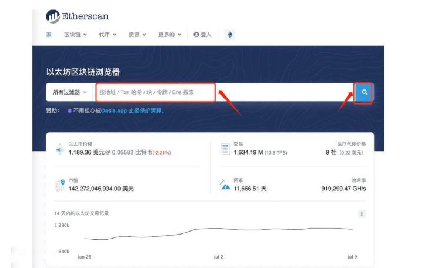

# 小狐狸钱包怎么取消授权合约功能？小狐狸钱包取消授权合约教程

加密货币钱包多而繁杂，如果选择或者操作不当难免会碰到一些坑。为了规避自己钱包的安全隐患，保护自己钱包资产，取消以往项目合约地址授权，这是必须要了解的。尤其近年来被黑客盗取的链上资产太多了，作为最受欢迎的钱包之一，小狐狸钱包用户也在担心被盗事件发生到自己身上，所以迫切想要知道一些方法来预防。那么小狐狸钱包怎么取消授权合约功能？取消钱包授权合约步骤还是蛮复杂的，尤其是对于新手来说，接下来[**GTokenTool**](https://www.gtokentool.com)为大家详细介绍一下这个详细教程。

## 小狐狸钱包怎么取消授权合约功能？

小狐狸钱包取消授权合约功能的步骤比较复杂，需要12个步骤，下面是教程详解：

1. 打开eth区块浏览器，输入钱包地址，点击查找

<figure><figcaption></figcaption></figure>

2. 点击更多

<figure><figcaption></figcaption></figure>

3. 点击令牌批准

<figure><figcaption></figcaption></figure>

4. 点击连接到web3

<figure><figcaption></figcaption></figure>

5. 连接小狐狸钱包

<figure><figcaption></figcaption></figure>

6. 点击确定

<figure><figcaption></figcaption></figure>

7. 然后看到钱包已连接，并且需要和上面的地址保持一致

<figure><figcaption></figcaption></figure>

8. 点击erc20看到很多已授权的地址，以第一个为例，点击取消

<figure><figcaption></figcaption></figure>

9. 点击撤销

<figure><figcaption></figcaption></figure>

10. 在小狐狸钱包点击确认

<figure><figcaption></figcaption></figure>

11. 可以查看刚才的交易情况

<figure><figcaption></figcaption></figure>

12. 链上交易确认后，刷新页面，这时候会发现刚才的第一个国家3不见了，表示取消授权成功。

<figure><figcaption></figcaption></figure>

## 小狐狸钱包可以交易吗？

小狐狸钱包可以交易，小狐狸钱包支持多个主流公链平台和数百种数字资产的交易，用户可以选择“交易”功能，在支持交易的数字资产列表中选择自己想要交易的数字资产，然后输入交易数量和交易对方地址，即可完成数字资产交易。

为保证数字资产的安全性，小狐狸钱包采用了多重加密和安全备份措施，用户在创建钱包时需要设置钱包密码并备份助记词。用户还可以启用Touch ID或Face ID等生物识别功能，以增强钱包的安全性。

小狐狸钱包对于数字资产的发送和交易均需要支付一定的手续费用，费用大小取决于当前网络的拥堵情况和用户所选择的交易速度。用户可以选择快速、普通或经济等不同的交易速度，以达到更好的手续费用控制效果。

在交易市场，资金的安全永远是第一位。学会掌握如何降低风险和规避风险很重要，定期管理我们的智能合约权限，去除掉我们不再使用或不再信任的代币授权，这是很有必要的。用户在参与某种项目的时候也可以临时建立一个小钱包，也可以作为一种避险手段。另外在选择钱包时，也要提前对钱包有所了解。

如有不明白或者不清楚的地方，请加入官方电报群：[https://t.me/gtokentool](https://t.me/gtokentool)
