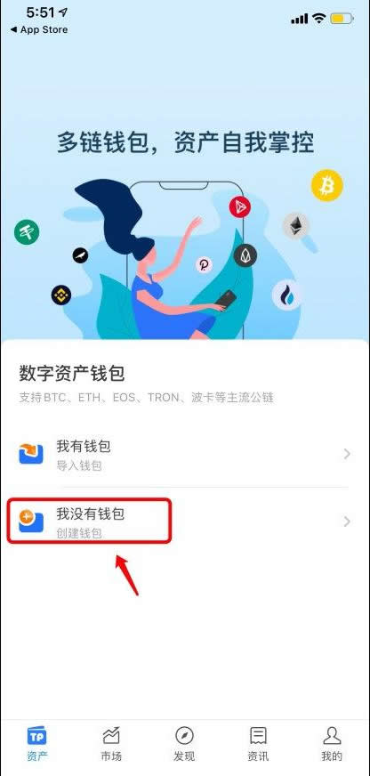

# 以太坊钱包哪个最安全？如何创建以太坊钱包？

以太坊钱包是让投资者可以对帐户进行控制的应用程序，也就是用于存储以太坊私钥的工具，而私钥则可以代表投资者在以太坊上进行交易和签名。因此选择合适的以太坊钱包至关重要，因为它们决定了私钥的安全性和便捷性。目前市场上常见的以太坊钱包主要分为硬件钱包、软件钱包，对于这些钱包，投资者最关注的还是具体的以太坊钱包哪个最安全？就目前来看，Ledger、MetaMask这种知名度高的钱包是安全的。下面[**GTokenTool**](https://www.bgtokentool.com)为大家详细说说。

<figure><figcaption></figcaption></figure>

## 以太坊钱包哪个最安全？

以太坊钱包的安全性取决于多种因素，包括钱包的类型、功能、用户的使用习惯等。就资料分析来看，Ledger、MetaMask、TokenPocket、imToken等钱包是比较安全可靠的，下文是钱包的具体介绍：

### 1、Ledger

比特币硬件钱包制造商Ledger是数字货币安全领域技术领先的公司之一，能为消费者和企业提供值得信赖的硬件。Ledger是基于智能卡的比特币硬件钱包，提供技术领先的最高保护等级，兼具可用及操控性。Ledger硬件钱包是一个多功能钱包，安全存储私钥的硬件设备，查看钱包和发送交易时，硬件钱包需要与软件钱包配合才能使用。同时支持安全存储比特币、以太坊及平台代币、Zcash等。

### 2、MetaMask

MetaMask是一款在浏览器上使用的插件类型的以太坊钱包，该钱包不需要下载，只需要在浏览器添加对应的扩展程序即可，非常轻量级，使用起来也非常方便。目前支持谷歌、360、火狐等浏览器。

### 3、TokenPocket

TokenPocket是多链数字钱包。一键设置登录密码，保护你的用户隐私，支持指纹和脸部识别，操作更方便，数据更安全。私钥储存在本地，物理隔离重要数据，经过三层算法处理，敏感信息永不泄露。

### 4、imToken

imToken是一款移动端轻钱包App，它旨在为普通用户提供一款安全放心、简单好用、功能强大的数字资产钱包应用。主要功能：1.私钥自持;2.轻钱包功能;3.支持多种数字资产;4.关注全球各大交易所，各类数字资产行情-设置价格提醒。

## 如何创建以太坊钱包？

创建以太坊钱包步骤可能有些繁琐，下文是在TP钱包创建以太坊钱包的教程：

1、打开TokenPocket钱包后，点击【我没有钱包】

<figure><figcaption></figcaption></figure>

2、选择想要创建的底层钱包，选择以太坊

<figure><figcaption></figcaption></figure>

3、点击【创建钱包】

<figure><figcaption></figcaption></figure>

4、依次设置【钱包名】和【密码】，然后勾选【服务及隐私条款】，点击【创建钱包】

<figure><figcaption></figcaption></figure>

5、进入备份助记词页面后，请勿截图助记词，备份后点击【备份完成，进行验证】

<figure><figcaption></figcaption></figure>

6、按照上一步的助记词顺序填入，然后点击【确认】

<figure><figcaption></figcaption></figure>

7、至此，您的新钱包已经创建成功。

<figure><figcaption></figcaption></figure>

以上全部内容就是对以太坊钱包哪个最安全这一问题的解答，选择最安全的以太坊钱包需要考虑用户的个人需求、操作习惯以及对安全性的特别关注。硬件钱包如Ledger因其物理存储私钥的特性，通常被认为是最安全的选项。而软件钱包如MetaMask、TP钱包和imToken等，虽然便利性较高，但在使用过程中需要注意保护好私钥和设置复杂密码以增强安全性。总之，无论选择使用哪个钱包，用户都要保管好钱包的私钥和助记词。

如有不明白或者不清楚的地方，请加入官方电报群：[https://t.me/gtokentool](https://t.me/gtokentool)
