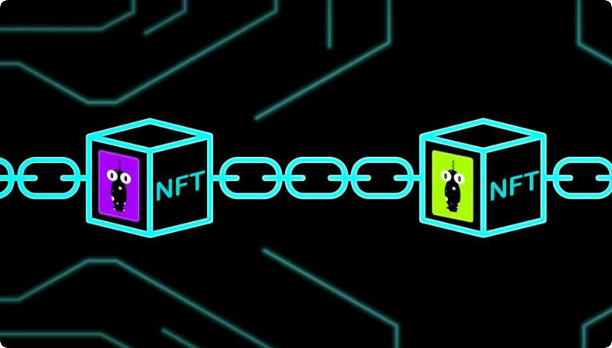
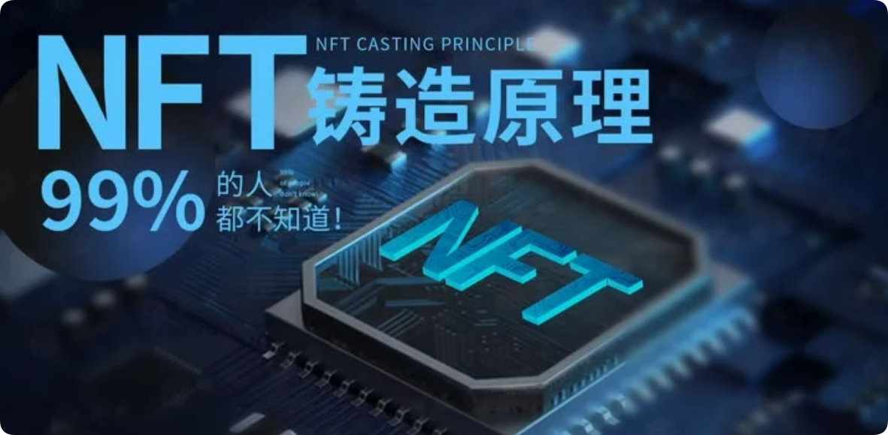

# 一文弄懂NFT铸造的原理是什么？

与艺术界相关的NFT场景，目前是NFT大放异彩的主要舞台，只不过是一个巨大的投机泡沫，主要被希望让自己变得更重要、更富有的衰落名人利用，金融鲸鱼在嗅到巨额利润一个高度动荡的市场，但是还是有很多投资者前仆后继的想要进行NFT铸造。其实现在投资者们通过国内外知名数字的艺术品交流平台就可以很便捷的将自己的艺术作品进行上链，然后变成NFT数字作品。但是很多投资者并不知道[**NFT铸造**](https://docs.gtokentool.com/ming-xing-chan-pin/nft-zhu-zao)的原理是什么？下面[**GTokenTool**](https://www.gtokentool.com)带大家一文弄懂NFT铸造原理。

<figure><figcaption></figcaption></figure>

## NFT铸造的原理是什么？

其实NFT的铸造流程远没有我们所看到的那么简单，其背后的运行逻辑和每一步涉及的技术栈对普通人而言是相对复杂的，它的具体步骤如下所示：

### 1.制作作品数字ID

例如将一张图片制作成NFT，我们首先需要提取它的基本信息：图片的作者、图片内容属性，包括尺寸、颜色等等，将这些信息转化为byte字节，然后将字节输入到加密算法中得到一个输出值。若选择的是哈希算法，可以得到一个哈希值，基于哈希算法单项性和抗碰撞属性，每一个哈希值都唯一对应一个源内容，无法轻易被篡改。这个哈希值就是这张图片的数字化中间产物-数字ID。

### 2.ID通证化

选择区块链任意一条公链进行智能合约开发，不同的公链，其底层标准协议逻辑或技术组件都有所差别，这也导致我们开发的智能合约也会有所不同。智能合约直接映射了我们制作的NFT具有的基本属性和流转方式。

将开发好的智能合约部署到我们所选择的公链，此时它变成了一个DAPP,APP即客户端应用，D是decentralization的首字母，译为去中心化，DAPP即去中心化应用。然后我们调用我们开发的智能合约，将图片数字化ID储存在我们所选择的公链上。

### 3.NFT作品展示

在将图片信息存储到选择公链上时，我们会得到一个通证ID，通过这个ID，我们可以前往开发的智能合约中读取图片NFT信息数据，此时我们会得到一个通证URL，它就相当于一把“密匙”，通过这个密匙我们就可以借助浏览器或其他介质应用，还原我们储存在IPFS分布文式文件系统中，铸造的NFT作品内容。

<figure><figcaption></figcaption></figure>

## 如何铸造NFT？

在这里，择了全球最大的NFT交易平台OpenSea，登陆网址并注册账号。就可以进入交易平台，发现、创造、买卖、收集NFT作品了。

点开“创造“按钮，拖拽图片文件到图像框，取定一个项目名称，同时根据自身需要，决定是否选择添加项目描述，或是否要将多个文件创作成为一个合集，也可以跳过这些选项，直接点击确认“创造”键，选取的照片便成功转化成了NFT数字作品《Seeback,no one》。

到这时再回头看整个过程，仅仅选定图片、登陆注册、填写铸造信息这三个步骤，花费不到5分钟时间，一个NFT作品便铸造成功。经过《链新》亲测，同一账号批量化操作多个NFT作品铸造，每一个NFT作品的铸造时间不超过1分钟。

从这一刻起，这张图片正式成为NFT数字作品，只要以太坊链存在一天，这张照片会永远活在链上，而且所有看到它的人都会知道，谁是这张图片的产权所有人。

上述内容就是关于NFT铸造的原理是什么这一问题的解答，希望大家能够一文弄懂NFT铸造原理。该技术允许一些有趣的可能性。艺术家们已经像传统版画一样出售了他们作品的多份副本，但每一份都与另一份一样多。他们还可以选择将艺术品的所有权出售给一个人。一些电脑游戏正在使用NFT来规范游戏中的数字项目。拥有某个NFT可能会让你拥有一块虚拟土地，或者在驾驶游戏中拥有一辆更快的汽车。正如发明者所期望的那样，您还可以将NFT绑定到物理对象。

如有不明白或者不清楚的地方，请加入官方电报群：[https://t.me/gtokentool](https://t.me/gtokentool)
