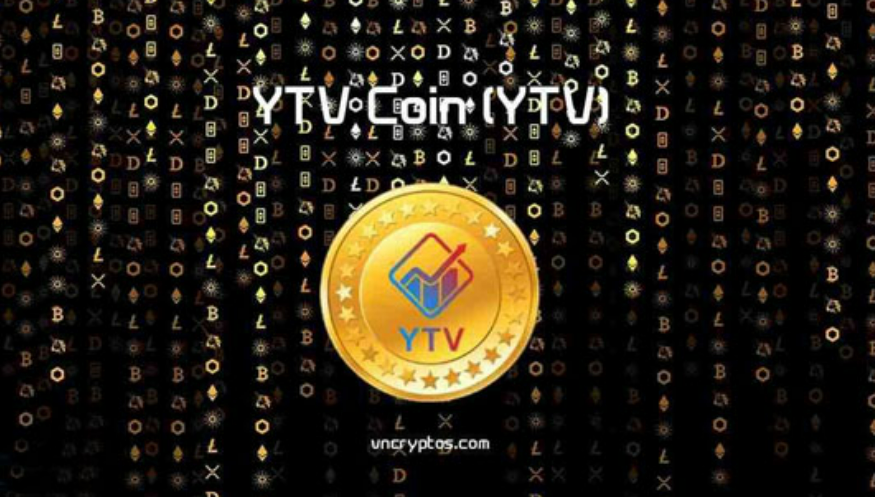

# YTV币前景怎么样？YTV是什么币种？

YTV今日价格为$0.00019670，其24小时的交易量为暂不提供。YTV在过去24小时内无增减变化。其市值为暂不提供。其流通总量为暂不提供，其发行量为100000万YTV。通过区块链扩大全球影响力；纳迦全球市场(Naga Global Markets)正在为全球社区(Global Community)创建分散的利润分享投资产品。YTV的目标是成为一个DeFi平台，当我们的社区发展壮大并且业务得到优化时。

<figure><figcaption></figcaption></figure>

## YTV是什么币种？

YTVCoin(YTV币)是运行在TRON-TRC20区块链上的新一代加密货币，YTVcoin是一种DeFi借贷协议，允许用户通过将LKT存入平台支持的多个池之一来赚取利息。YTVcoin是一种实用型代币，将用于交易、交换和电子商务，我们为您带来开创新天地的平台。

**Tv代币项目特征：**

YTvcoin是运行在波场区块链上的新一代加密货币。

1. **证明：**&#x7406;想情况下，选择的平台应该在生产环境中运行多年，在可靠性(技术)和稳定性(社区、硬分叉等)方面具有良好的记录。
2. **权力下放：**&#x4E0E;其他智能合约区块链相比，波场区块链的去中心化程度最高，因为波场网络有数千个节点。我们可以确信，这些系统比人类历史上几乎任何系统都更淮被不当操纵。
3. **建立并兼容：**&#x6240;选择的周围应该有足够的生态系统。 例如，DLT平台确保钱包不仅存在，而且易于使用，所有人都可以使用，而不仅仅是加密书呆 子。这也意味着更多的跨链和其他集成(即通过链链接)以及平台与更广泛的加密经济的更集成网格。

## YTV币前景怎么样？

根据官方数据得知YTV币已被交易所下架，该项目目前已经没有购买渠道了，此类项目已经无法投资，没有投资价值了。

所有这些考虑使我们决定使用TRON，这是一个完善的区块链，也是最古老、迄今为止使用最多和经过实战考验的智能合约平台。它为我们提供了所有所需的功能和属性、区块浏览器、不仅开发人员可以使用的钱包，以及一个可以与之交互并参与其中的庞大生态系统。

我们的目标是成为一个DeFi平台，当我们的社区发展壮大并且业务得到优化时。届时，我们将为您带来一个全新的DeFi平台。

VTVCoin的目标是在未来成为一个去中心化的平台，核心要索真正受到智能合约的监管。因此，YTVCoin可以成为服务和产品的顶级DeFi平台之一。公司从一开始就作为DeFi平台起步并不容易。我们需要时间来优化整个系统。但是，当它准备就绪时，我们将为您带来DeFi平台的优势。

如有不明白或者不清楚的地方，请加入官方电报群：[https://t.me/gtokentool](https://t.me/gtokentool)
